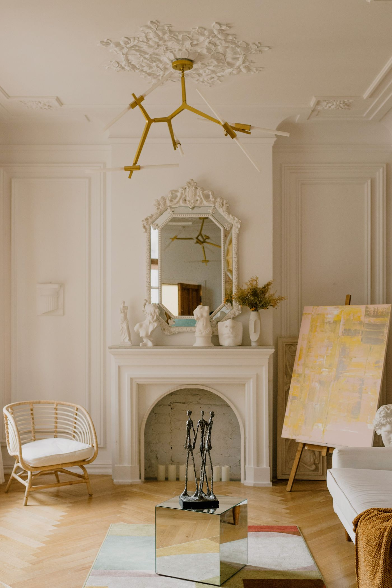
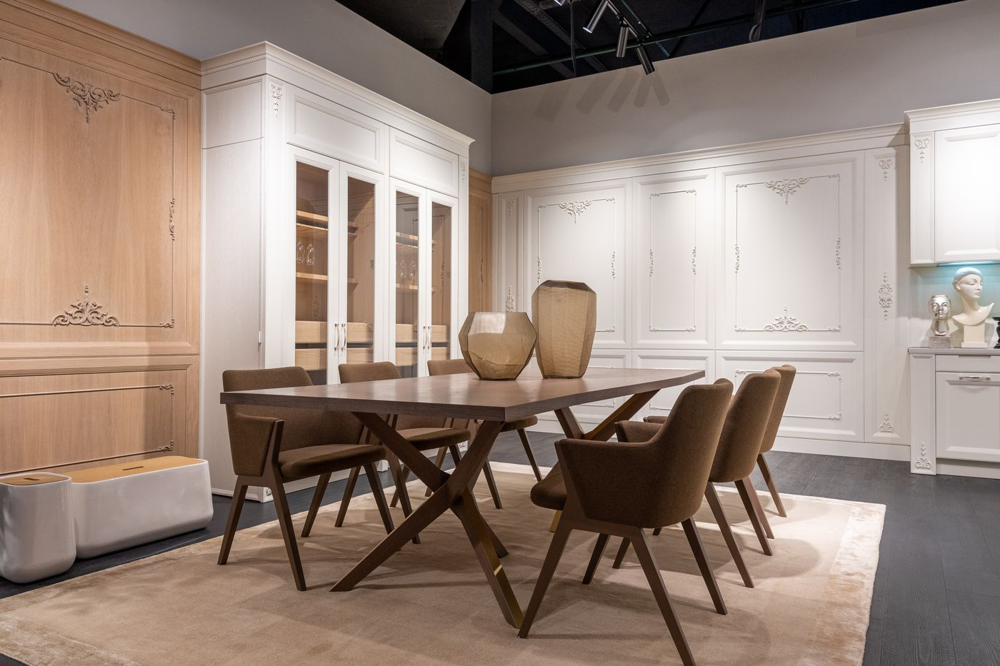
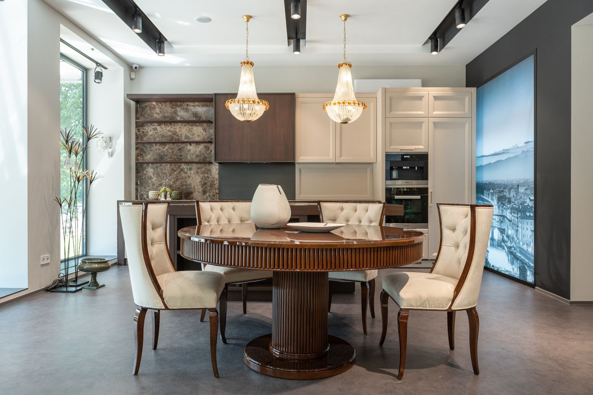
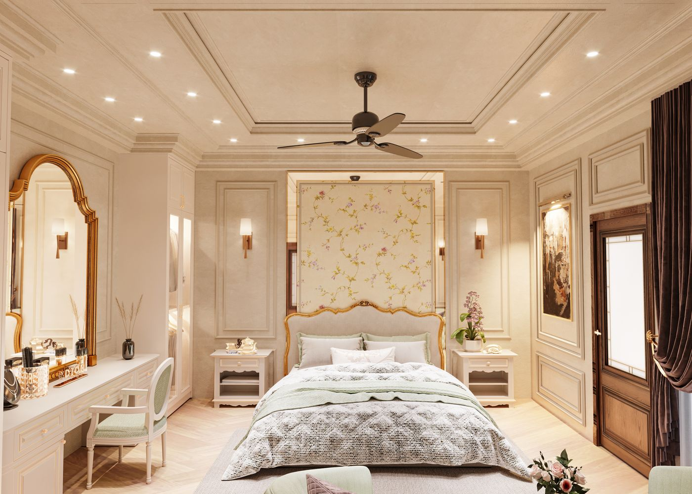
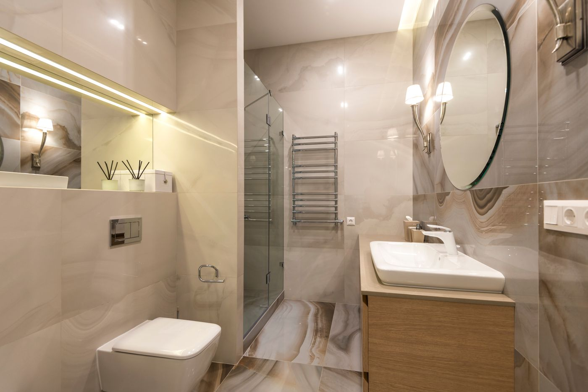

## Гостиная

Загородный дом 140 м² мы оформили в духе современной классики: сдержанная лепнина, благородная светлая палитра и natural-фактуры вместо избыточного декора. Такой интерьер не устаревает и одинаково хорошо смотрится и при дневном свете, и в вечернем освещении.

Гостиная стала парадным центром дома. Стеновые панели с профилированным багетом, портал и потолочная розетка задают классическую основу, а лаконичная мебель, паркет «ёлочкой» и точечные латунные акценты добавляют лёгкости и современности. Композиция получилась спокойной, но статусной.

## Кухня-столовая

Кухню объединили со столовой — в доме это сердце, где собирается семья. Фасады со сдержанной филёнкой в цвет стен и вставки из тёплого дерева поддерживают классическую линию, а массивный обеденный стол задаёт масштаб. Люстры с хрустальными подвесами и мягкие стулья делают зону нарядной, не перегружая её.

Функционально всё продумано под загородный ритм: вместительные системы хранения, встроенная техника и отдельная рабочая зона у окна с видом на участок.

## Спальня

Хозяйскую спальню решили в тёплых кремовых тонах с деликатными золотистыми деталями. Мягкое изголовье в резной раме, симметричные бра, туалетный столик с зеркалом и лепной декор потолка складываются в спокойный, «обволакивающий» интерьер для отдыха. Встроенные шкафы в цвет стен сохраняют геометрию комнаты чистой.

## Ванная

Ванную облицевали крупноформатным керамогранитом под мрамор — тёплый рисунок камня перекликается с общей палитрой дома. Классические бра у зеркала, подвесная сантехника и деревянная тумба уравновешивают глянец камня, а скрытая подсветка добавляет мягкости. Получилось статусно и при этом практично в уходе.
