## Прихожая

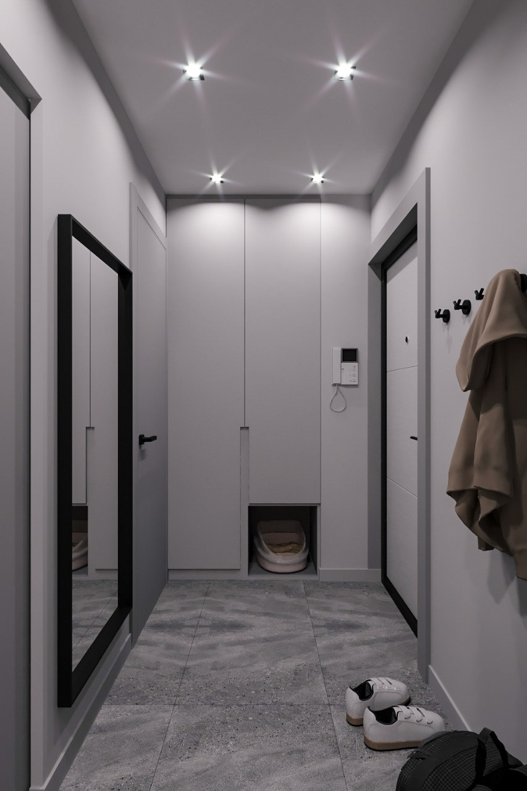
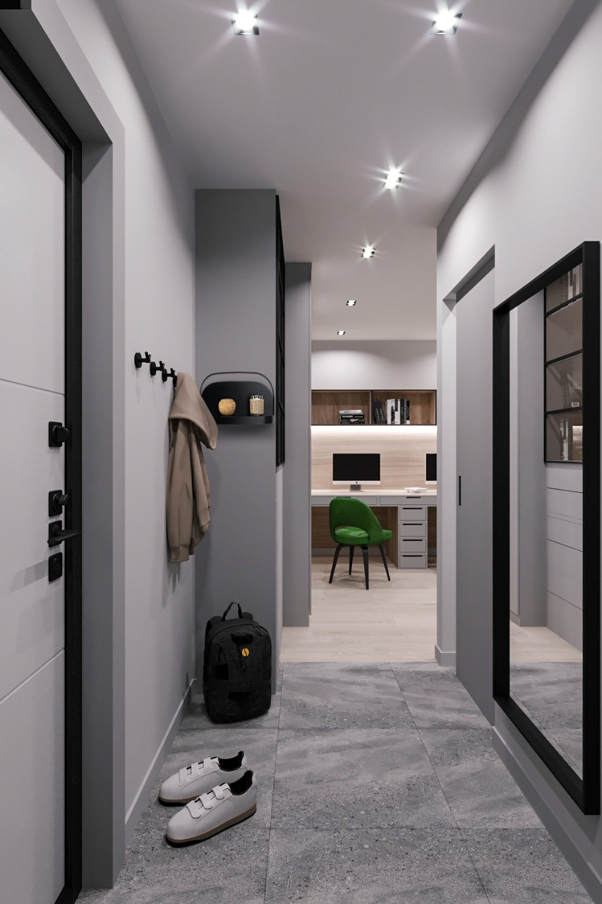

Просторная и выверенная до сантиметров входная зона с первых шагов задаёт эмоциональный тон всей квартире. Доминирующая серая палитра в сочетании с графичными чёрными акцентами формирует стильное, но при этом сдержанное пространство, безупречно соответствующее общей концепции современного минимализма с индустриальными нотками. Напольное покрытие, имитирующее фактуру необработанного бетона, не только визуально усиливает лофтовый характер интерьера, но и обладает абсолютной практичностью — оно устойчиво к влаге, грязи и механическим повреждениям, что критически важно для входной зоны.

Чёткая геометрия мебели и встроенные системы хранения позволяют поддерживать идеальный порядок, надёжно скрывая от глаз всё лишнее. Вместительный гардеробный шкаф выполнен в монохромной гамме и деликатно интегрирован в архитектурную нишу, словно растворяясь в плоскости стены. Особого внимания заслуживает продуманная забота о домашних питомцах: в нижней части шкафа предусмотрена специальная ниша для кошачьего лотка, которая позволяет элегантно скрыть его от посторонних глаз, сохраняя визуальную чистоту и эстетику пространства.

Для повседневной верхней одежды использованы лаконичные чёрные крючки — решение, сочетающее в себе функциональность и минималистичную эстетику. Масштабное зеркало в строгой чёрной раме не только выполняет свою прямую утилитарную функцию, но и работает как мощный оптический инструмент, визуально раздвигая границы помещения и наполняя его дополнительным светом и воздухом.

## Кухня

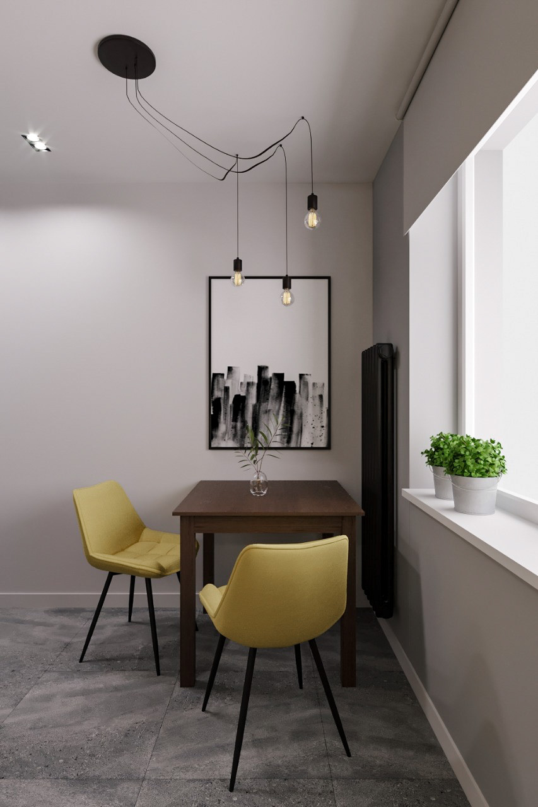
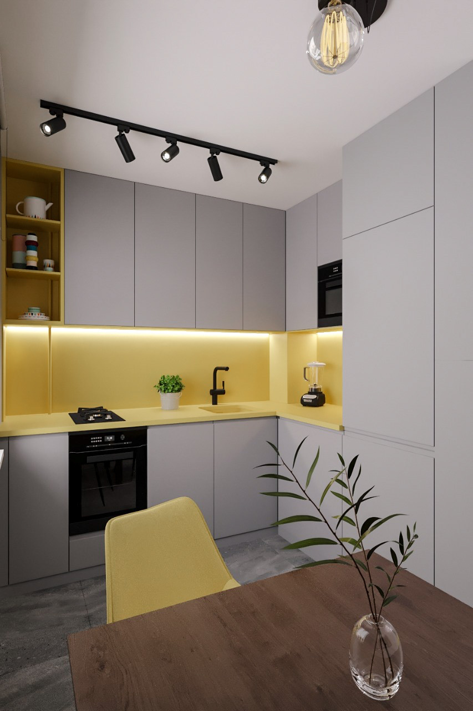
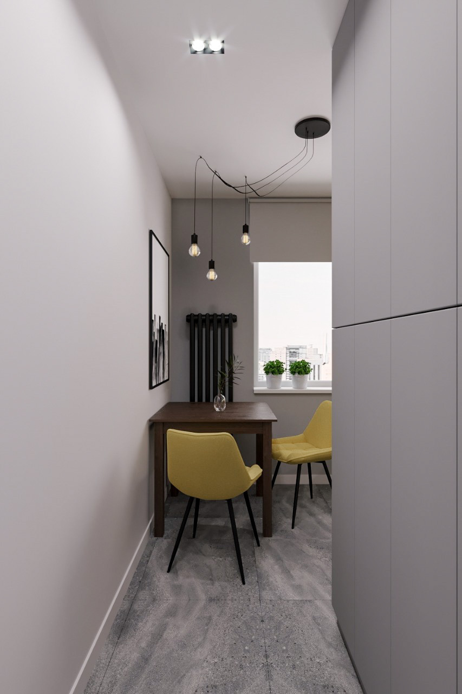

Основой колористической палитры кухни стали сдержанные серые тона, служащие идеальным, спокойным холстом для жизнерадостных желтых акцентов. Этот сочный, энергичный оттенок не только добавляет пространству уюта, но и стал ключом к элегантному решению технической задачи. Кухонный фартук и столешница выполнены в едином желтом цвете, который мы виртуозно использовали для интеграции инженерных коммуникаций: открытую газовую трубу, которую по строгим нормам безопасности нельзя зашивать в глухие короба или скрывать за фасадами, мы выкрасили в тот же оттенок. Благодаря этому смелому приему труба визуально слилась с фоном и открытыми полками, превратившись из вынужденного архитектурного ограничения в оригинальную, почти незаметную дизайнерскую деталь.

Обеденная зона выдержана в эстетике современного индустриального шика. Благородный стол из темного дерева привносит в интерьер архитектурную глубину и природное тепло, а мягкие стулья с желтой обивкой создают визуальный мостик, мастерски связывающий столовую с рабочим блоком в единую гармоничную композицию. Брутальный характер помещения подчеркивают черные металлические каркасы и эффектные подвесные светильники с ретро-лампами Эдисона, добавляющие пространству аутентичного лофтового шарма.

Световой сценарий выстроен максимально продуманно и многослойно. Мобильные трековые системы и направленные точечные споты отвечают за яркое функциональное освещение, необходимое для кулинарных процессов, тогда как деликатная скрытая подсветка рабочей зоны обеспечивает дополнительный визуальный комфорт. Это делает пребывание на кухне по-настоящему приятным и расслабляющим в любое время суток.

## Рабочая зона

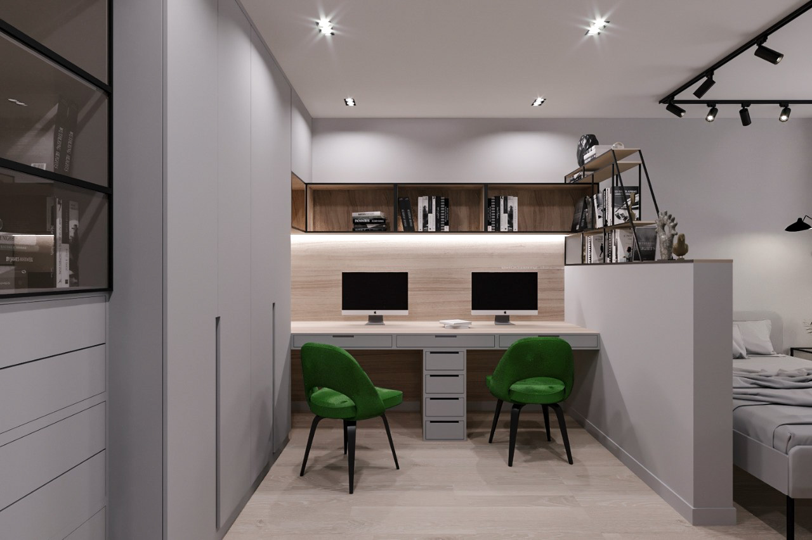
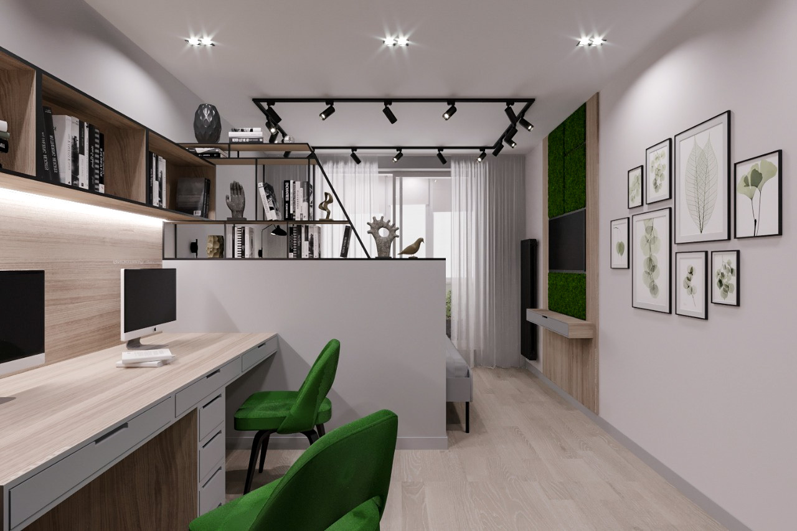
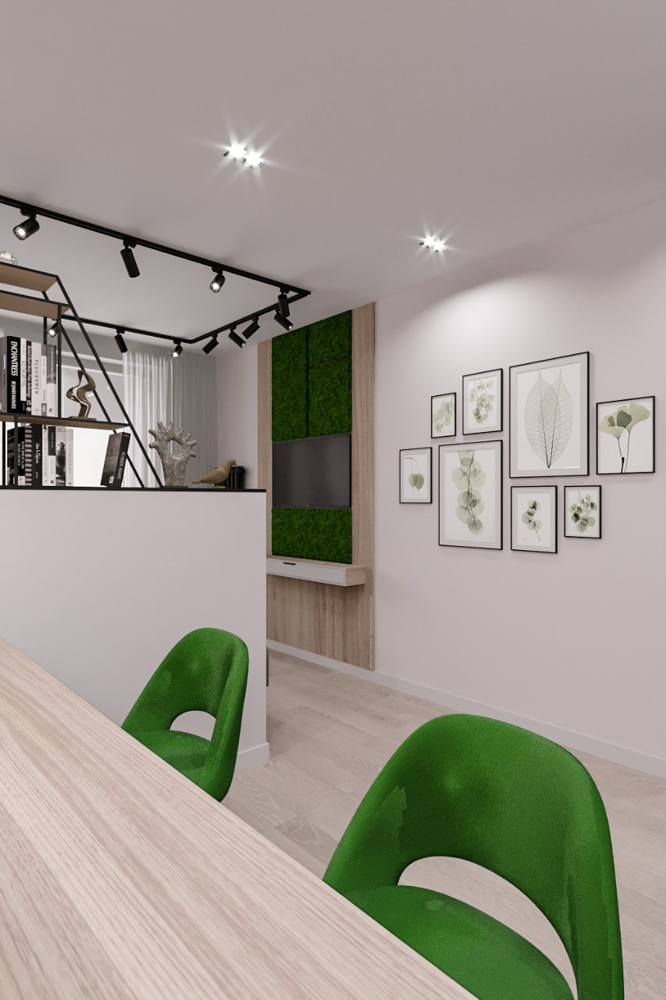
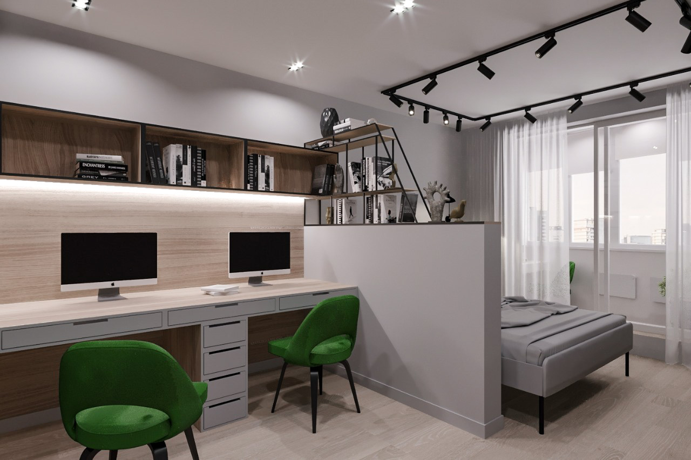
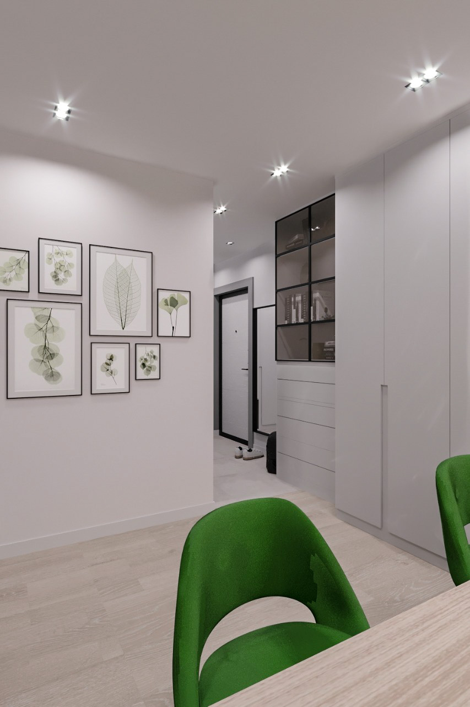

Пространство домашнего офиса спроектировано с безупречной эргономикой, рассчитанной на одновременную и комфортную работу двух человек. Чтобы пользователи не мешали друг другу, мы организовали масштабный письменный стол, центр которого делит вместительная тумба с выдвижными ящиками. Этот приём создаёт чёткие, интуитивно понятные границы личного пространства, сохраняя при этом визуальное единство зоны. Вопросы хранения решены максимально практично: комбинация закрытых шкафов и открытых полок формирует удобную систему, совершенно не перегружающую интерьер.

Фоновая отделка рабочего уголка выполнена в тёплых, тактильных древесных тонах. Это решение мастерски смягчает строгую, холодную серо-чёрную гамму остального пространства, наполняя его природным уютом. Для абсолютного комфорта столешница оснащена встроенной подсветкой, обеспечивающей идеальные условия для концентрации, а воздушные открытые стеллажи придают композиции визуальную невесомость.

Ключевым колористическим акцентом выступают рабочие кресла насыщенного зелёного оттенка. Они не только привносят в сдержанную палитру свежую, жизнерадостную энергию, но и служат важнейшей стилистической связкой. Их цвет элегантно перекликается с эффектным панно из стабилизированного мха в телевизионной зоне, создавая тонкую рифму с природой и поддерживая целостную концепцию всей квартиры.

Особого архитектурного внимания заслуживает перегородка, деликатно отделяющая кабинет от приватной спальной зоны. Она спроектирована в двух уровнях: надёжная нижняя часть из гипсокартона обеспечивает необходимое чувство уединения, тогда как верхняя представляет собой открытый стеллаж на графичном металлическом каркасе с деревянными полками. Этот изящный ход позволяет чётко разграничить функциональные сценарии, совершенно не утяжеляя объём комнаты и сохраняя в ней ощущение света, воздуха и свободы.

## Спальная зона

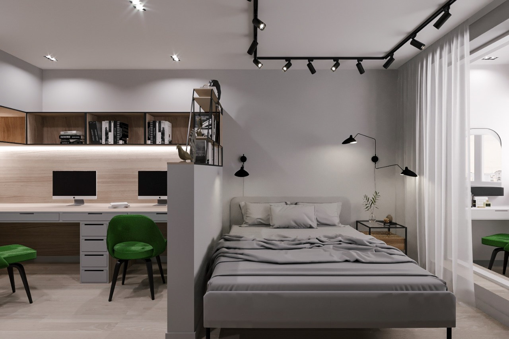
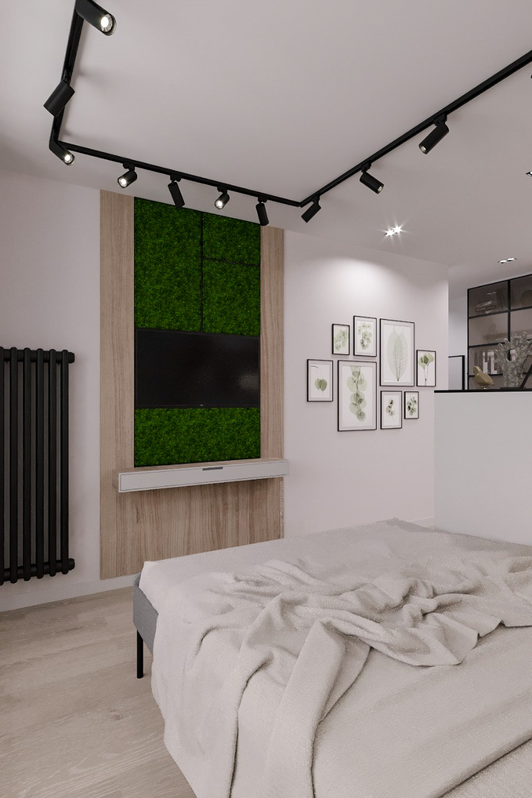

Центром приватного пространства стала уютная кровать в сдержанной серой гамме, облачённая в лаконичный и тактильный текстиль. Зону изголовья дополняют стильные чёрные бра, которые выступают не только в роли выразительного графичного акцента, но и обеспечивают комфортный, направленный свет для вечернего чтения, не тревожащего второго партнёра.

Пространство напротив спального места отведено под телевизионную зону, которая превратилась в главную визуальную доминанту комнаты. Реализуя особое пожелание заказчиков, мы спроектировали стену за экраном как эффектную комбинацию тёплых древесных панелей и масштабной фитостены из стабилизированного мха. Этот смелый природный акцент привносит в строгий серый интерьер живую энергию, свежесть и уникальную фактурность, лишний раз подчёркивая глубоко индивидуальный подход к созданию интерьера.

Атмосферу природного спокойствия деликатно поддерживают минималистичные постеры с ботаническими принтами. Их эстетика изящно перекликается с сочными зелёными акцентами в рабочей и гостиной зонах, выстраивая цельную, бесшовную и гармоничную концепцию всего дома.

Световой сценарий спальни продуман с ювелирной точностью, чтобы максимально раскрыть архитектурный объём помещения. Комбинация мобильных трековых систем, проложенных вдоль потолка, и направленных точечных спотов формирует многослойное, мягкое и при этом функциональное освещение. Этот продуманный свет мастерски выявляет богатство используемых материалов и подчёркивает выразительность каждой детали, создавая идеальную, расслабляющую среду для полноценного восстановления сил.

## Санузел

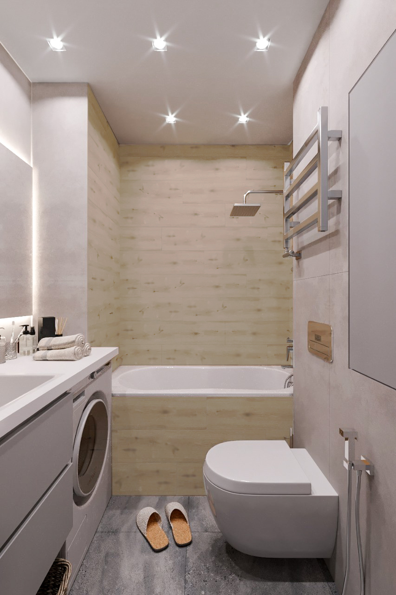
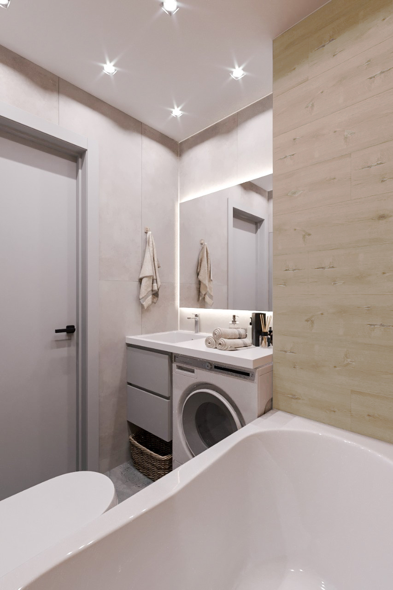
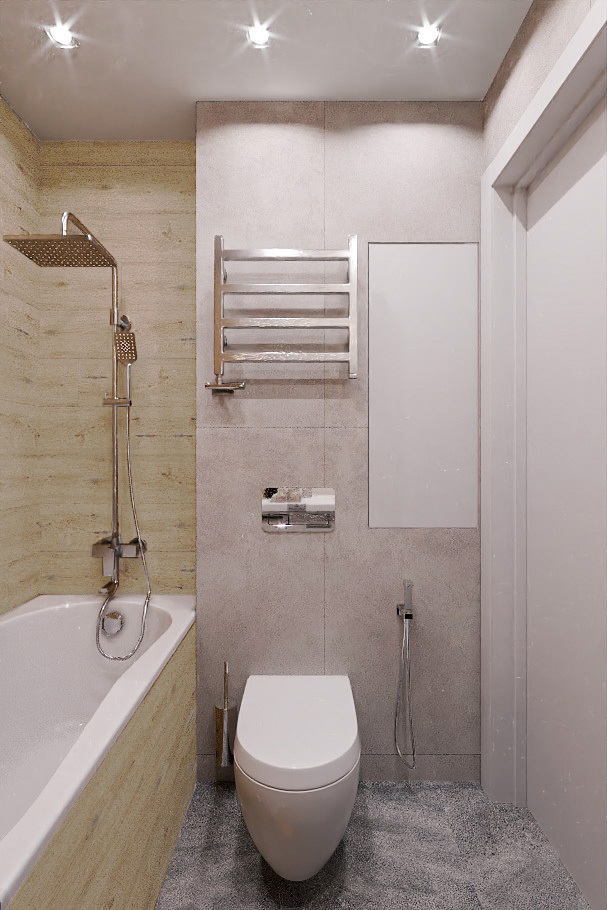

Архитектурные границы этого помещения были деликатно расширены за счёт площади прилегающего коридора. Этот продуманный планировочный ход позволил не только комфортно разместить полноценную чашу ванны, но и интегрировать бытовую зону со стиральной и сушильной машинами. Техника эргономично скрыта под единой монолитной столешницей, объединённой с раковиной, что формирует цельный и визуально безупречный образ. Пространство под зоной умывальника отведено под вместительные выдвижные ящики, обеспечивающие удобное и скрытое хранение бытовой химии и повседневных аксессуаров.

Колористическая палитра санузла выдержана в благородной, сдержанной серой гамме, которая благодаря тонкой игре фактур совершенно не воспринимается холодной или отстранённой. Стену за ванной украшают панели из светлого дерева, привносящие в интерьер тактильное тепло и природную мягкость. На полу же разворачивается эффектный визуальный контраст: серый керамогранит с выразительной фактурой натурального камня добавляет пространству брутальный индустриальный акцент. Подобное сочетание материалов элегантно перекликается с эстетикой лофта, которую заказчики стремились деликатно интегрировать в дизайн своего дома.

Работа с объёмом и светом здесь выстроена безупречно. Масштабное зеркальное полотно, растянувшееся во всю ширину стены над раковиной, мастерски растворяет физические границы помещения, многократно умножая его визуальный простор и свет. Использование подвесного унитаза со скрытой инсталляцией не только экономит драгоценные сантиметры, но и оставляет пол полностью открытым, значительно облегчая процесс уборки. Инженерные коммуникации и бытовые мелочи надёжно спрятаны за фасадами встроенных систем, поддерживая идеальную чистоту линий.

Световой сценарий включает в себя направленные потолочные споты, обеспечивающие равномерный базовый свет, и деликатную скрытую подсветку за зеркалом, создающую камерный уют в зоне умывальника. Завершают композицию строгие металлические детали — лаконичный полотенцесушитель, стильные смесители и минималистичная фурнитура, безупречно поддерживающие общую концепцию современного минимализма.