## Прихожая

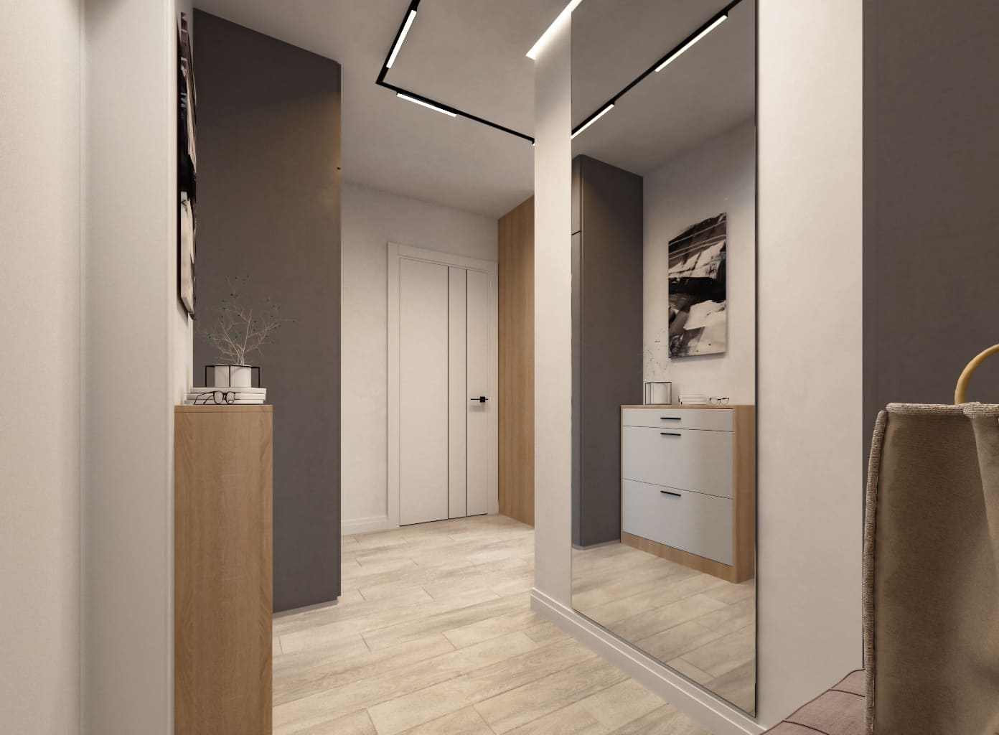
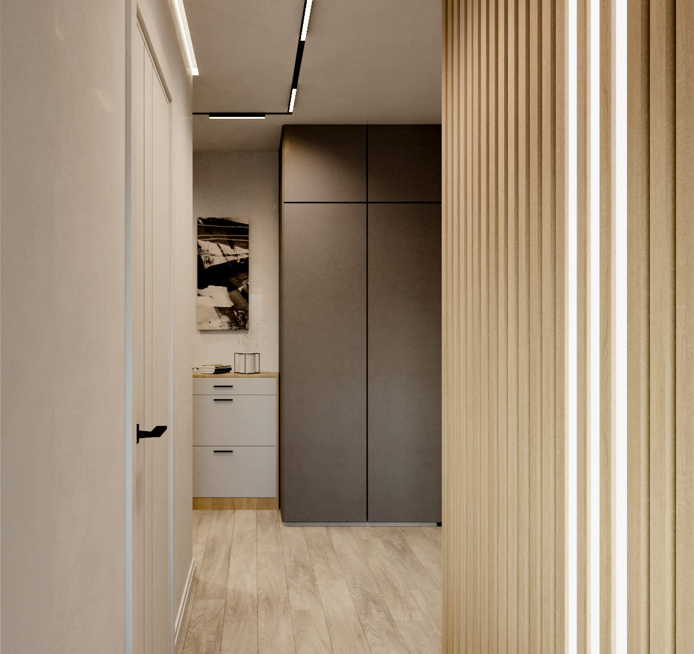 
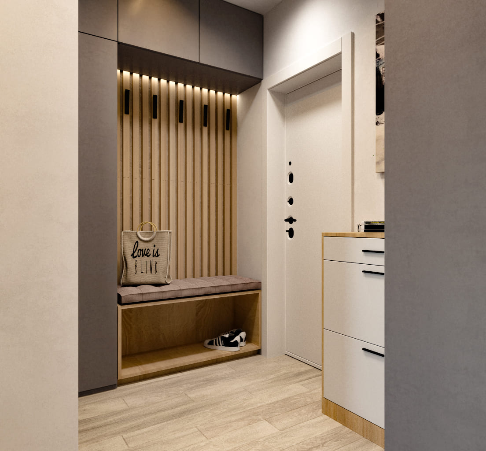  
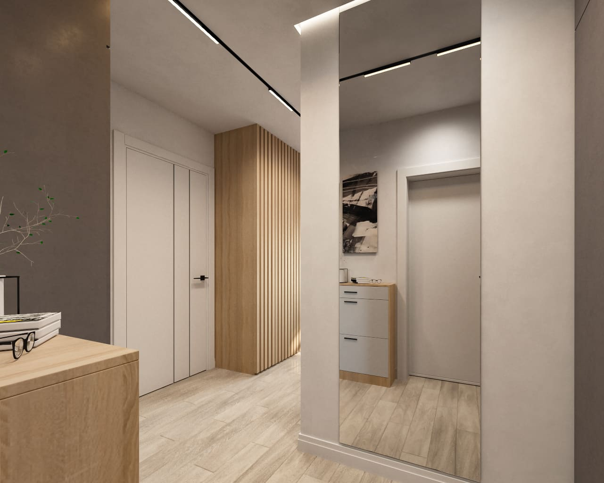  

Этот дизайн-проект однокомнатной квартиры разрабатывался для молодого холостяка. Главными критериями заказчика стали бескомпромиссный комфорт, продуманная функциональность и современная стилистика с выразительными нотками лофта. Одним из ключевых пожеланий также было грамотное зонирование гостиной, чтобы обособить спальное место от лаунж-зоны. Входное пространство квартиры полностью отражает этот практичный и лаконичный подход.

Здесь нет ничего случайного — помещение наполнено лишь теми элементами, которые действительно необходимы в повседневной жизни. Встроенный комплекс включает открытую тумбу для обуви с мягким пуфом-сиденьем, настенную панель с крючками для верхней одежды и вместительный шкаф-пенал, примыкающий сбоку. Для хранения аксессуаров и мелочей предусмотрен крупный напольный комод с тремя секциями: на его столешнице удобно оставить ключи, очки или книгу, а во вместительных ярусах размещаются перчатки, шарфы и головные уборы. На стене напротив входа установлено большое зеркало, которое не только позволяет оценить образ перед выходом, но и визуально раздвигает границы компактного помещения. Рядом с комодом гармонично вписался двустворчатый платяной шкаф.

Визуальный облик прихожей выдержан в духе строгого минимализма с брутальным характером. Чистые линии, выверенная геометрия и полное отсутствие лишних деталей создают ощущение порядка и свободы. Базовая бело-бежевая палитра эффектно разбавлена глубокими антрацитовыми акцентами в отделке пенала и шкафа. Единственным декоративным элементом выступает выразительное абстрактное панно в чёрно-коричнево-белой гамме, расположившееся над комодом. Благодаря интеграции с кухней по принципу открытого пространства, прихожая наполняется естественным светом из её окна и воспринимается значительно просторнее своих реальных размеров.

## Кухня

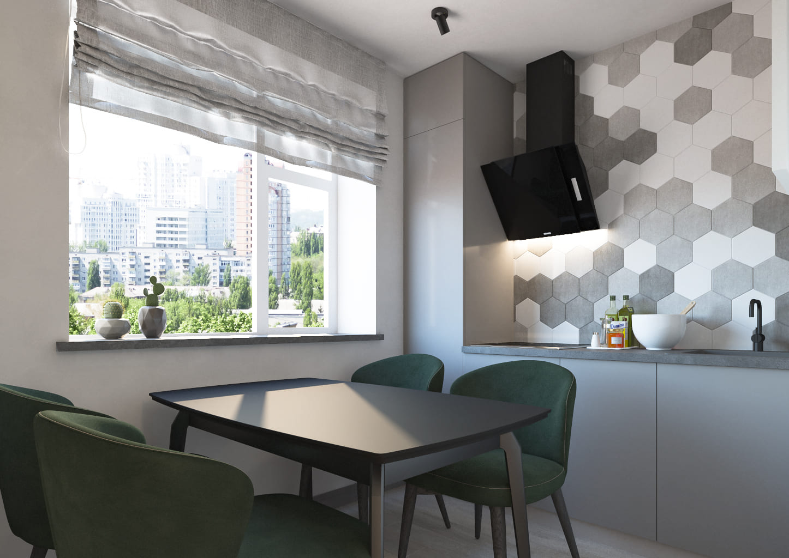
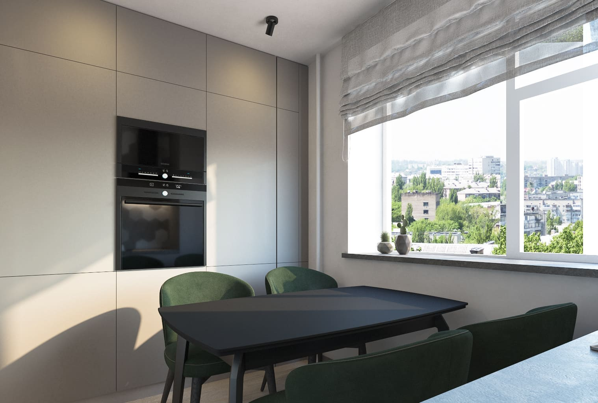
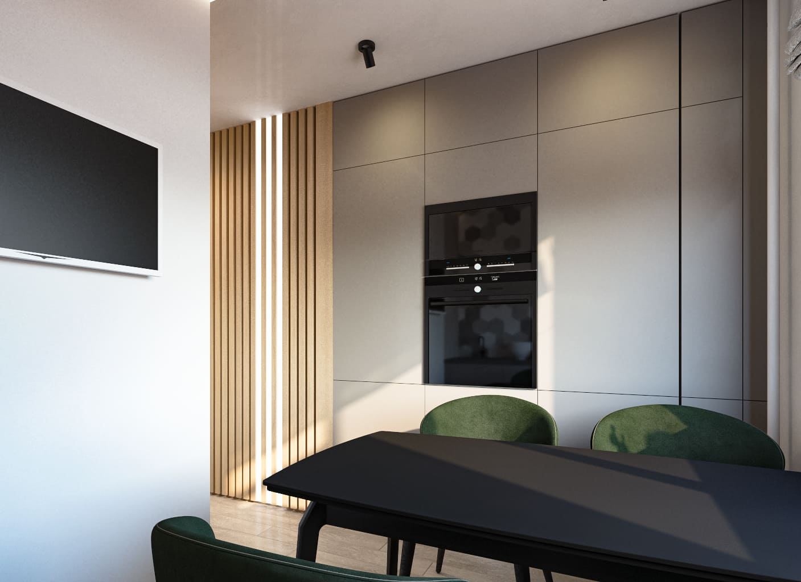
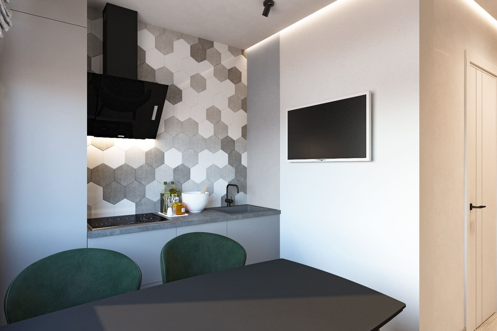

Кухня полностью поддерживает общую концепцию квартиры, выступая эталоном брутальной эстетики, безупречной функциональности и визуальной сдержанности. Пространство логично поделено на два смысловых блока: рабочую зону и столовую.

Кухонный гарнитур имеет двухлинейную планировку. Справа от входа размещена нижняя база со встроенной мойкой, посудомоечной машиной и варочной панелью; верхний ярус шкафов здесь намеренно отсутствует, чтобы сохранить «воздух» и не утяжелять интерьер. Левая линия отдана под колонну с высокой техникой: здесь интегрированы холодильник, духовой шкаф и микроволновая печь. Обеденная группа выглядит основательно и стильно: массивный прямоугольный стол глубокого антрацитового оттенка дополнен мягкими креслами-стульями в благородном защитно-зелёном тоне. На противоположной стене закреплён компактный телевизионный экран.

Оформление интерьера выдержано в строгой, по-мужски лаконичной манере. Графитово-антрацитовые фасады корпусной мебели эффектно сочетаются с текстилем оливково-защитного цвета, а полное отсутствие декоративных деталей лишь подчёркивает минималистичный характер пространства. Благодаря формату open space, органично связывающему кухню с прихожей, помещение не кажется тесным: отсутствие глухих перегородок позволяет ему «дышать» и визуально ощущаться значительно просторнее своих реальных размеров.

## Гостиная-спальня

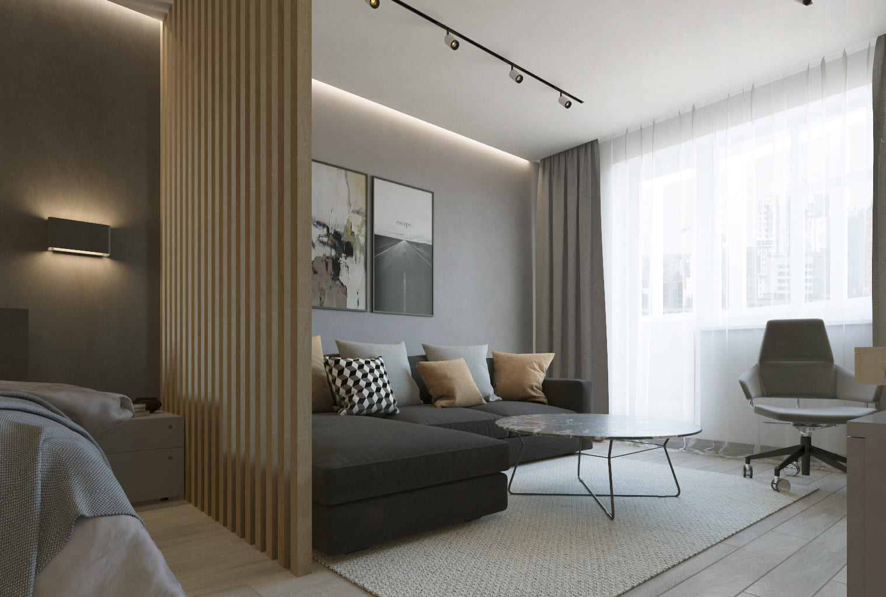
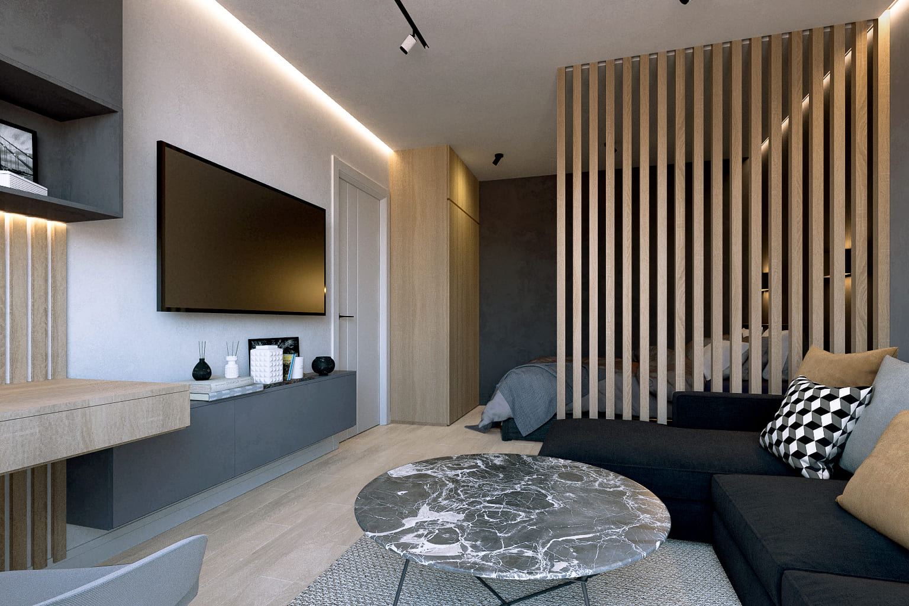
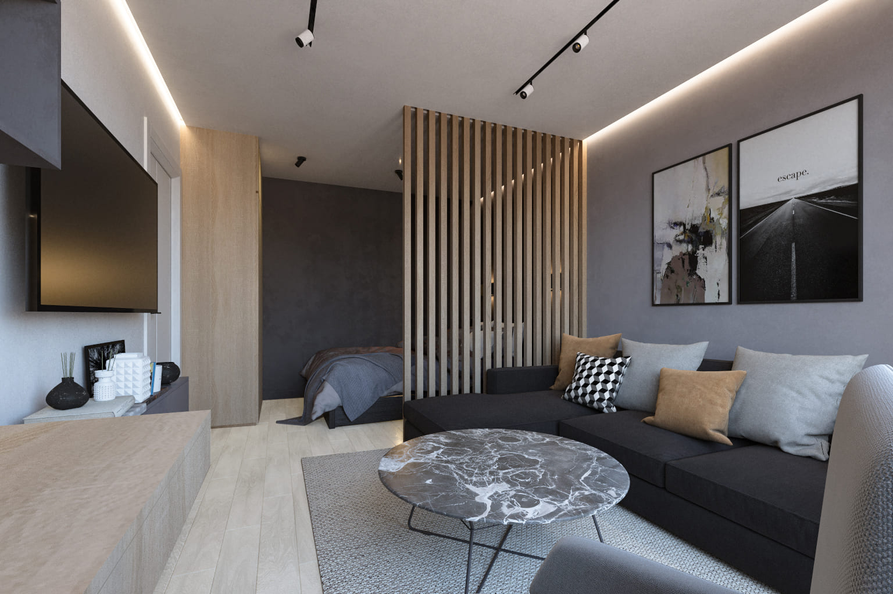
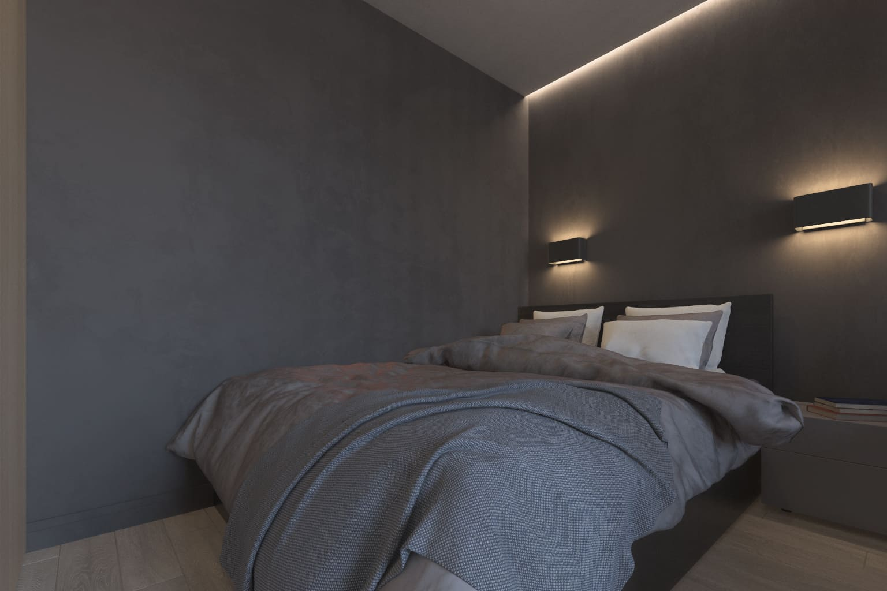
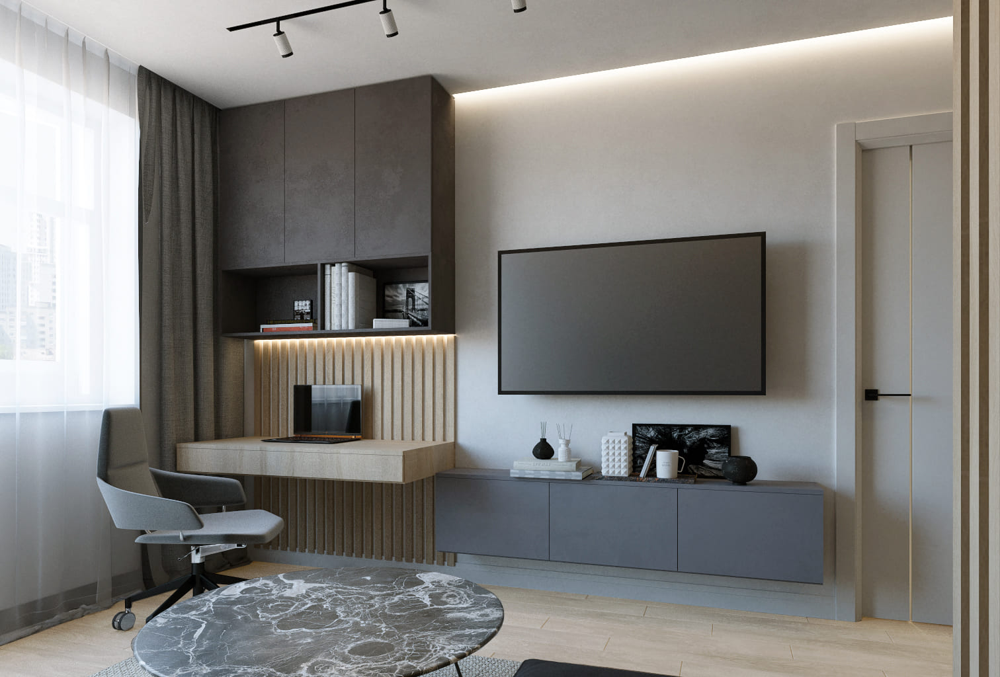

Пространство гостиной-спальни полностью поддерживает заданный вектор на функциональность, визуальную сдержанность и брутальную эстетику. Интерьер выдержан в единой стилистике и цветовой гамме: базовый белый цвет стен и потолка служит идеальным фоном для тёплых бежевых древесных фактур и графитово-антрацитовой отделки мебели в духе лофта. Декор здесь сведён к абсолютному минимуму. Следуя пожеланию заказчика, комнату удалось грамотно разделить на два независимых сценария — приватную спальную зону и открытую гостиную. Визуальной границей между ними выступила перегородка из бежевых деревянных реек, создающая эффект «комнаты в комнате» и обеспечивающая необходимое чувство уединения и расслабления.

Спальный блок оформлен в лучших традициях мужского лофта. Центром композиции стала просторная двуспальная кровать, дополненная напольной прикроватной тумбой и компактным двустворчатым шкафом. В отделке преобладают глубокие антрацитовые тона: они читаются в оформлении акцентной стены, изголовья кровати и строгих минималистичных бра. Тёмно-серая тумба и фактурный текстиль — тяжёлое одеяло и покрывало — лишь усиливают эту суровую, но притягательную эстетику.

Зона отдыха сформирована вокруг вместительного углового дивана и массивного круглого журнального стола. На противоположной стене закреплена телевизионная панель с лаконичной тумбой. Эта часть интерьера также отличается прямолинейностью форм и брутальным характером: строгая геометрия, антрацитово-серая палитра и два выразительных панно с сугубо мужским характером, украсившие стену над диваном.

По настоятельной просьбе хозяина квартиры в пространство органично интегрирован мини-кабинет. Он включает подвесную столешницу для работы, эргономичное компьютерное кресло и навесной шкаф, комбинирующий открытые полки для книг и глухие секции для хранения. Дизайн рабочего уголка полностью соответствует общей концепции: чёткие прямые линии, лаконичный графитовый шкаф и строгое кресло подчёркивают его деловой и маскулинный настрой.

Несмотря на обилие тёмных, брутальных деталей, интерьер не производит мрачного или давящего впечатления. Этот баланс достигается за счёт светлой базы — белых стен и потолка, а также тёплых бежевых акцентов в виде деревянных реек, элементов мебели и натурального текстиля. Важную роль играет и продуманный световой сценарий: скрытая потолочная подсветка создаёт мягкую, обволакивающую атмосферу, а яркие акцентные бра в спальной зоне обеспечивают необходимый уровень освещённости, делая пространство объёмным и по-настоящему уютным.

## Ванная комната

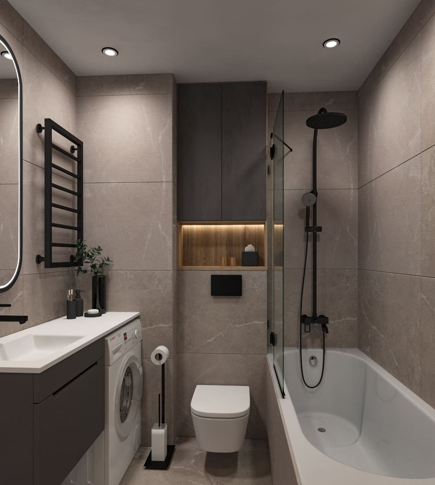
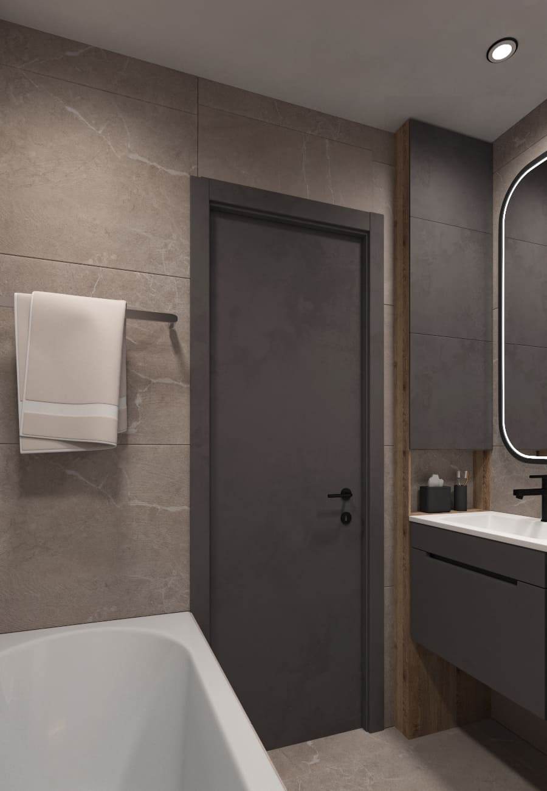

Санузел полностью поддерживает заданную концепцию квартиры, воплощая в себе брутальную эстетику, безупречную эргономику и лаконичность лофта. Пространство организовано предельно рационально, где каждый элемент подчинён практическому смыслу и не терпит ничего лишнего.

Наполнение комнаты включает всё необходимое для комфортного быта: ванну, подвесную тумбу с интегрированной раковиной, над которой парит изящное овальное зеркало, а также современный подвесной унитаз. Чтобы оптимизировать площадь, стиральная машина была встроена в единую мебельную композицию, разделив одну общую столешницу с зоной умывания.

Вопросы хранения решены деликатно и скрытно. У входа, в зоне раковины, установлен узкий шкаф-пенал с глухими фасадами, а в нише над инсталляцией оборудована открытая полка с эффектной скрытой подсветкой. Для повседневного комфорта над чашей ванны закреплён минималистичный держатель для полотенец, а пространство над стиральной машиной дополнено практичным полотенцесушителем.

Визуальный облик ванной выдержан в строгой, по-мужски сдержанной палитре. Глубокий антрацитовый оттенок доминирует в дизайне дверей, мебельных фасадов и модуле инсталляции, а стены облицованы керамогранитом в благородных кофейно-коричневых тонах. Чтобы интерьер не казался излишне тяжёлым или мрачным, эту тёмную гамму эффектно уравновешивает белоснежная сантехника. Чистый белый цвет ванны, раковины и унитаза привносит в пространство необходимый контраст, свежесть и идеальный визуальный баланс.