## Прихожая

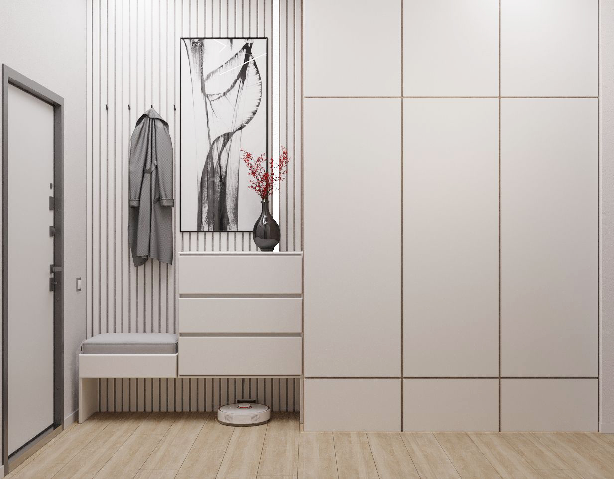
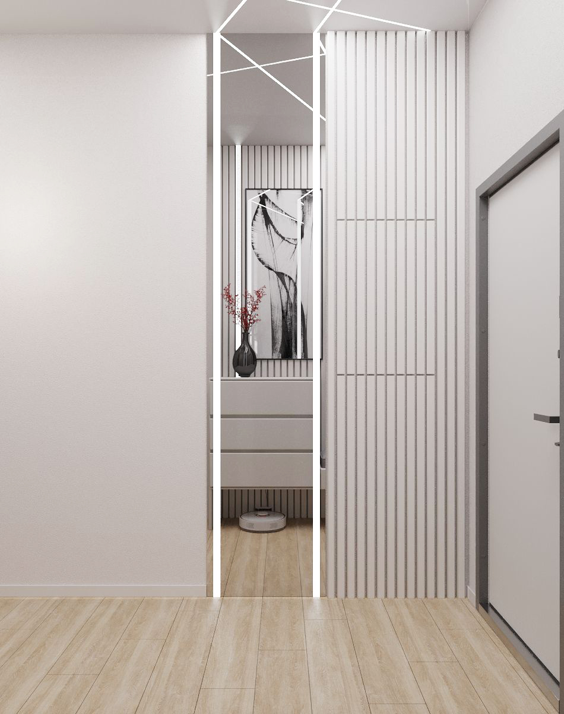

Входная группа с порога задаёт тон всему жилью, демонстрируя безупречную чистоту линий и спокойную архитектурную гармонию. Стены декорированы вертикальными панелями, которые не только задают пространству выразительный ритм, но и визуально вытягивают пропорции помещения. Объёмная система хранения мастерски замаскирована: вместительный встроенный шкаф полностью забирает на себя функцию размещения верхней одежды и бытовых принадлежностей, не перегружая интерьер. Зона для комфортного переобувания представлена элегантной банкеткой с мягким сиденьем, в нижней части которой предусмотрена практичная ниша для базы робота-пылесоса и повседневной обуви. Сдержанную эстетику холла оживляет выразительное абстрактное полотно с графичным рисунком, привносящее в обстановку авторский характер. А завершает композицию зеркальная вставка, дополненная чёткой геометричной подсветкой, — приём, который многократно умножает глубину помещения и придаёт ему современное, технологичное звучание.

## Кухня-гостиная

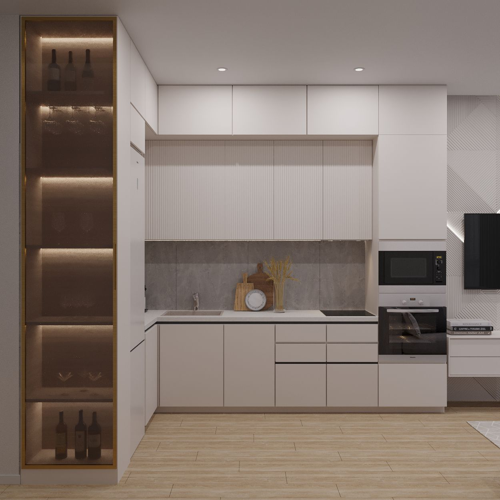
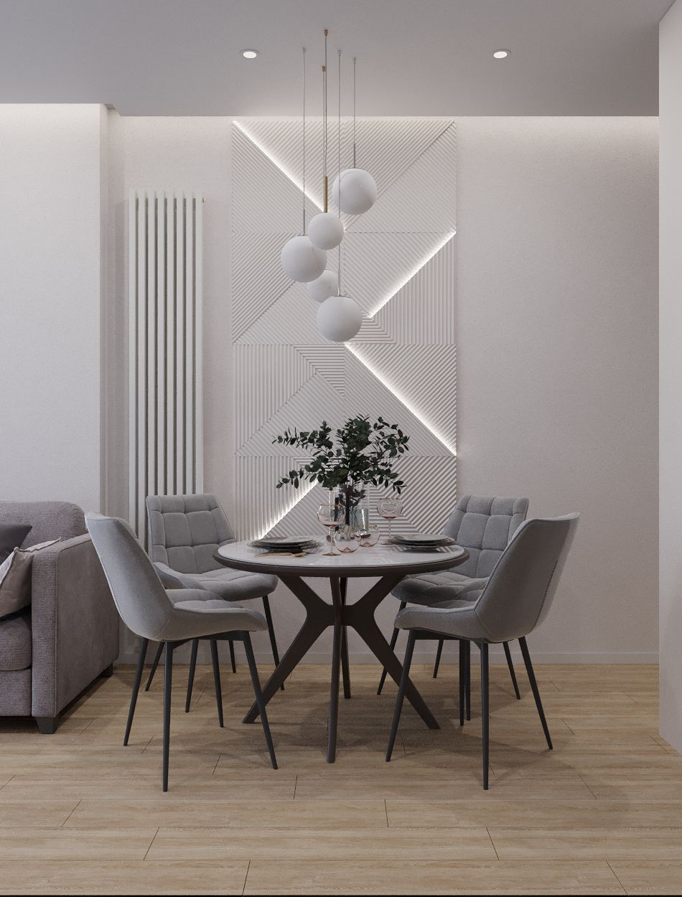
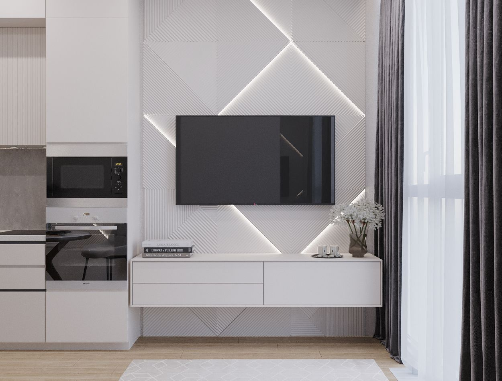
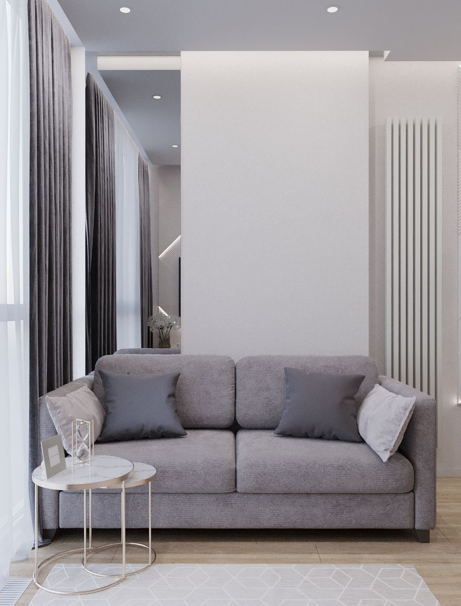

Рабочая зона кухни решена в деликатной светлой палитре. Гладкие фасады, намеренно лишённые видимой фурнитуры, безупречно продолжают общую минималистичную эстетику пространства. Монолитность глухих шкафов эффектно разбивает архитектурная ниша: стеклянные полки с интегрированной мягкой подсветкой становятся притягательным визуальным центром, привносящим в строгий интерьер необходимую глубину и уют.

Столовая группа выделена в самостоятельный смысловой блок. Композиция строится вокруг элегантного круглого стола в окружении комфортных мягких стульев. Фоном для неё служит выразительная рельефная панель со скрытым светом, что формирует камерную, по-настоящему ресторанныю атмосферу для неспешных трапез.

Пространство гостиной сформировано просторным, располагающим к отдыху диваном, который дополняют изящные, визуально невесомые приставные столики, расположившиеся у самого окна. Медиазона стала ярким архитектурным акцентом: стена за телевизором декорирована объёмными панелями, геометрию которых подчёркивает динамичная диагональная подсветка. Этот смелый приём не только придаёт обстановке актуальное, современное звучание, но и безупречно собирает весь интерьер в единую, выверенную картину.

## Спальня

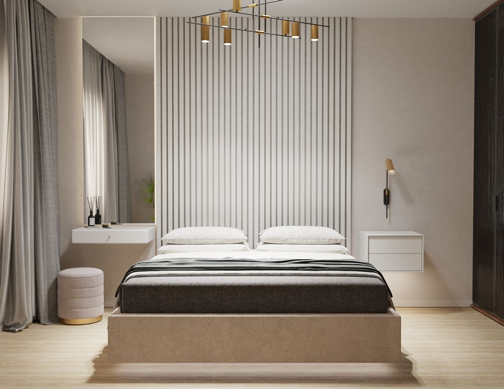
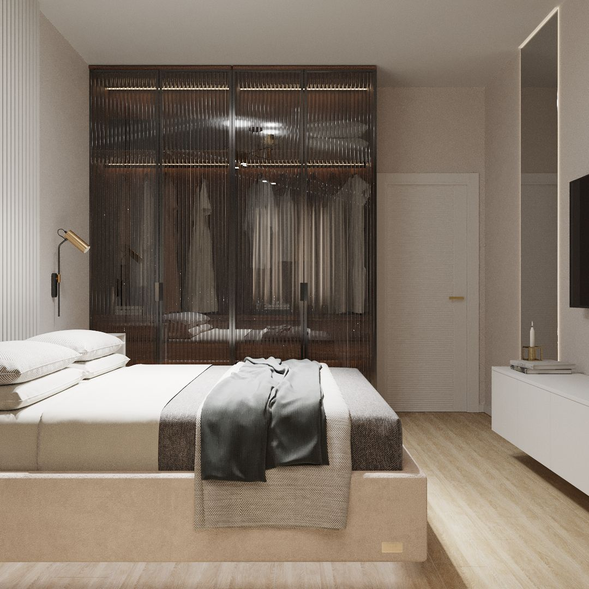

Интерьер этой комнаты выстроен на принципах сдержанной эстетики и безупречного уюта. Воздушная светлая база, обогащённая сложными серо-бежевыми нюансами, формирует умиротворяющую, обволакивающую атмосферу — идеальное пространство для полноценного отдыха и восстановления сил после напряжённого дня.

Архитектурной доминантой спальни выступает масштабное мягкое изголовье кровати. Ритмичное чередование вертикальных панелей, деликатно подчеркнутое скрытой подсветкой, не только задаёт помещению чёткую геометрию, но и становится главным визуальным магнитом, притягивающим взгляд.

Наполнение пространства по обе стороны от спального места продумано с ювелирной точностью. Слева расположилась элегантная зона будуара: изящный туалетный столик дополнен высоким зеркальным полотном, которое мастерски работает на оптическое расширение объёма комнаты. Правую сторону поддерживает лаконичная прикроватная тумба, над которой расположилось настенное бра с фурнитурой из благородного матового золота, добавляющее интерьеру тонкого шика.

Отдельного внимания заслуживает подход к организации хранения. Вместо традиционного глухого шкафа здесь спроектирован гардероб с прозрачными стеклянными фасадами и внутренней подсветкой. Этот приём превращает утилитарную функцию в полноценный декоративный элемент: содержимое шкафа выглядит безупречно организованно, а сама комната обретает дополнительную глубину, визуальную лёгкость и современный лоск.

## Ванная комната и туалет

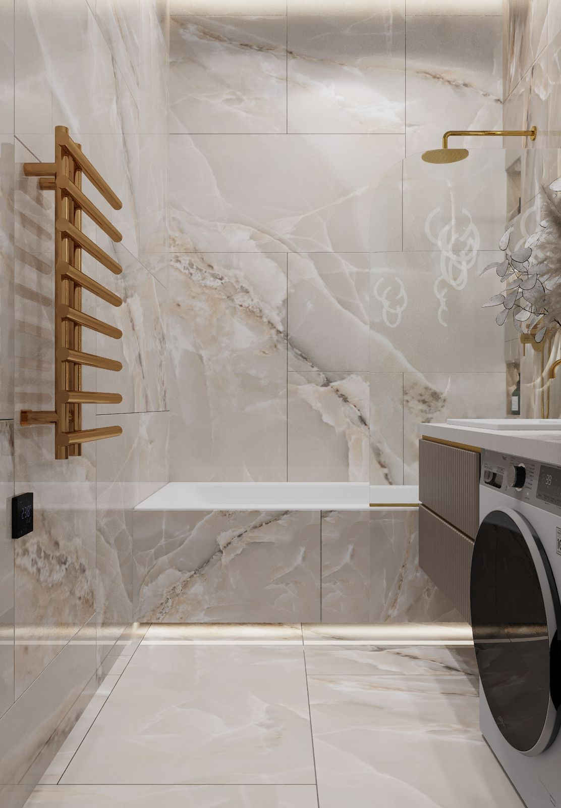
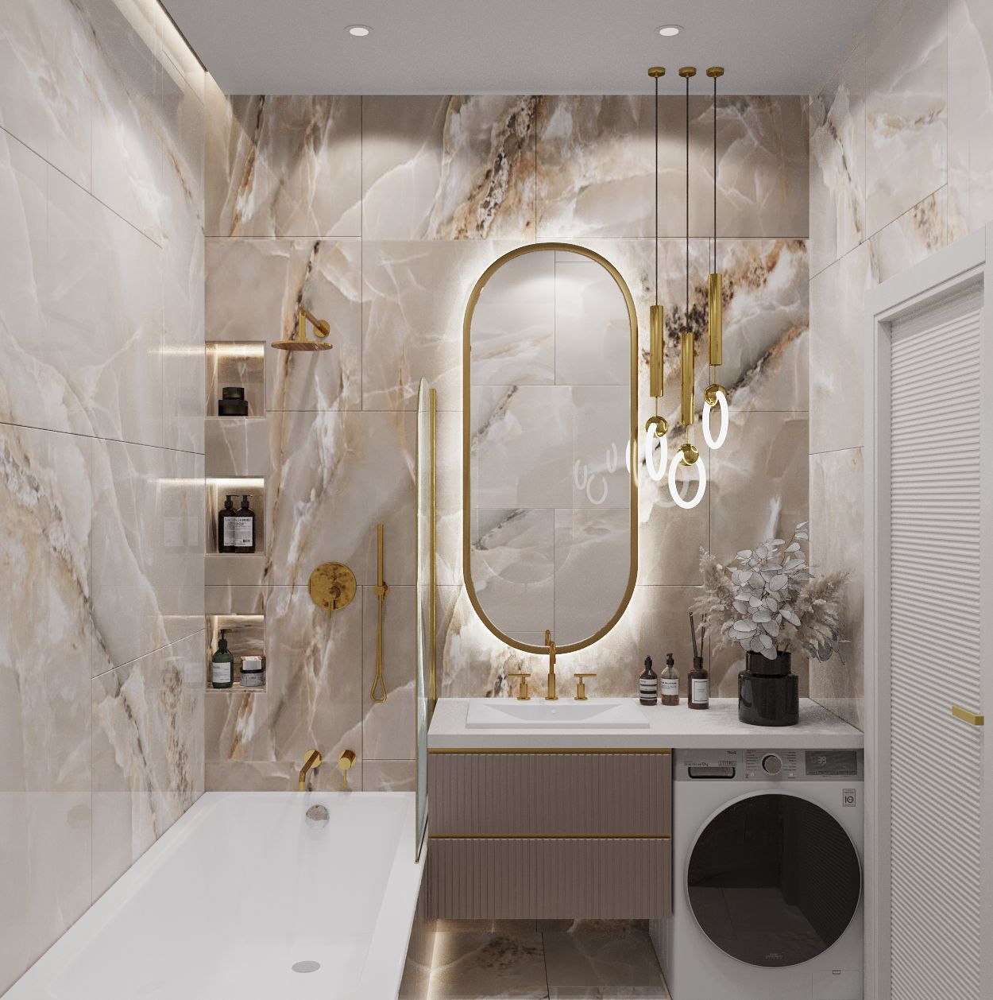
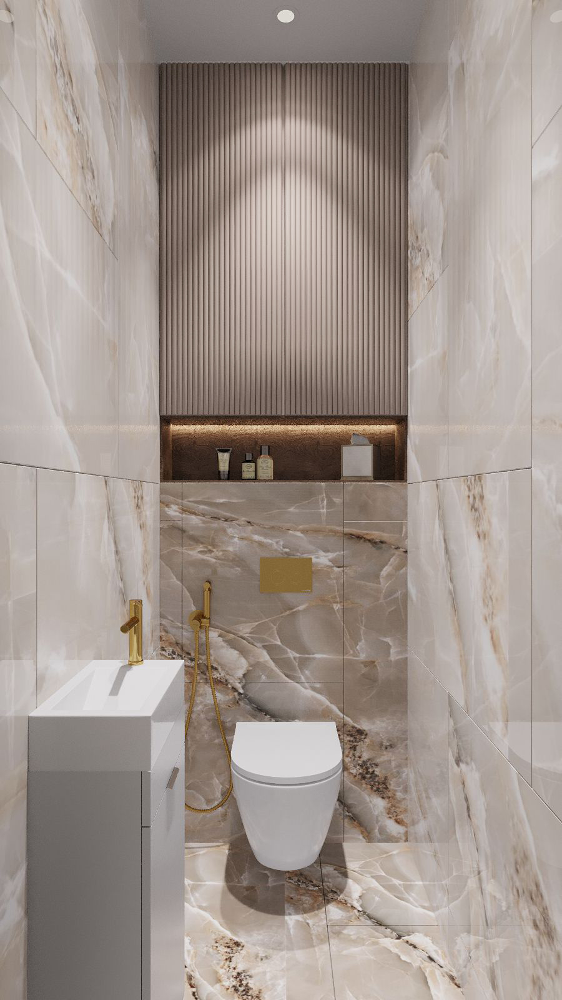

Интерьер ванной выстроен в тёплой, обволакивающей палитре натурального камня. Плавные, живописные прожилки на поверхности плитки создают иллюзию глубины и наполняют пространство мягким, рассеянным светом. Благородные золотистые акценты в сантехнической фурнитуре наделяют обстановку ощущением статусности, оставаясь при этом в рамках сдержанной элегантности, без малейшего намёка на вычурность.

Ощущение простора и архитектурной цельности усиливается за счёт продуманной работы со светом и отражениями: лаконичное зеркало в тонкой металлической раме, дополненное деликатной подсветкой, многократно умножает объём помещения. Пространство под широкой монолитной столешницей использовано максимально прагматично — туда эргономично интегрирована стиральная машина, что позволило сохранить безупречную эстетику, не жертвуя бытовой функциональностью.

Архитектурные ниши со встроенной подсветкой стали изящным решением для хранения уходовой косметики и банных принадлежностей, привнося в интерьер дополнительный уют. А сама чаша ванны, отличающаяся строгими, прямолинейными формами, безупречно поддерживает общий минималистичный ритм пространства, не выбиваясь из заданной концепции.

Гостевой санузел стал логическим продолжением ванной комнаты благодаря использованию идентичных отделочных материалов. Такой приём обеспечивает бесшовный визуальный переход между помещениями, поддерживая ощущение единого, цельного интерьера.

Архитектурной доминантой небольшого пространства стала декоративная панель с ритмичными вертикальными рейками, подчеркнутыми скрытой подсветкой. Этот приём не только добавляет помещению визуальной глубины и объёма, но и задаёт выразительный геометрический акцент. Вопросы хранения решены скрытно и деликатно: встроенная система позволяет поддерживать безупречный порядок, не перегружая интерьер лишними деталями и сохраняя его минималистичную чистоту.
