## Прихожая

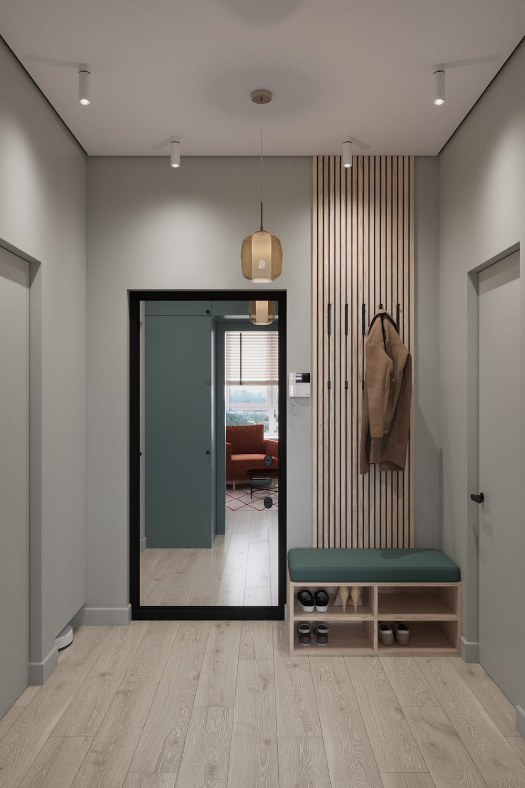
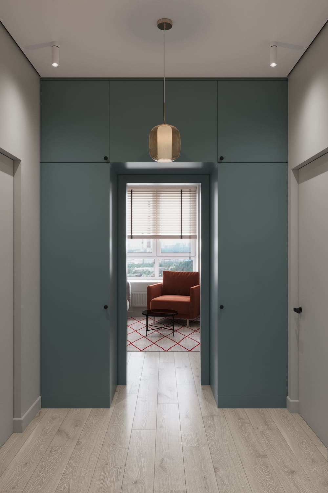  

Входная зона встречает гостей деликатной природной гаммой: мягкий шалфей, светлые древесные фактуры и строгий графит. Эта сдержанная палитра не утомляет взгляд, а сразу настраивает на домашний лад. Вопрос хранения решён безупречно и скрытно: высокий шкаф-купе вмонтирован в архитектурную нишу и визуально сливается с плоскостью стен. Для повседневного сценария выделена открытая секция: вертикальные рейки с крючками и удобная банкетка с мягким сиденьем образуют идеальную систему, где обувь аккуратно убрана в нижний ярус, а верхняя одежда и сумки всегда находятся под рукой.

Визуально раздвигает границы компактного холла лаконичное зеркало в чёрном графичном обрамлении, придающее пространству дополнительную глубину и воздух. Световой сценарий построен на тёплых температурах: комбинация акцентного подвесного светильника и направленных потолочных спотов создаёт мягкую, обволакивающую атмосферу. Завершает образ напольное покрытие с тактильной и визуальной фактурой светлого дерева, которое привносит в интерьер необходимое тепло и уют.

## Кухня-гостиная

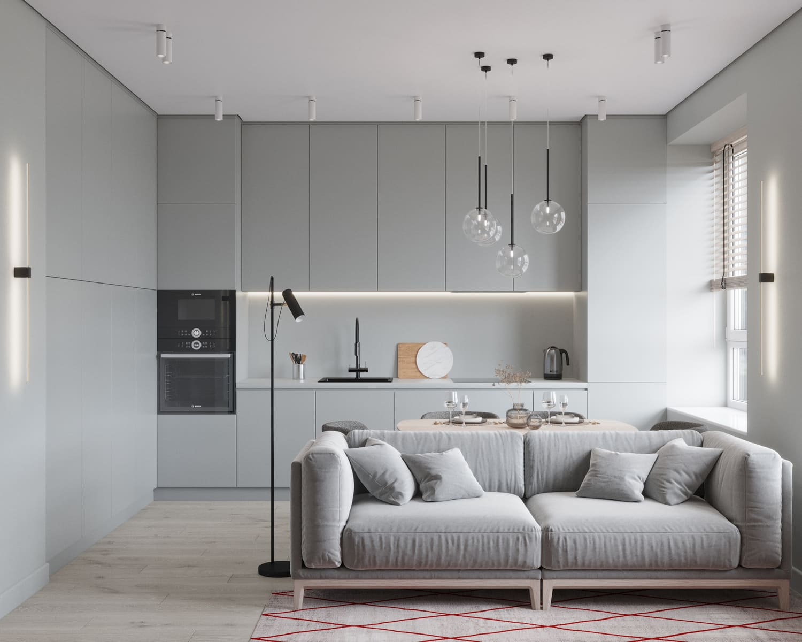
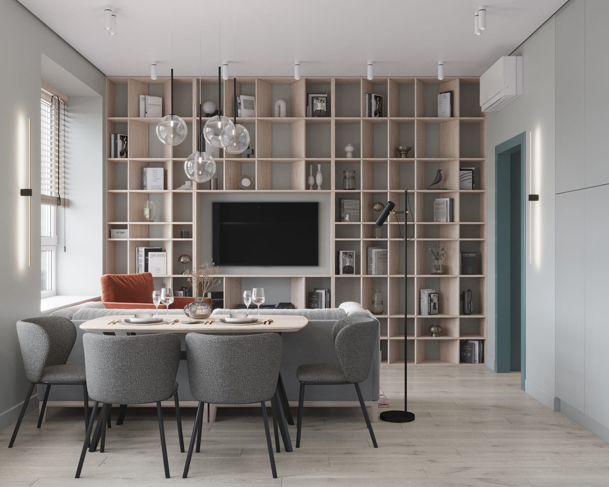
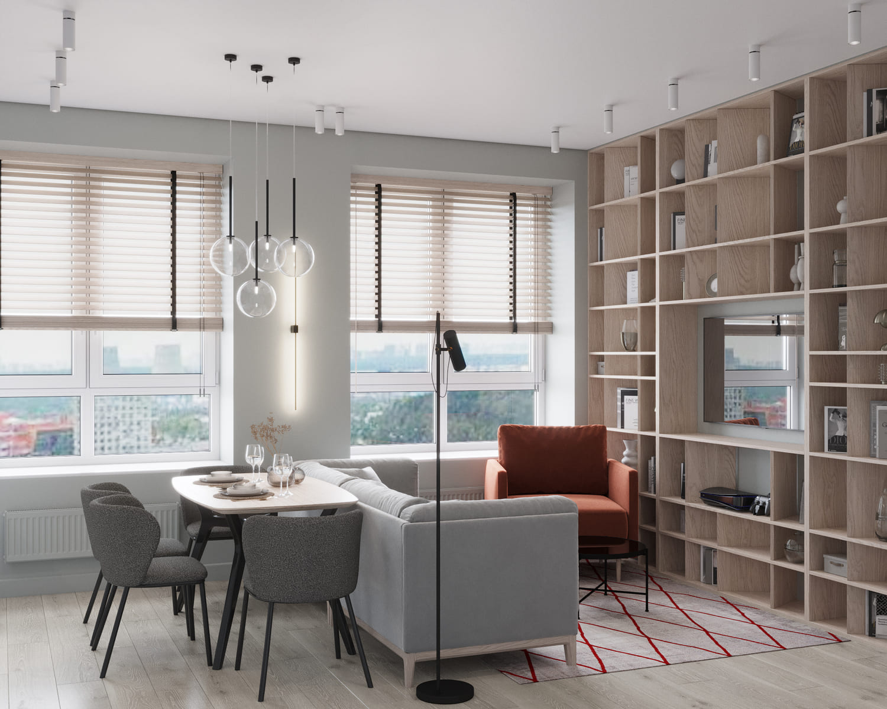
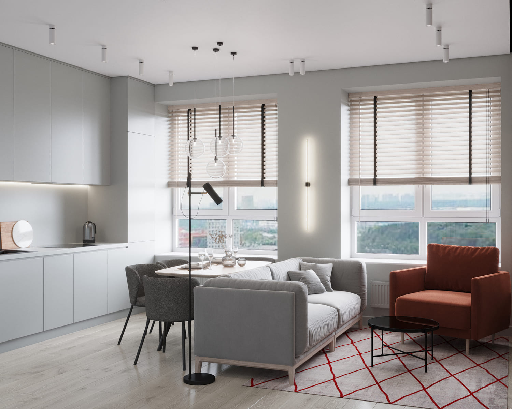

Кухонный блок решён в деликатной светло-серой гамме. Фасады намеренно лишены видимой фурнитуры, а вся бытовая техника скрыта, благодаря чему гарнитур воспринимается как цельная, почти архитектурная форма. Системы хранения полностью спрятаны за глухими дверцами, что поддерживает в интерьере визуальную чистоту и порядок. Для повседневного комфорта рабочая поверхность оснащена эргономичной встроенной подсветкой, обеспечивающей идеальные условия для кулинарных процессов.

Обеденная группа расположилась у окна, в непосредственной близости от дивана. Это практичное и многофункциональное решение: стол одинаково успешно используется как для семейных трапез, так и в качестве удобного рабочего места для учёбы или удалённых задач. Композиция из трёх подвесных светильников над столом формирует уютную, камерную атмосферу, располагающую к неспешным ужинам и тёплому общению.

Зона релаксации сформирована просторным мягким диваном и креслом насыщенного терракотового оттенка. Именно этот предмет мебели выступает главным цветовым акцентом, эффектно оживляющим сдержанную нейтральную палитру комнаты. Гибкости световому сценарию добавляет стильный напольный торшер, позволяющий легко адаптировать уровень освещённости под настроение и время суток.

Ключевым элементом, деликатно разделяющим пространство, выступает стенка с открытым стеллажом. Эта конструкция не только зонирует комнату, но и берёт на себя основную нагрузку по хранению, с лёгкостью вмещая всё: от домашней библиотеки до гаджетов. Ниша для телевизора вписана в композицию стеллажа предельно тактично, не перегружая интерьер и сохраняя его визуальную лёгкость.

## Спальня

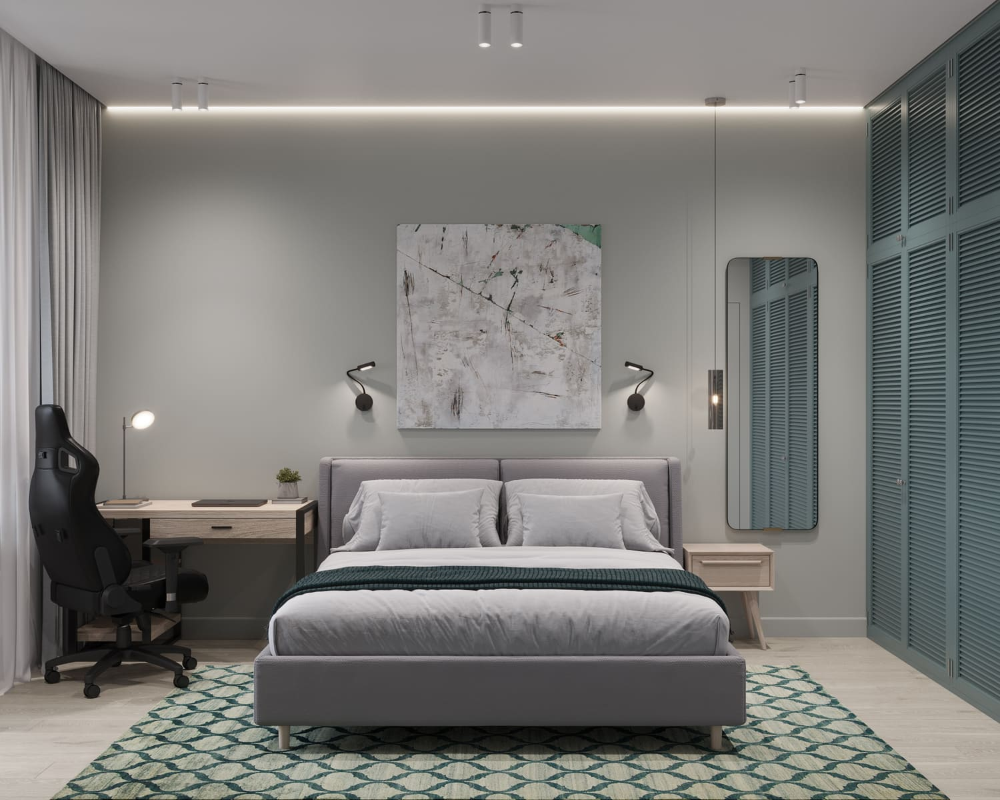
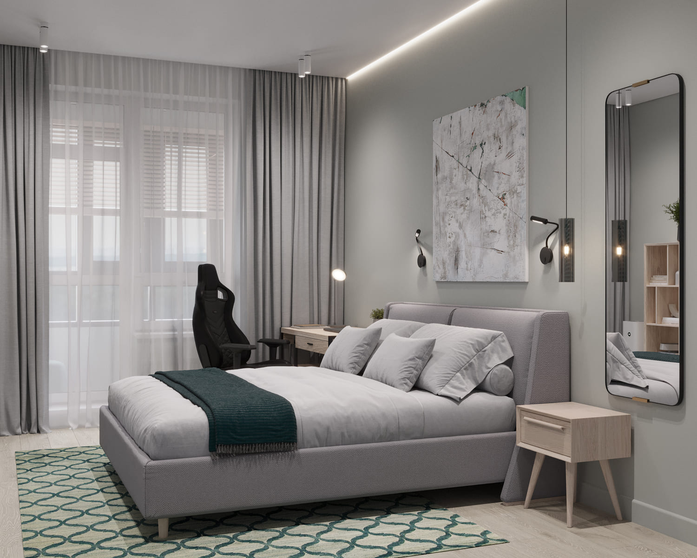
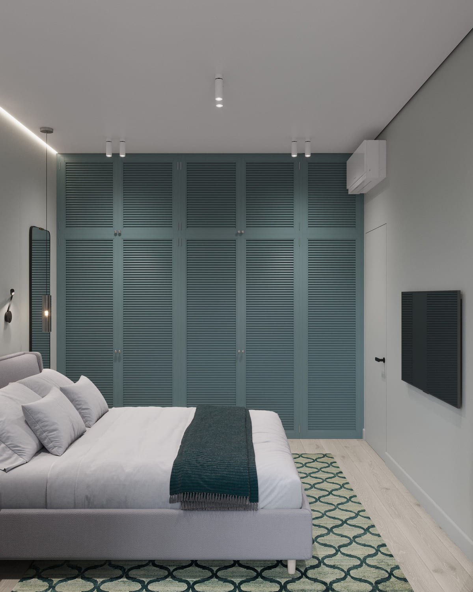
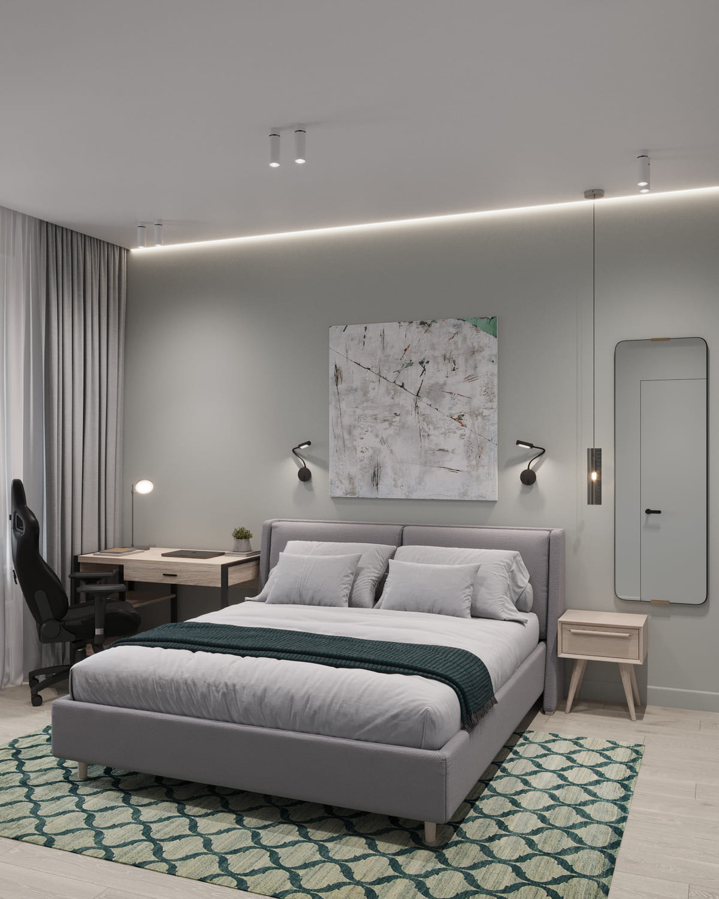
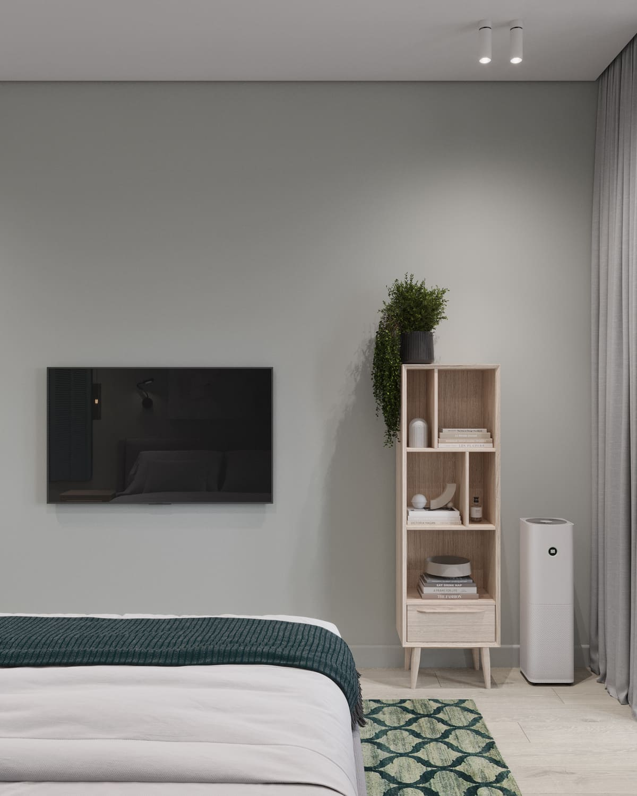

Спальня, выступающая сердцем этой квартиры, мастерски объединяет в себе сразу несколько жизненных сценариев: это и полноценная зона отдыха, и домашний офис, и личное пространство хозяина. Интерьер выстроен на принципах спокойствия и выверенной эргономики: приглушённая природная палитра, деликатный свет и обволакивающий уют создают идеальную среду для восстановления сил.

Центром композиции стала просторная кровать с мягким, тактильным изголовьем, по обе стороны от которой расположились симметричные прикроватные тумбы. Стену над спальным местом украшает выразительное абстрактное панно, задающее комнате особое настроение, а изящные подвесные светильники обеспечивают комфортное локальное освещение. Воздушности интерьеру добавляет зеркало на тонком, почти невесомом подвесе — деталь, которая привносит в пространство чувство лёгкости и отсутствия лишних визуальных преград.
Вопросы хранения решены максимально деликатно: вдоль одной из стен выстроен вместительный гардеробный блок. Его фасады выполнены в эстетике шаттерсов, что придаёт шкафу аккуратный, архитектурный вид. Благодаря такому приёму массивная система хранения визуально уходит на второй план, не перегружая объём комнаты, но сохраняя безупречную функциональность.

Рабочая зона логично расположилась у окна, в месте с лучшим естественным освещением. Здесь установлены лаконичный письменный стол и современное эргономичное геймерское кресло — идеальная связка для продуктивной учёбы или онлайн-активностей. При этом визуальный шум полностью исключён: вся оргтехника и кабельная группа надёжно скрыты от глаз.

Сценарий досуга поддерживает настенный телевизор, а завершает образ открытый стеллаж, где разместились предметы декора и личные вещи, наделяющие комнату характером и индивидуальностью.

## Ванная комната

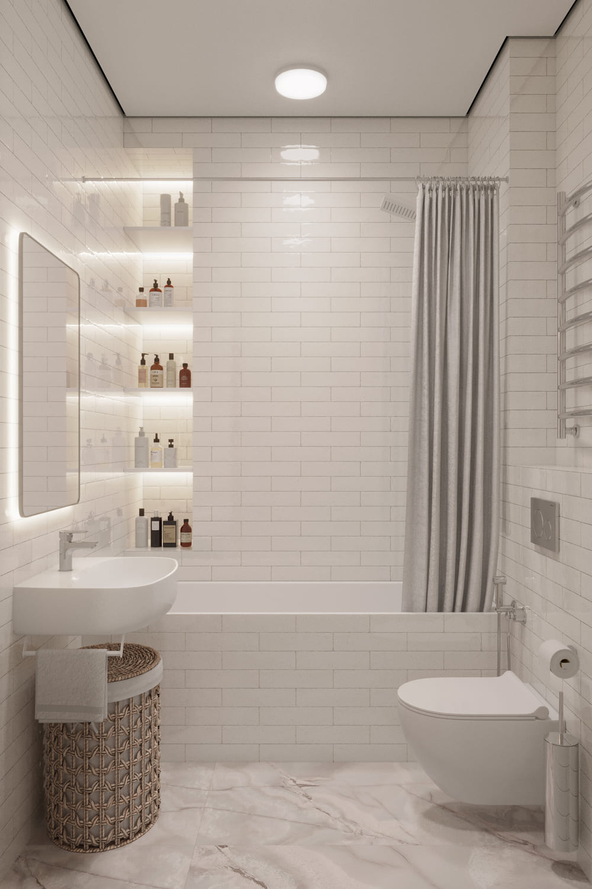
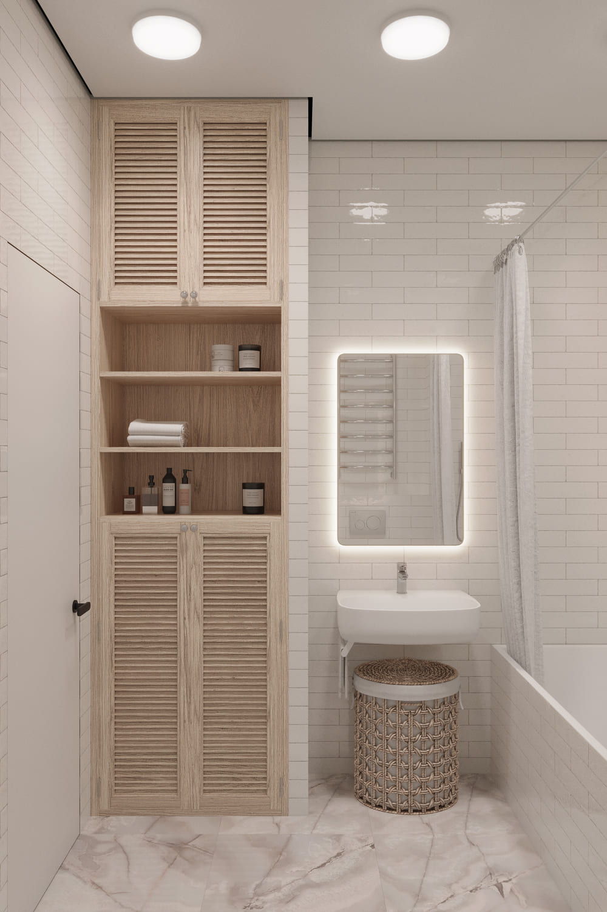
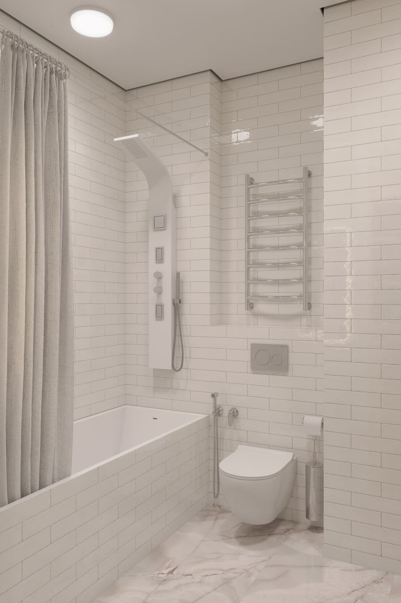

Интерьер санузла выстроен на гармоничном сочетании спокойной нейтральной палитры, ритмичной фактуры плитки «под кирпичик» и согревающих древесных оттенков. Главной концепцией помещения стало создание предельно ёмких систем хранения при сохранении абсолютной визуальной лёгкости и «воздуха».

Все бытовые мелочи, хозяйственные средства и банные полотенца надёжно скрыты от глаз за фасадами-шаттерсами встроенного шкафа, чья рельефная створка придаёт пространству особую архитектурную выразительность. При этом повседневная косметика и средства ухода всегда остаются под рукой благодаря продуманным открытым полкам.

Зону умывальника венчает зеркальное полотно с мягкой, рассеянной подсветкой, обеспечивающее комфортное и деликатное освещение вне зависимости от времени суток. Пространство под чашей раковины использовано максимально рационально: там интегрирована компактная корзина для белья, чьи пропорции и эстетика безупречно вписались в общий дизайн-код комнаты.

Купальная зона представляет собой ванну, функционально объединённую с современной душевой системой. Чтобы флаконы не загромождали бортики, в стене спроектированы эргономичные ниши с внутренней подсветкой, ставшие стильным и удобным хранилищем для шампуней и гелей. Безупречную эргономику помещения дополняет подвесной унитаз со скрытой инсталляцией и гигиеническим душем. А системы тёплого пола и эстетичный полотенцесушитель становятся финальными аккордами, формирующими по-настоящему комфортный сценарий повседневной жизни.