## Прихожая

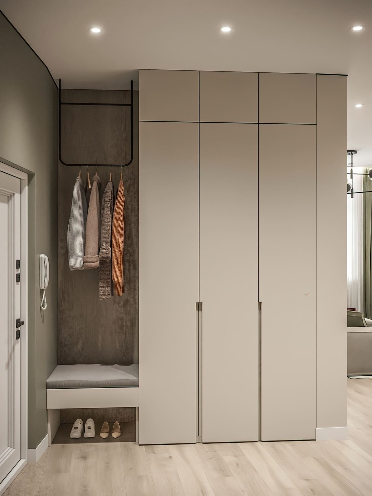
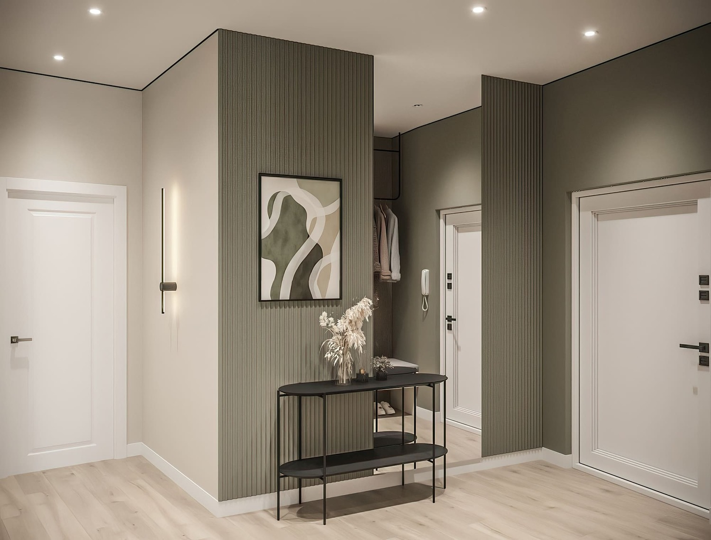
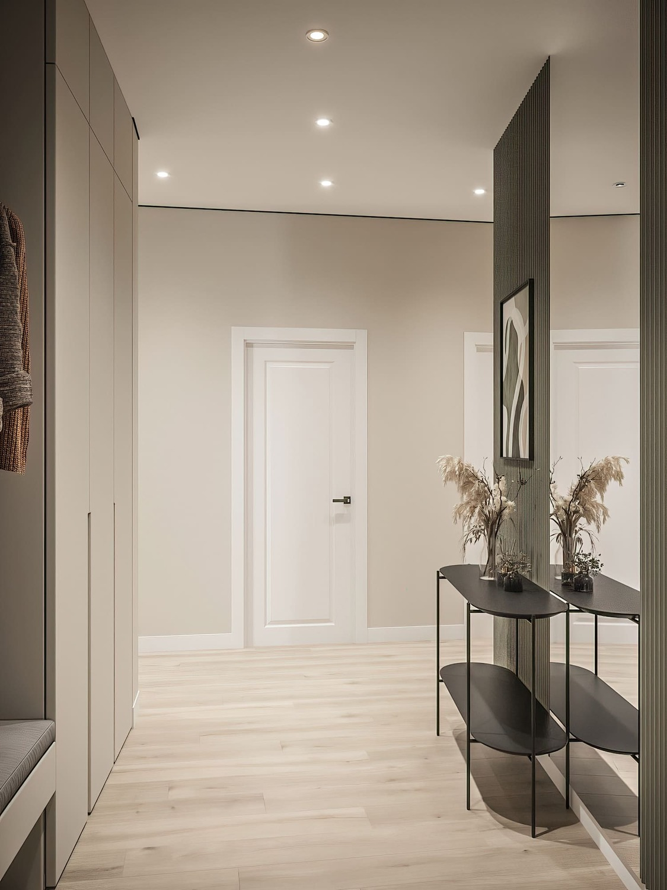

Входная зона гармонично сочетает воздушную светлую базу с деликатными природными акцентами, с порога настраивая на домашний лад. Ключевым элементом композиции стал вместительный встроенный шкаф в нейтральном бежевом оттенке. Он безупречно вписывается в архитектуру помещения, не утяжеляя пространство, при этом обеспечивая исчерпывающий объём для хранения верхней одежды и аксессуаров.

Рядом расположилась комфортная мягкая банкетка с открытой нижней нишей для повседневной обуви. Композицию дополняет лаконичная чёрная вешалка, чья графичность визуально облегчает общий ансамбль. Масштабное зеркальное полотно не только насыщает холл дополнительным светом, но и мастерски корректирует нестандартную геометрию квартиры, зрительно раздвигая её границы.

Выразительным акцентом выступают рифлёные панели благородного оливкового оттенка — они привносят в интерьер фактурную глубину и тонко рифмуются с природной палитрой. Воздушности обстановке добавляет минималистичная консоль на изящных металлических опорах. Строгие чёрные нюансы в декоре и фурнитуре создают стильный графичный контраст, а тёплая скрытая подсветка наполняет пространство мягким, обволакивающим сиянием, делая прихожую по-настоящему уютной.

## Кухня-гостиная

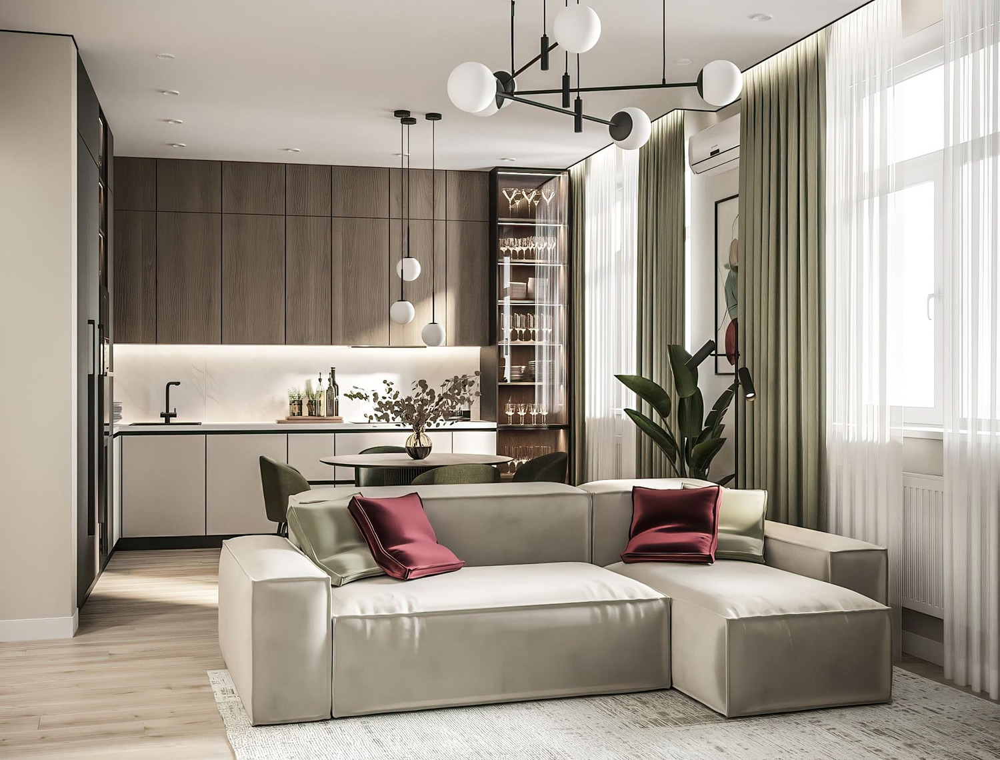
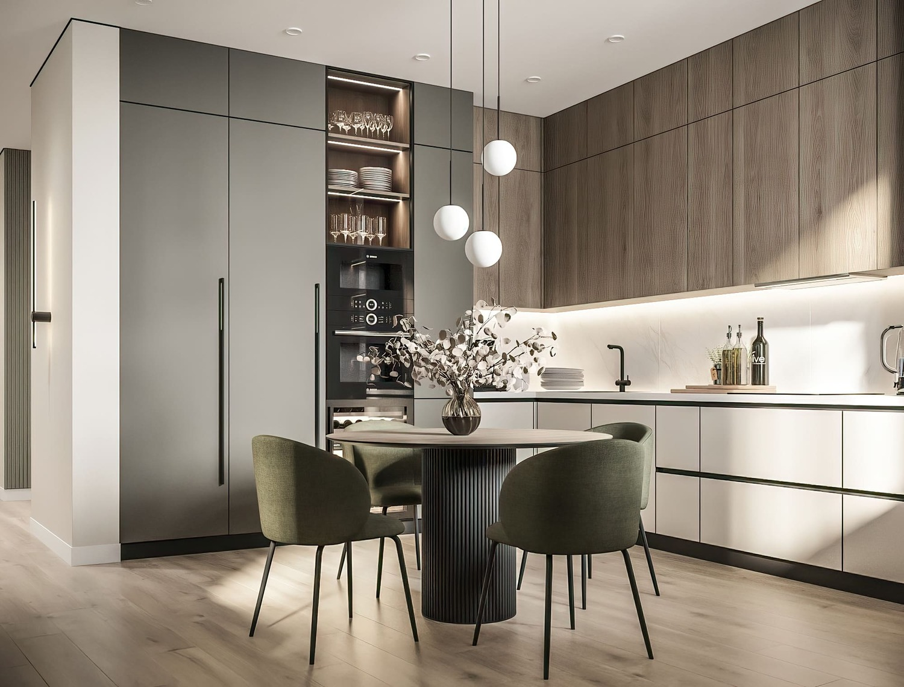
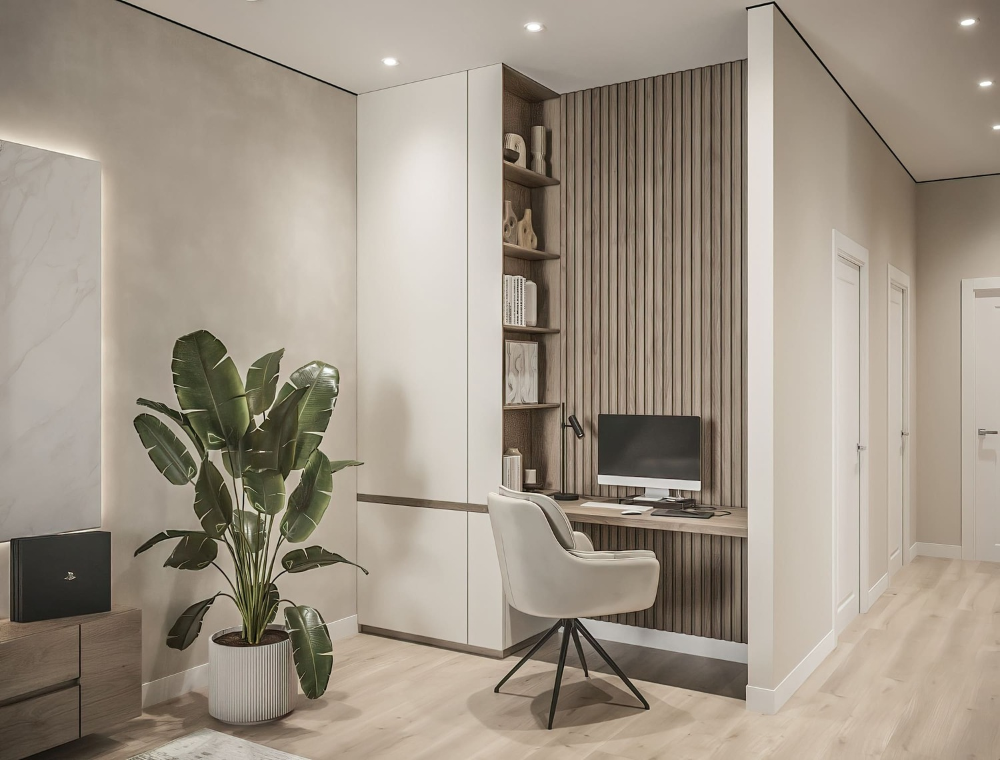
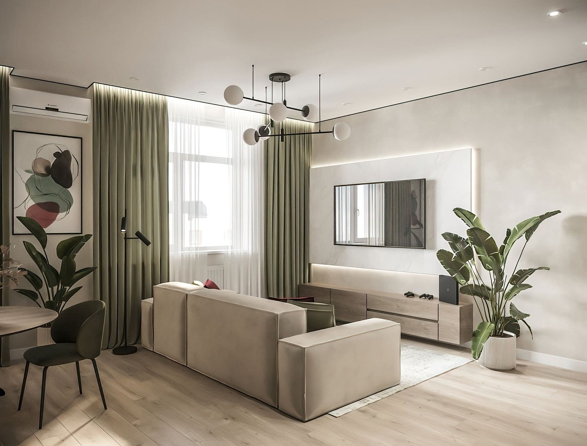

Кулинарный блок решён в тёплой древесной палитре, которая наполняет пространство ощущением природной подлинности и домашнего тепла. Игра контрастов между светлыми фасадами, глубокими тёмными тонами дерева и графичными чёрными деталями придаёт интерьеру выразительность, сохраняя при этом визуальную лёгкость. Просторная рабочая столешница, продуманная эргономика хранения и интегрированные световые сценарии обеспечивают максимальный комфорт в процессе приготовления пищи. Особую элегантность композиции добавляет открытая витрина из стекла, ставшая изящным местом для хранения коллекционных бокалов и парадной посуды.
Обеденная группа сформирована вокруг стола с выразительным рифлёным основанием округлой формы. Вокруг него расположились мягкие кресла благородного изумрудно-зелёного оттенка, формирующие камерную, по-ресторанному уютную атмосферу для неспешных семейных застолий. Венчают эту зону лаконичные подвесные светильники, чей деликатный свет создаёт интимную, располагающую к долгим беседам обстановку.

Центром притяжения в зоне отдыха стал масштабный диван в нежном песочном оттенке, дополненный декоративными подушками с акцентными принтами. Этот предмет мебели не только визуально собирает всё пространство воедино, но и буквально приглашает к расслаблению. Панорамное остекление, обрамлённое портьерами сочного зелёного тона, наполняет комнату щедрым потоком естественного света и дарит ощущение безграничного простора.

Медиазона выдержана в эстетике сдержанной элегантности: светлая архитектурная панель со скрытой подсветкой служит фоном для деревянной ТВ-тумбы. Живые крупнолистные растения, расставленные в этой части комнаты, привносят в интерьер дыхание природы и освежающую динамику.

Деликатно интегрированный в архитектуру помещения рабочий уголок остался практически незаметным глазу, но при этом полностью закрывает все функциональные потребности хозяйки. Деревянные стеновые панели и открытые полки формируют камерное пространство для сосредоточенной работы, где есть всё необходимое: вместительные системы хранения, удобная столешница и эргономичное кресло. Этот скрытый оазис продуктивности органично вплёлся в общую ткань интерьера, не нарушая его целостности и жилой атмосферы.

## Спальня

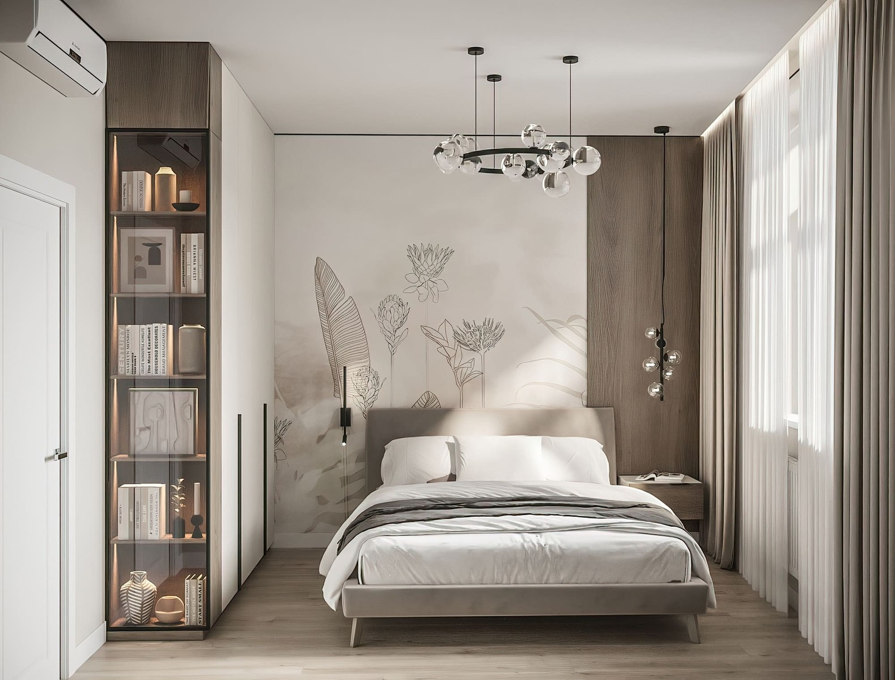
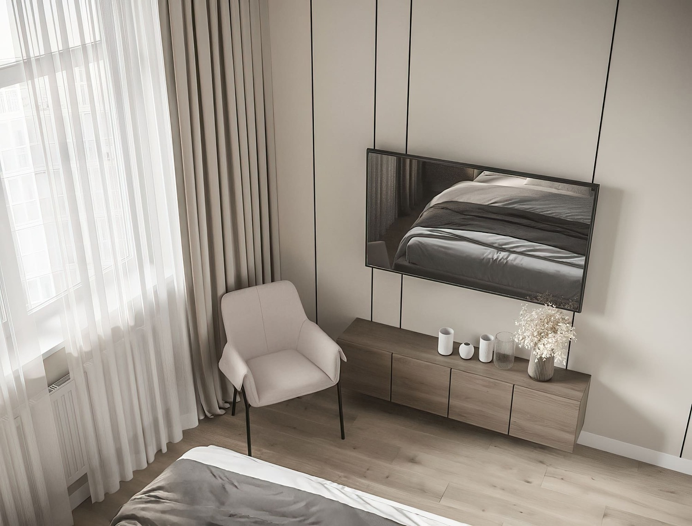

Архитектурной и визуальной доминантой комнаты выступает просторная кровать с мягким текстильным изголовьем, решённым в тёплой, обволакивающей песочной гамме. Стену в изголовье украшает изящная художественная роспись с ботаническим мотивом, которая привносит в интерьер нотку индивидуальности и природной лёгкости. По обе стороны от спального места симметрично расположились декоративные деревянные панели: они служат элегантным обрамлением зоны отдыха, формируя камерное, уединённое пространство и дарящее чувство защищённости.

Система хранения реализована через вместительный встроенный шкаф, чей дизайн мастерски сочетает глухие фасады и открытые витрины из стекла. Внутренняя подсветка полок не только красиво экспонирует содержимое, но и наполняет мебель объёмом и теплом, делая её визуально невесомой, тогда как закрытые секции безупречно скрывают повседневные вещи, поддерживая в комнате идеальный порядок.

Пространство щедро наполнено естественным светом благодаря масштабным оконным проёмам. Многослойное текстильное оформление — невесомый белый тюль в паре с плотными портьерами благородного бежевого оттенка — позволяет гибко управлять уровнем инсоляции и создаёт уютную, тактильную оболочку. Вечерний световой сценарий продуман до мелочей: он включает в себя направленные потолочные споты, парящие прикроватные подвесы и эффектную центральную люстру с выразительными стеклянными плафонами, которая задаёт интерьеру парадное, но по-домашнему тёплое настроение.

Медиазона выдержана в эстетике лаконичного минимализма. Подвесная консоль из тёплого дерева безупречно рифмуется с общей стилистикой спальни, а масштабное зеркальное полотно, расположившееся над ней, мастерски раздвигает физические границы комнаты, умножая свет и объём. Завершает функциональную композицию компактное мягкое кресло нежного пудрового оттенка, сформировавшее идеальный уголок для чтения и спокойного отдыха.

## Санузел

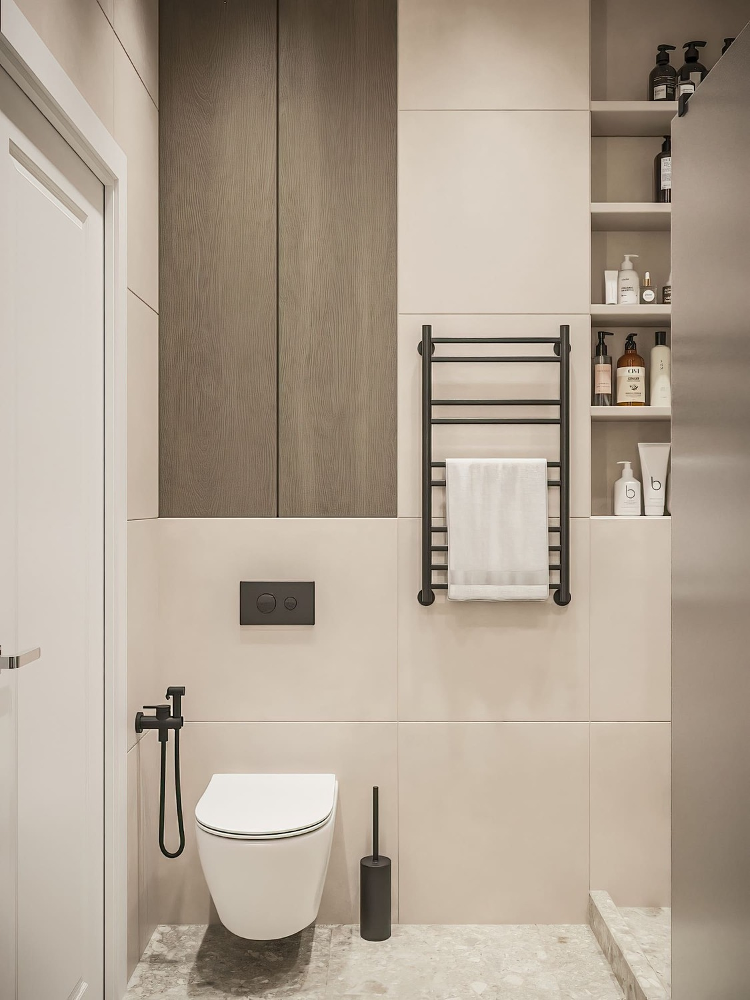
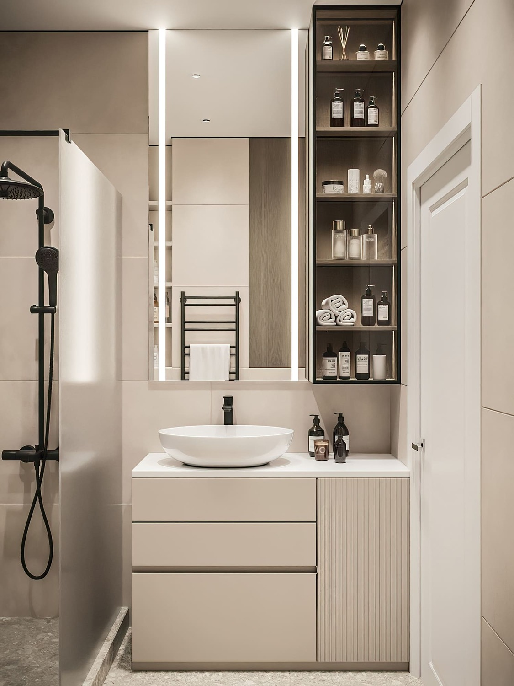
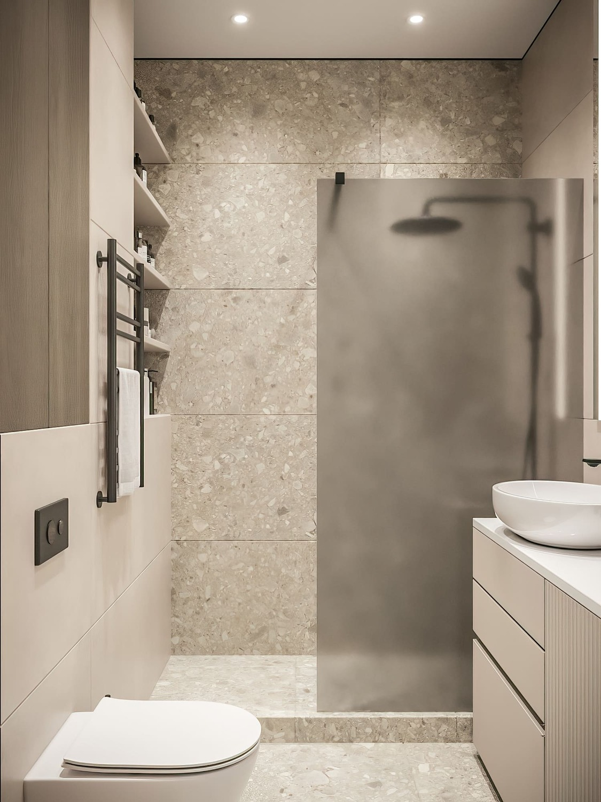

Визуальной доминантой этого помещения стал выразительный керамогранит, мастерски имитирующий фактуру натурального камня. Им облицованы пол и стены в душевой зоне, что придаёт интерьеру архитектурную глубину и благородство. Этот активный природный рисунок деликатно уравновешен спокойной бежевой палитрой основной плитки, формируя умиротворяющую и расслабляющую атмосферу. Чтобы пространство не казалось холодным, в дизайн интегрированы тёплые древесные фактуры — они присутствуют в мебельных фасадах и отделке встроенных ниш, привнося домашний уют и безупречно перекликаясь с общей концепцией всей квартиры.

Эргономика и функциональность санузла продуманы без малейших компромиссов. Душевая зона деликатно обособлена от остального пространства при помощи перегородки из матового стекла, которая зонирует помещение, не перекрывая поток света. Использование подвесного унитаза со скрытой инсталляцией позволило максимально разгрузить пол, придав интерьеру визуальную лёгкость. А архитектурные ниши и встроенные полки стали эстетичным и скрытым от посторонних глаз хранилищем для всех необходимых банных принадлежностей.

Световой сценарий выстроен с заботой о повседневном комфорте. Зеркальную зону обрамляют вертикальные световые линии, обеспечивающие мягкое, рассеянное и приятное для глаз освещение. Дополнительный объём и ощущение воздушности пространству придают встроенные потолочные споты. Завершают композицию и добавляют интерьеру строгой современной графики чёрные акценты: лаконичная мебельная фурнитура, стильные смесители и минималистичный полотенцесушитель выступают эффектными контрастными штрихами на спокойном фоне.

## Постирочная

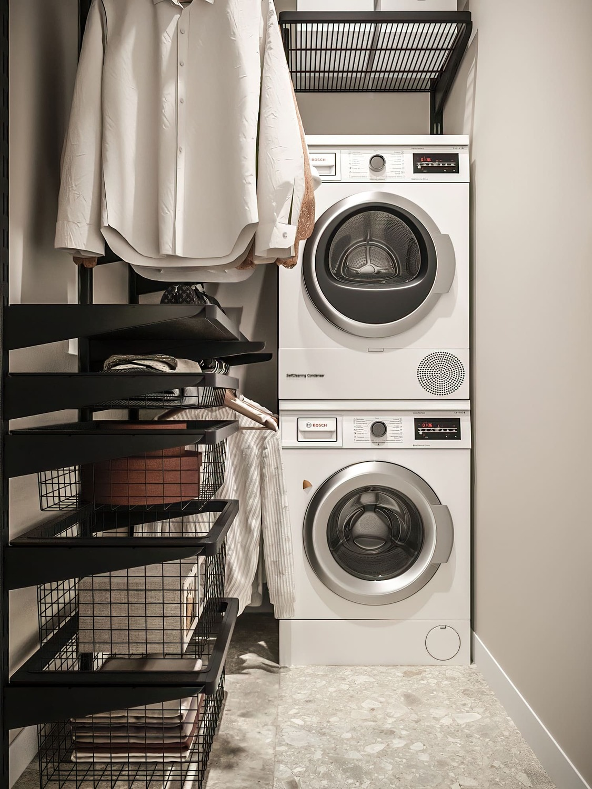
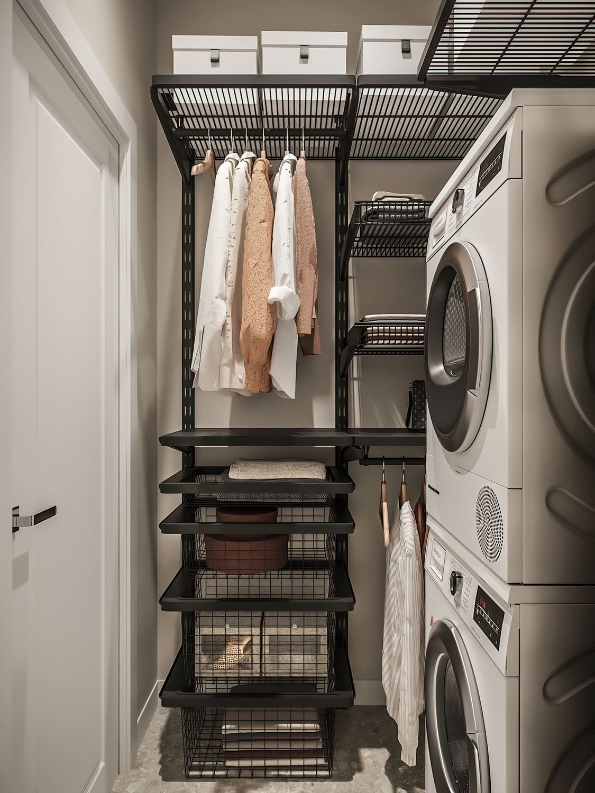

Даже в условиях весьма скромного метража эта хозяйственная зона стала образцом безупречной эргономики и продуманной функциональности. Пространство спроектировано так, чтобы вместить весь необходимый арсенал техники и грамотно организовать системы хранения. Стиральная и сушильная машины интегрированы в виде единой вертикальной колонны — этот архитектурный приём не только существенно экономит полезную площадь, но и делает ежедневную эксплуатацию максимально комфортной. Зону над техникой заняли открытые полки, ставшие удобным плацдармом для размещения коробок с бытовой химией и хозяйственными мелочами.

Основную нагрузку по сортировке и хранению домашнего текстиля берёт на себя вместительный стеллажный модуль, оснащённый выдвижными металлическими корзинами. Такое решение обеспечивает быстрый доступ к белью и аксессуарам, поддерживая идеальный порядок. Отдельное внимание уделено процессу сушки: здесь предусмотрены специальные вешала, где можно аккуратно разместить одежду сразу после стирки. Эта деталь особенно важна для ухода за деликатными тканями, которые нельзя отправлять в барабанную сушку и которые требуют бережного расправления.

Визуальный облик помещения мастерски балансирует между утилитарностью и современной эстетикой. Использование чёрных металлических элементов в конструкциях стеллажей и корзин придаёт интерьеру стильную графичность и гарантирует абсолютную надёжность несущих систем. Чтобы нивелировать ощущение тесноты, мы обратились к воздушной светлой палитре стен, которую эффектно заземляет напольное покрытие с выразительной каменной текстурой. Этот свежий фон работает на оптическое расширение границ, наполняя компактную постирочную ощущением лёгкости, чистоты и визуального простора.