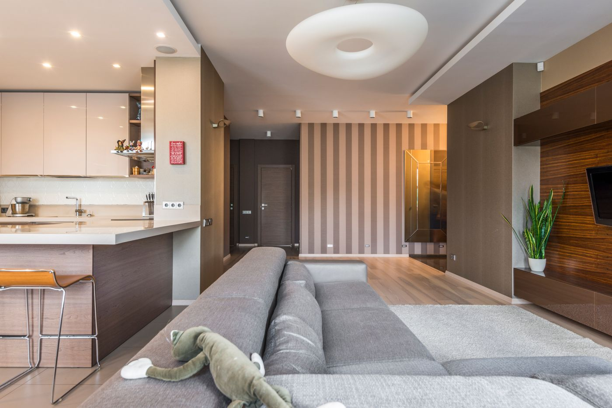
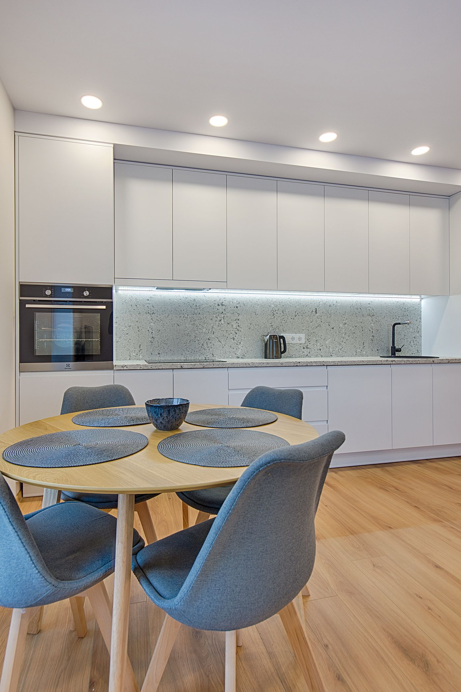
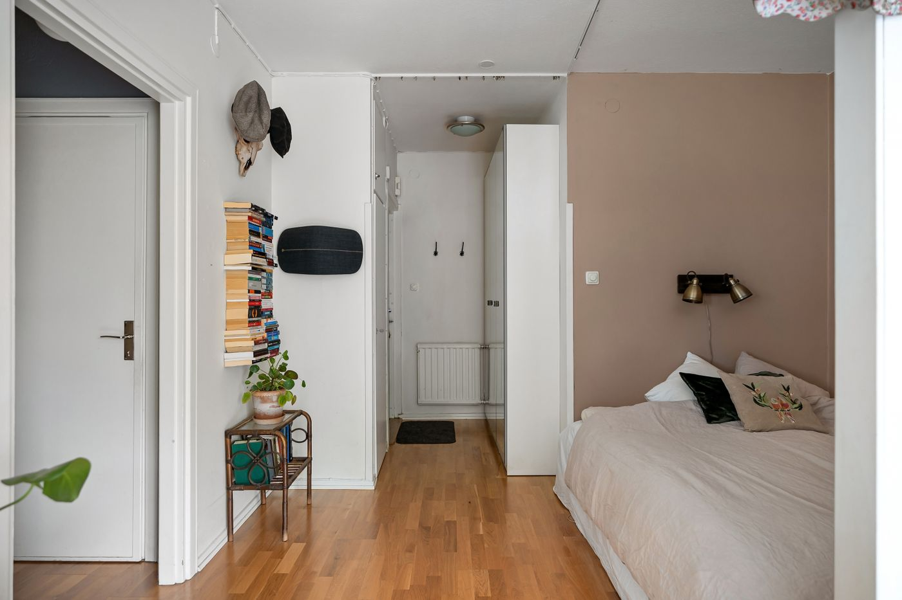
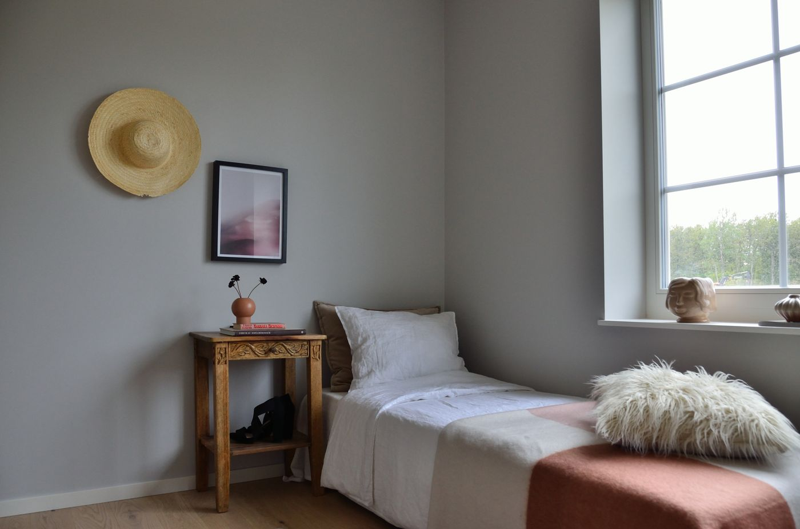
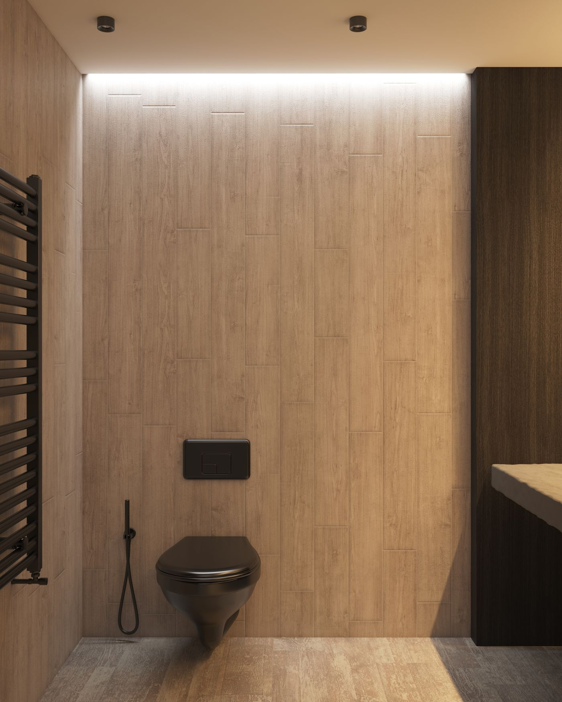

## Кухня-гостиная

Двухкомнатную квартиру 54 м² мы собрали вокруг одной идеи — тёплого минимализма, в котором нет ничего лишнего, но есть ощущение дома. Основу задают светлые стены, мягкая бежевая гамма и напольное покрытие в тёплом древесном тоне: оно объединяет комнаты и наполняет пространство спокойным дневным светом.

Кухню и гостиную оставили единым объёмом, чтобы небольшая площадь работала на все сценарии сразу. Гарнитур со сдержанными матовыми фасадами и каменной столешницей растворяется в стенах, а обеденная зона у окна становится центром притяжения — здесь удобно и завтракать, и работать. Скрытая подсветка и точечные светильники дают несколько уровней освещения на вечер.

## Спальня

Спальню решили в тех же тёплых тонах, но добавили мягкий терракотово-пудровый акцент — он делает комнату уютнее и связывает её с общей палитрой квартиры. Кровать с текстильным изголовьем, простой прикроватный столик из массива и точечные латунные детали складываются в спокойный, «обволакивающий» интерьер.

Хранение спрятали во встроенный шкаф в цвет стен, чтобы не дробить пространство. Большое окно оставили открытым дневному свету, а плотные шторы при желании позволяют полностью затемнить комнату для отдыха.

## Ванная

Ванную облицевали крупноформатной плиткой под тёплое дерево — тот же приём, что и в жилых комнатах, поэтому санузел не выбивается из общего настроения. Подвесная сантехника, скрытая подсветка и матовые чёрные смесители придают пространству графичность и лёгкость в уходе. Компактно, тепло и по-домашнему спокойно.
