## Прихожая

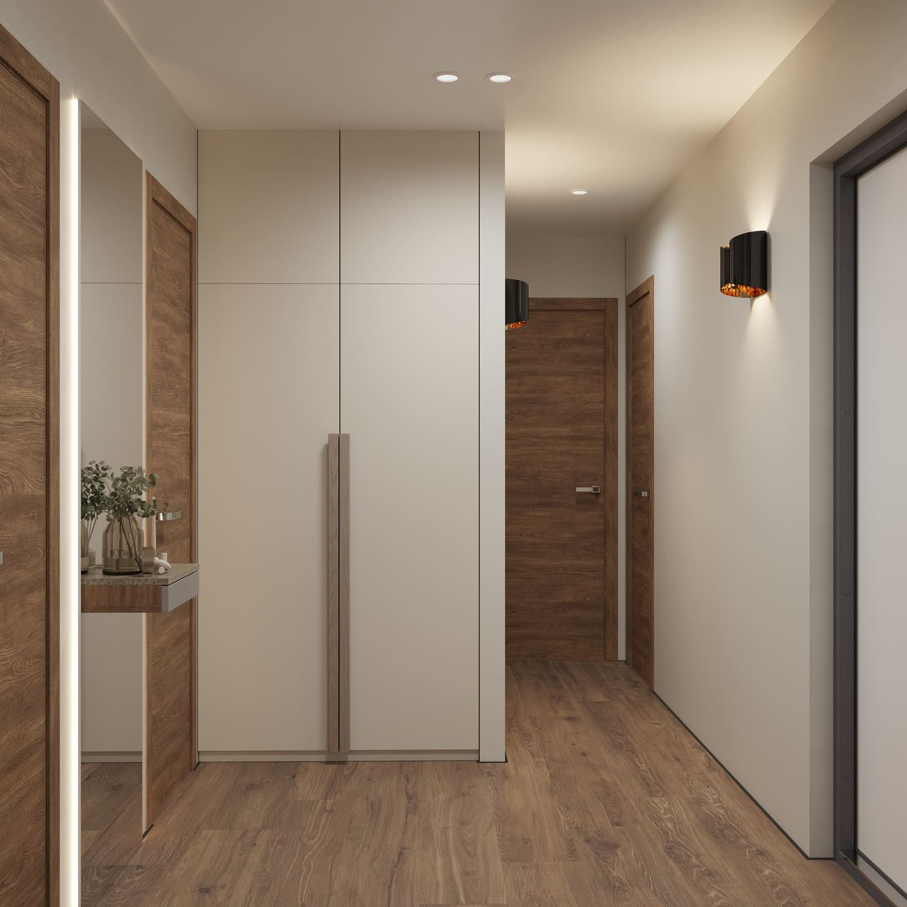
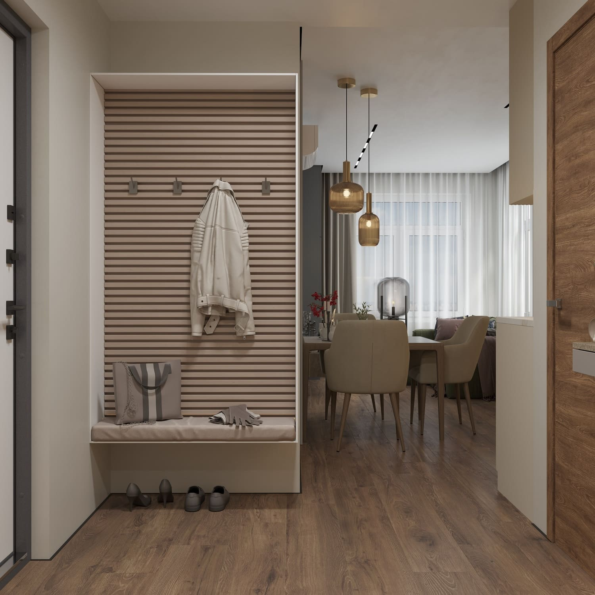
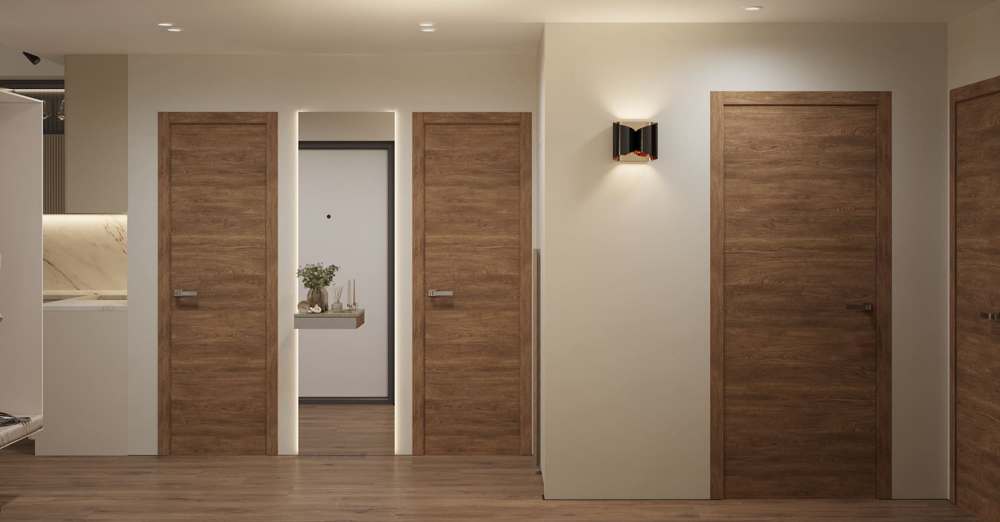

Входная группа с первых шагов задаёт эмоциональный тон всей квартире — она встречает теплом, продуманностью и настоящим домашним уютом. Несмотря на весьма скромный метраж, пространство получилось на редкость функциональным, что стало результатом тонкой планировочной работы. Благодаря деликатному смещению дверного проёма, ведущего в спальню, нам удалось выкроить площадь под полноценную встроенную систему хранения, которая органично растворилась в архитектуре холла и совершенно не перегружает его.

Колористическое решение прихожей построено на гармонии мягких бежевых оттенков и тёплых древесных фактур. Особую выразительность пространству придаёт акцентная зона, где ритмичные вертикальные рейки соседствуют с удобным мягким сиденьем. Этот функциональный островок позволяет с комфортом присесть, переобуться, разместить верхнюю одежду и мгновенно ощутить расслабляющую атмосферу дома. Отдельного внимания заслуживает проработанный световой сценарий: деликатная подсветка по контуру зеркала и тёплые настенные бра не только обеспечивают необходимый уровень освещённости, но и визуально добавляют помещению глубины, объёма и камерного уюта.

## Кухня-гостиная

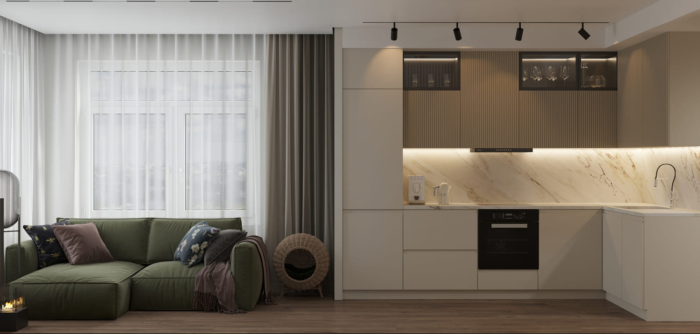
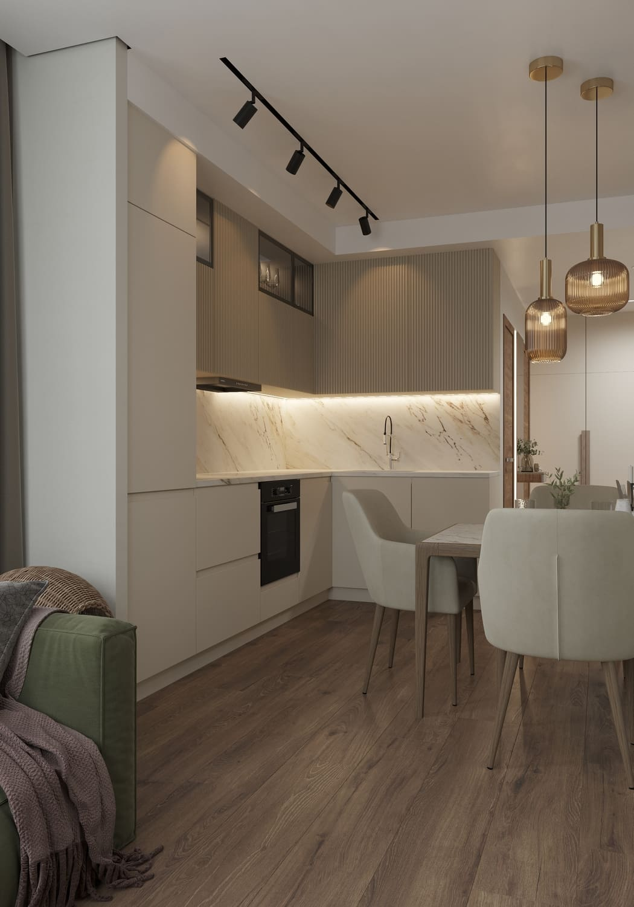
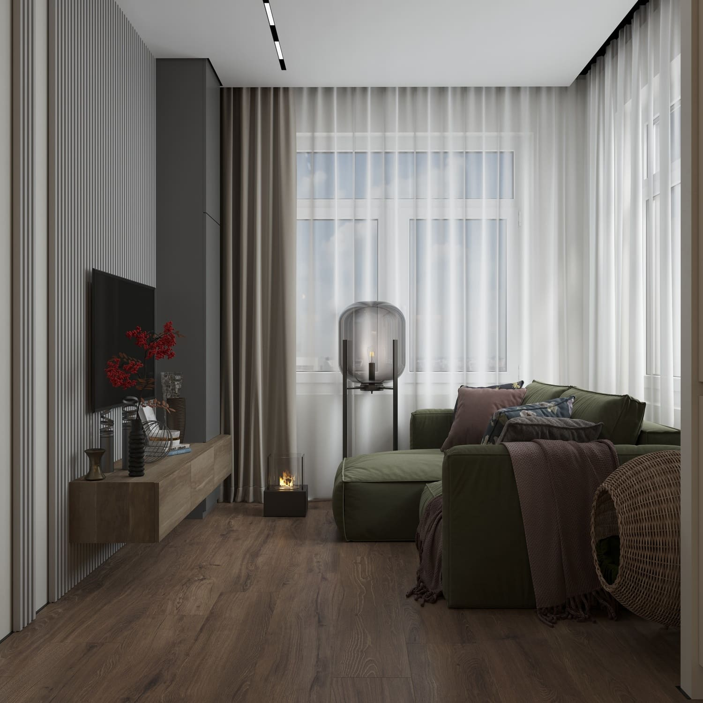
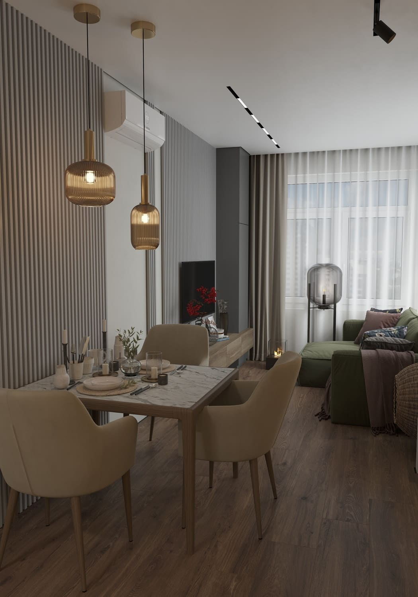

Рабочая зона кухни воплощает собой эталон современной лаконичности. Гарнитур с матовыми фасадами, намеренно лишёнными видимой фурнитуры, и выразительной фактурой верхних модулей формирует безупречно чистый и упорядоченный визуальный образ. Элегантности пространству добавляет стеновой фартук, облицованный благородным мрамором, а продуманная подсветка столешницы обеспечивает максимальный комфорт в процессе готовки. Несмотря на сдержанность базовой палитры, интерьер читается как статусный и эстетически безупречный. Графичности и архитектурной чёткости композиции придают чёрные акценты встроенной техники и строгие линии трековой системы освещения.

Столовая группа стала настоящим центром притяжения — уютным островком, который одинаково прекрасно подходит как для романтичных ужинов, так и для тёплых посиделок с друзьями. Композиция строится вокруг стола с эффектной мраморной столешницей, окружённого комфортными стульями в нейтральной текстильной обивке. Венчают эту зону изящные подвесные светильники, чьё тёплое, обволакивающее свечение создаёт по-настоящему камерную и располагающую к долгим беседам атмосферу.

Пространство гостиной буквально пропитано теплом и уютом. Главной визуальной и тактильной доминантой здесь выступает масштабный диван насыщенного глубокого зелёного оттенка. Многослойный мягкий текстиль и деликатная игра света, пробивающегося сквозь полупрозрачные портьеры, формируют невероятно расслабляющую обстановку. Авторский характер интерьеру придают выразительные детали: атмосферная свеча под стеклянным колпаком, декоративные подушки со сложной фактурой и ритмичные деревянные рейки на стене. Эти штрихи наполняют комнату жизнью, делая её образ по-настоящему индивидуальным и запоминающимся.

## Спальня

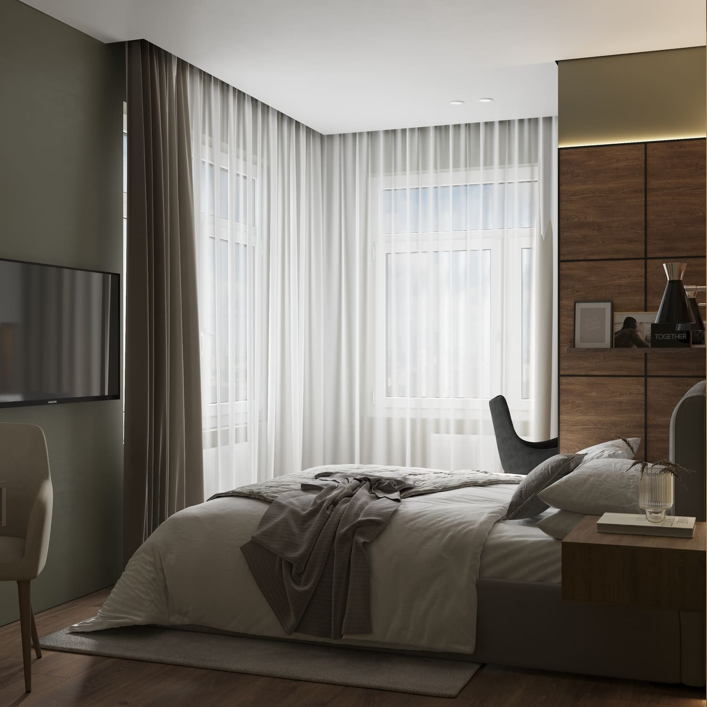
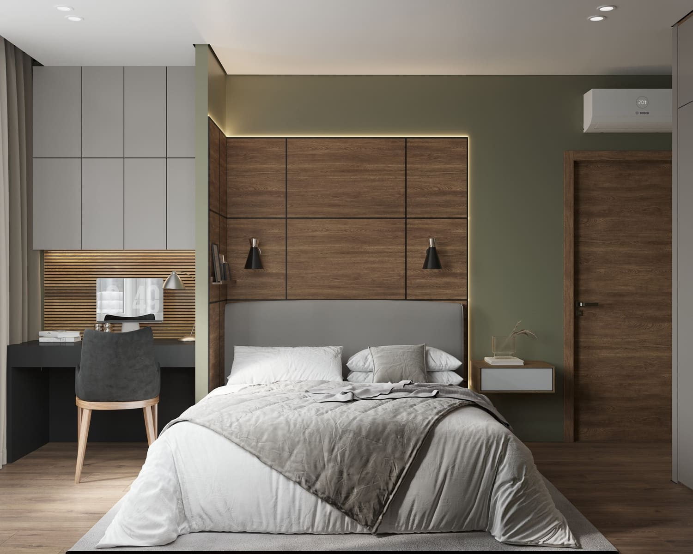
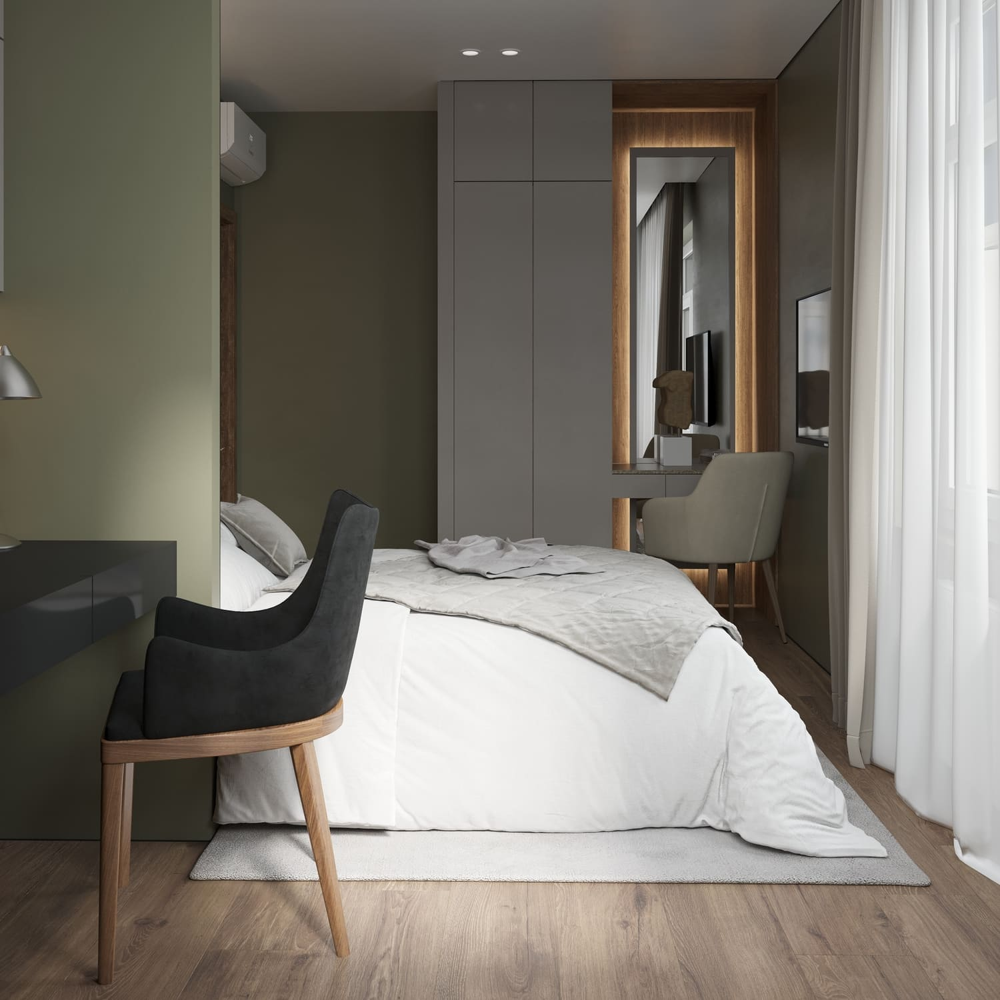
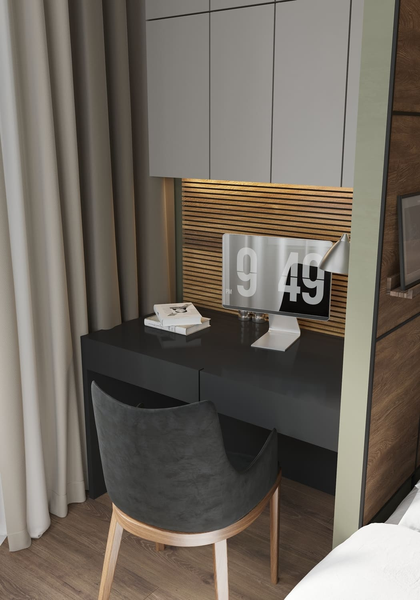
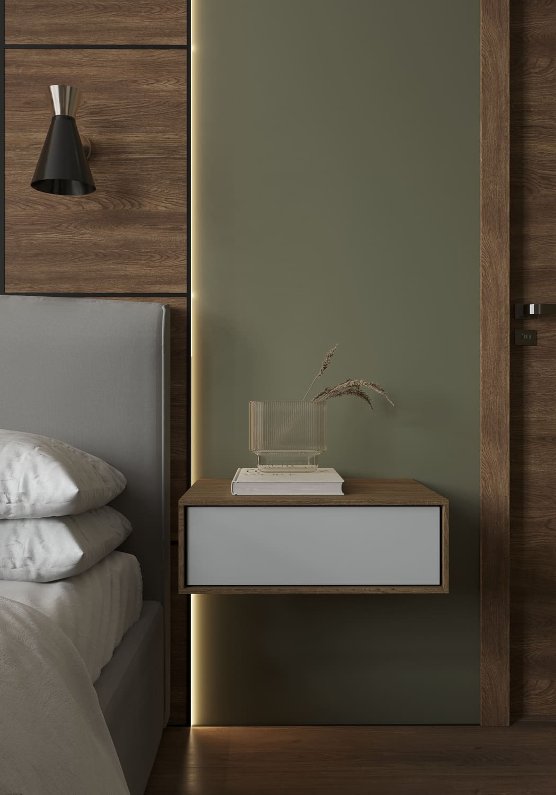
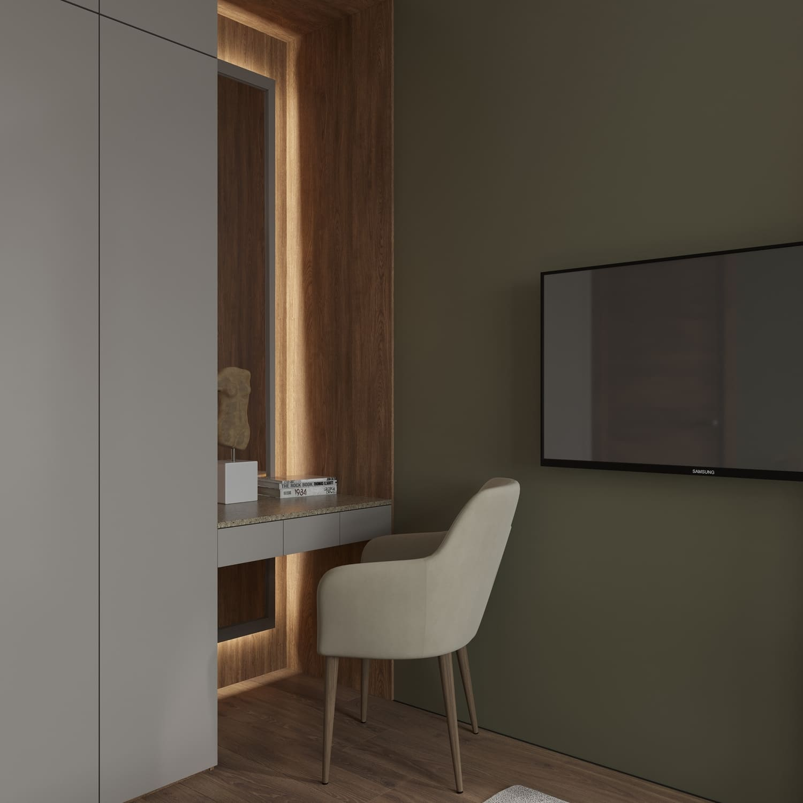

Эта комната стала воплощением абсолютного уюта, спокойствия и выверенной до мелочей эргономики — настоящим убежищем для отдыха и уединения. Именно здесь нам удалось реализовать одно из важнейших пожеланий заказчиков: организовать полноценное рабочее пространство, которое бы совершенно не нарушало покой второго партнёра во время сна. Благодаря деликатной частичной перегородке мы мастерски зонировали помещение, позволив спальному месту и домашнему офису восприниматься как самостоятельные функциональные блоки, не теряя при этом ощущения единого, цельного интерьера.

Колористическая палитра выстроена на гармонии мягких, природных оттенков: тёплый беж, сдержанный серый, тактильные древесные фактуры и приглушённый зелёный тон. Этот зелёный акцент эффектно перетекает на одну из стен, создавая визуальную связь с общей концепцией всей квартиры. Архитектурной доминантой спальной зоны выступает выразительная деревянная панель в изголовье кровати — она наполняет пространство природным теплом и архитектурной глубиной, а встроенная скрытая подсветка превращает вечернее время в по-настоящему атмосферный и расслабляющий ритуал.

Отдельного внимания заслуживает продуманная система меблировки и хранения. Вместительный шкаф до потолка с лаконичными графитово-серыми фасадами безупречно вписывается в интерьер, не перегружая его. Рабочая зона сформирована компактным письменным столом и навесными модулями для документов и книг, обеспечивая всё необходимое для продуктивной деятельности. Завершает композицию изящная консоль, интегрированная у окна, и функциональное зеркало с мягкой контурной подсветкой, которые добавляют пространству лёгкости и завершённости.

## Детская комната

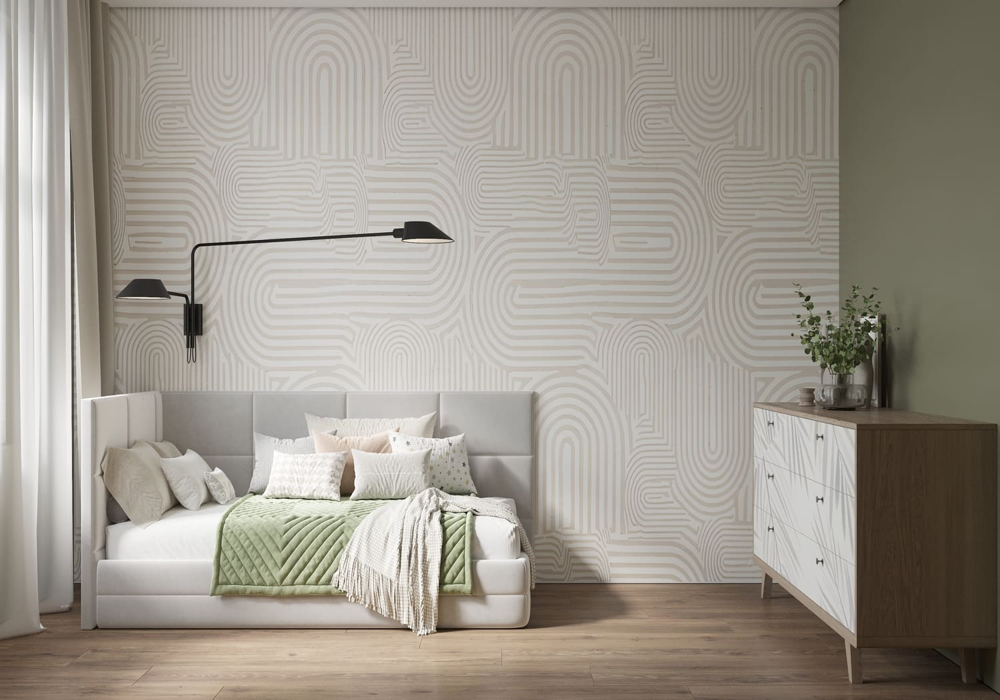
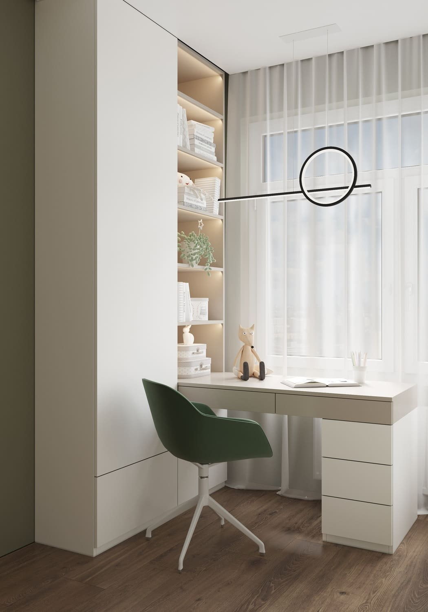
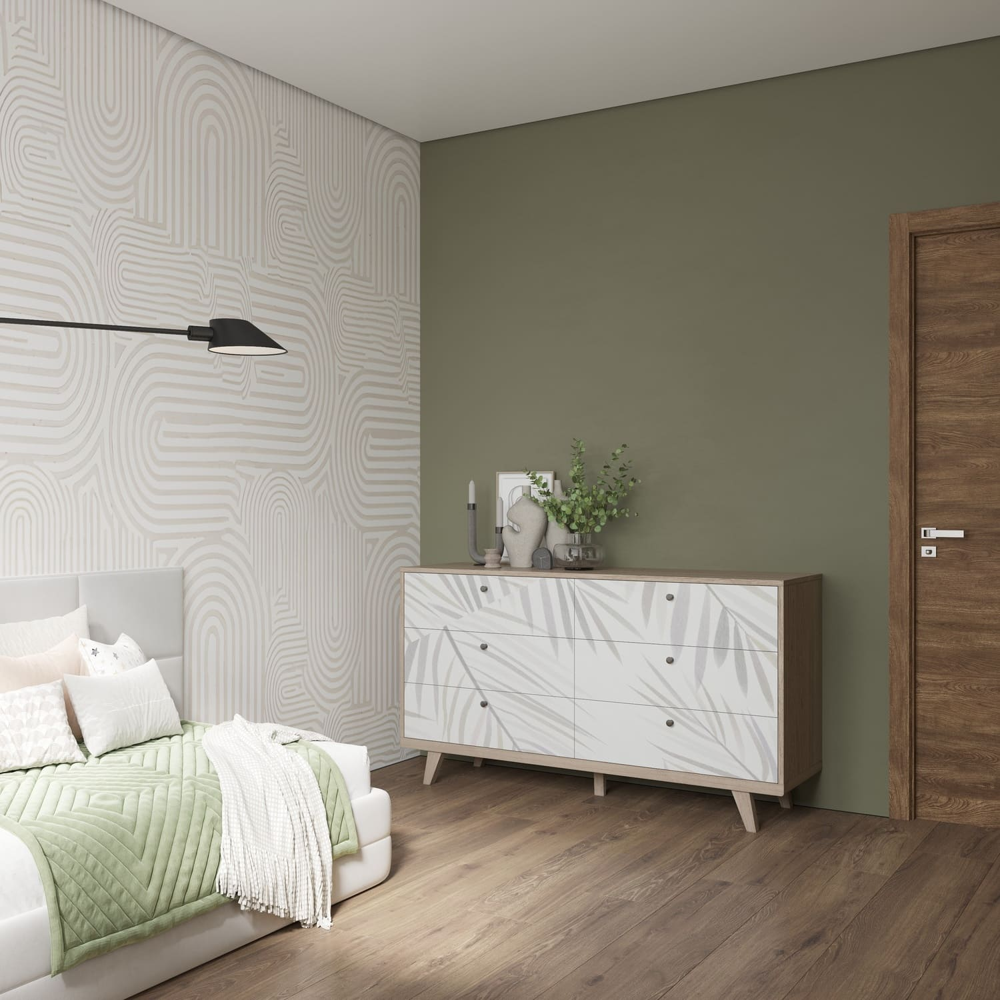

Пространство детской спроектировано как универсальная, «взрослеющая» вместе с ребёнком среда. Благодаря сдержанной базовой палитре и лаконичной современной геометрии, комната будет одинаково актуальна и комфортна как для малыша, так и для подростка. Центром зоны отдыха стала уютная кровать с масштабным мягким изголовьем и тактильным текстилем, располагающая к спокойному сну и вечернему чтению. Свежесть и визуальную нежность обстановке придают покрывало оттенка молодой зелени и декоративные подушки в пастельной гамме. Одну из стен украшают обои с выразительным графичным принтом: этот смелый акцент мастерски оживляет интерьер, не создавая при этом визуального шума и сохраняя идеальный композиционный баланс.

Рабочее место логично расположилось у окна, где просторный письменный стол получает максимум естественного света, формируя идеальные условия для учёбы и творчества. Эргономичное кресло с обивкой насыщенного зелёного цвета выступает деликатным цветовым пятном, органично вплетаясь в общую природную концепцию помещения. Вопросы хранения решены комплексно и эстетично: комбинация открытых стеллажей с мягкой подсветкой и вместительных глухих модулей позволяет легко организовать всё необходимое — от любимых игрушек до школьных учебников. Завершает образ и элегантно поддерживает ботанические мотивы дизайнерский комод, фасады которого украшены стильным растительным орнаментом.

## Ванная комната

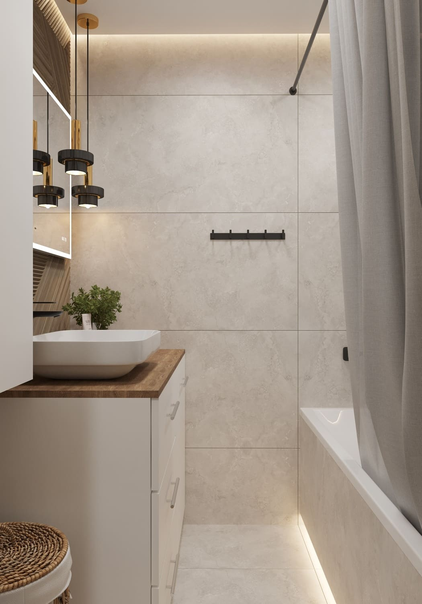
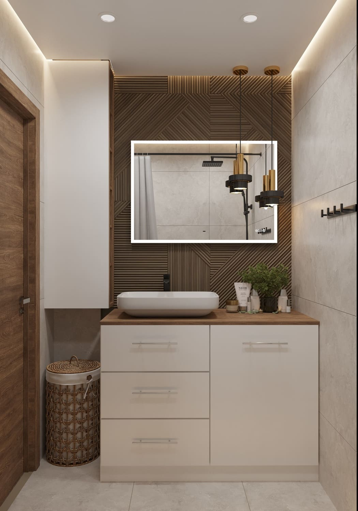
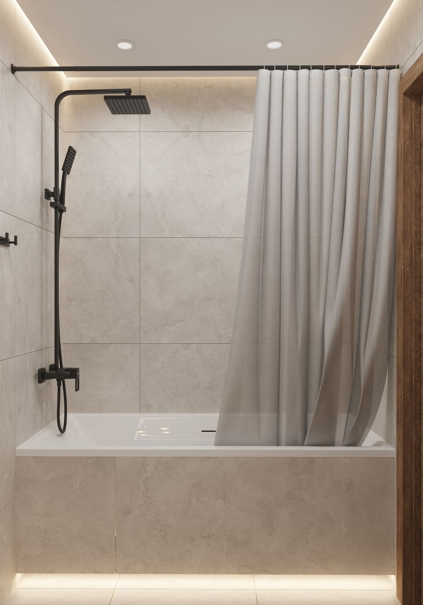

Визуальная концепция этого санузла строится на выразительной игре фактур и материалов. Гладкая светлая плитка выступает идеальным спокойным фоном, на котором особенно выигрышно смотрятся тёплые древесные акценты: массивная столешница и геометричная деревянная панель, обрамляющая зеркало. Такое сочетание не только создаёт визуальную глубину и архитектурный объём, но и наполняет пространство природным теплом.
Зона умывальника спроектирована с безупречной эргономикой. Вместительная подвесная тумба с системой выдвижных ящиков обеспечивает удобное хранение всех банных принадлежностей, сохраняя при этом визуальную лёгкость конструкции. Её венчает элегантная накладная раковина, чьи чистые линии придают интерьеру свежесть и современное звучание.

Купальная зона сочетает в себе практичность и эстетику. Ванна дополнена функциональной шторкой, а система скрытого слива поддерживает минималистичную чистоту линий. Графичный чёрный душевой гарнитур выступает стильным контрастным акцентом, подчёркивая современный характер помещения и добавляя интерьеру строгости.
Световой сценарий продуман до мелочей и работает на визуальную трансформацию пространства. Скрытая подсветка по периметру потолка создаёт эффект парящей плоскости, зрительно приподнимая его, а деликатное свечение в нижней части стен добавляет помещению уюта и камерности.

Особое внимание уделено деталям, которые завершают образ и подчёркивают продуманность каждого решения. Плетёная корзина из натуральной лозы для белья привносит в интерьер тактильность и природную фактуру, а лаконичные крючки и аксессуары служат не только функциональным, но и декоративным элементом. Здесь нет случайных вещей — каждый предмет занимает своё идеальное место, формируя гармоничное и завершённое пространство.

## Санузел

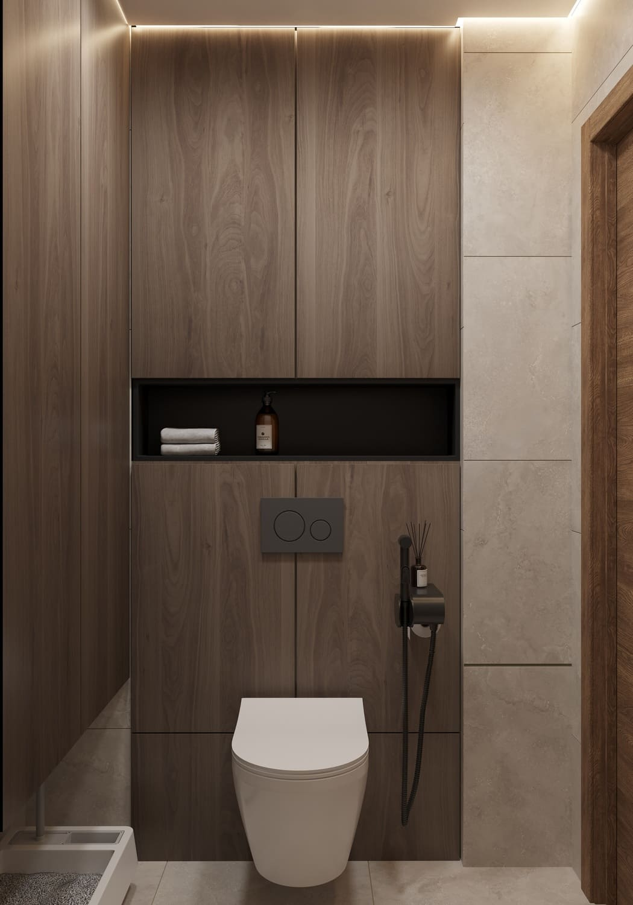

В отделке этого помещения доминирует крупноформатный керамогранит, мастерски имитирующий фактуру светлого природного камня. Такое решение безупречно работает на оптическое расширение границ, наполняя компактное пространство ощущением воздуха и визуальной свободы. Эффектным и тактильным противовесом этой прохладной элегантности выступает задняя стена, декорированная панелями из тёплого дерева. За этой благородной фактурой искусно замаскированы вместительные скрытые системы хранения, что позволяет поддерживать в интерьере абсолютный визуальный порядок, не перегружая его лишними деталями.

Современный характер санузла подчеркивают строгие графичные акценты. Чёрные элементы сантехнической фурнитуры, минималистичная рама инсталляции и лаконичные аксессуары привносят в обстановку актуальную эстетику и брутальную нотку, добавляя пространству архитектурной чёткости.

Вопросы повседневной эргономики элегантно решены при помощи встроенной ниши, спроектированной непосредственно над зоной унитаза. Это идеальное и всегда доступное место для хранения полотенец и базовой уходовой косметики. Интегрированная сверху декоративная подсветка не только обеспечивает мягкое, рассеянное свечение, но и придаёт этой зоне дополнительную визуальную глубину и уютный объём.

Особого внимания заслуживает забота о комфорте всех членов семьи. В планировку санузла деликатно и практически незаметно интегрирована специальная, эстетично оформленная зона для размещения лотка домашнего питомца. Этот продуманный штрих позволяет сохранить единую стилистику помещения, ничуть не жертвуя при этом бытовым удобством.

## Гардеробная

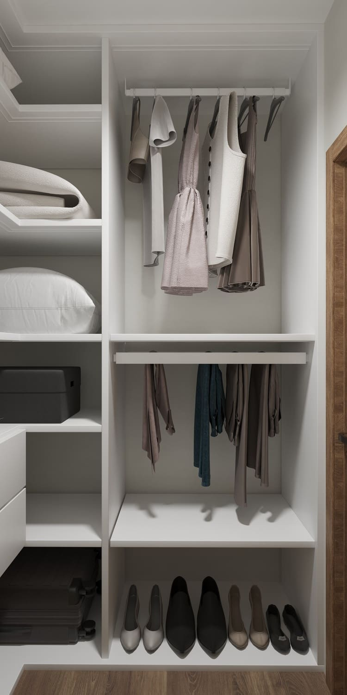

Пространство этой комнаты организовано по принципу строгой функциональности, где каждый элемент подчинён задачам эргономичного хранения. Наполнение продумано до мелочей и логично зонировано: здесь предусмотрены открытые полки для быстрого визуального обзора, выдвижные ящики для мелких аксессуаров, специализированные отсеки для обуви и дорожных чемоданов, а также разноуровневые штанги для развешивания одежды любой длины.

Светлая колористика внутренней отделки мастерски нивелирует эффект замкнутого пространства, визуально делая гардеробную гораздо просторнее и воздушнее. Благодаря выверенной, интуитивно понятной архитектурной структуре поддерживать безупречный порядок здесь не составляет никакого труда и происходит словно само собой. Это по-настоящему безупречное решение для тех, кто в повседневной жизни превыше всего ценит бытовой комфорт, системный подход и абсолютную организованность.