## Прихожая

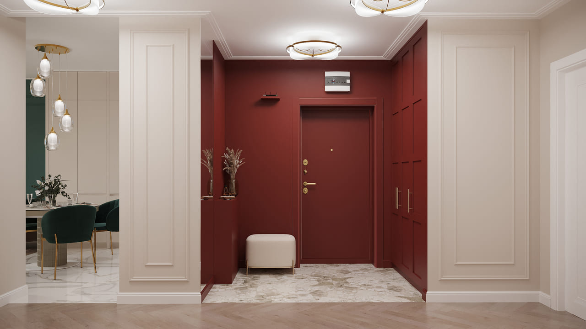
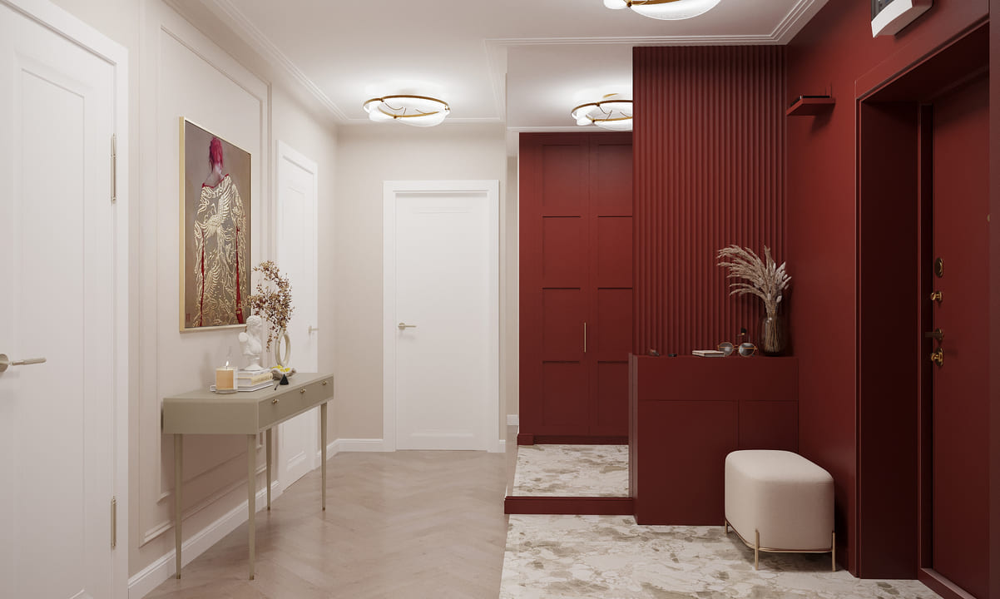 
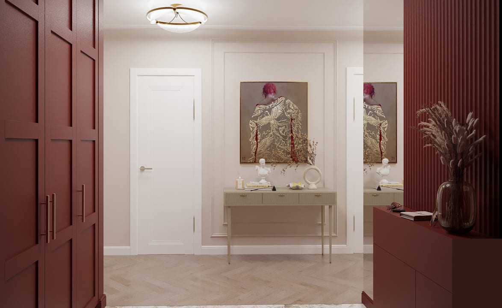  

В основе этого проекта лежит гармоничное сочетание утончённой эстетики и практичности. Супружеская пара, обратившаяся к нам, сформулировала задачу предельно ясно: планировочное решение от застройщика остаётся без изменений, никаких переносов стен, однако интерьер должен быть цельным, выверенным и продуманным в каждой детали. Стилистической основой послужила современная классика — лаконичная, наполненная светом, но дополненная выразительными акцентами, придающими индивидуальность каждому помещению.

Основу цветовой гаммы составляют мягкие бежевые и кремово-молочные тона, которые зрительно раздвигают границы пространства и наполняют его ощущением воздушности и тепла. Светлые дверные полотна и напольное покрытие в тёплой гамме усиливают этот эффект. При этом акцентные решения — смелые и неповторимые. Цветом обозначены прихожая, гостиная, рабочий кабинет и спальня: каждое помещение читается как отдельная глава, но вместе они складываются в единую, гармоничную историю.

Прихожая решена в духе современной классики с выразительным цветовым жестом: насыщенный терракотово-красный оттенок обрамляет входную зону, превращая её в яркую визуальную рамку и сразу задавая эмоциональный тон всей квартире. Этот глубокий тон контрастирует со спокойной бежево-белой гаммой остальных помещений. Потолочные плафоны в латунном корпусе дают мягкое, обволакивающее освещение, подчёркивая насыщенность цвета и изящество лепного декора. В качестве напольного покрытия выбран керамогранит с текстурой мрамора — практичный и статусный, — который мягко сменяется тёплым паркетом, уложенным классической ёлочкой.

По одну сторону расположен вместительный шкаф-купе, встроенный в нишу и облицованный панелями в цвет стен, с лаконичными интегрированными ручками и фасадами, выполненными в традиционной филёнчатой раскладке. По другую — компактная зона с изящной консолью и настенными композициями, напоминающая миниатюрную домашнюю галерею. Отдельное внимание уделено удобству: здесь предусмотрены ниша для декоративной вазы и мелких предметов, мягкий пуф для комфортного обувания и зеркало, которое зрительно умножает объём помещения.

## Кухня-гостиная

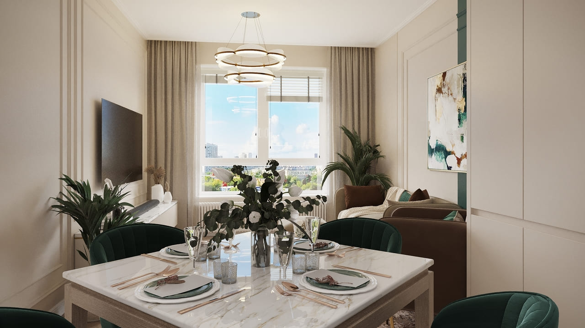
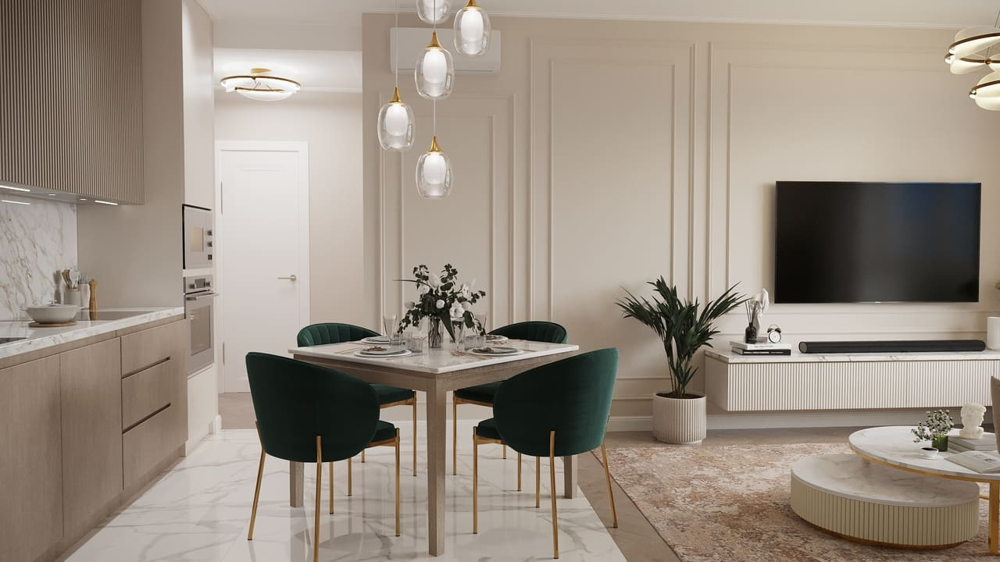
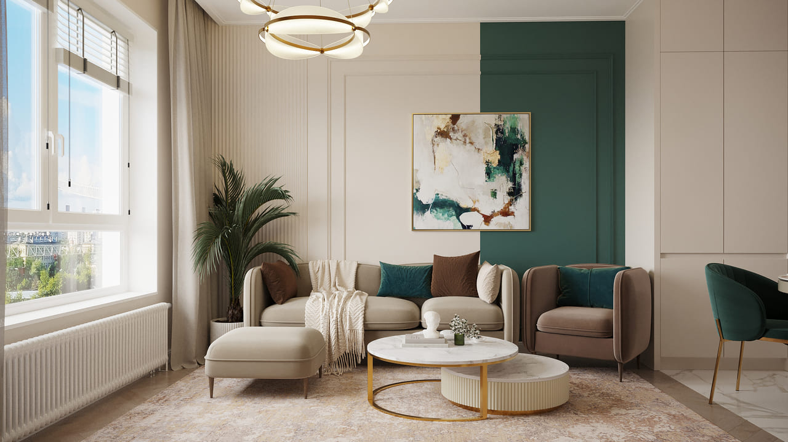
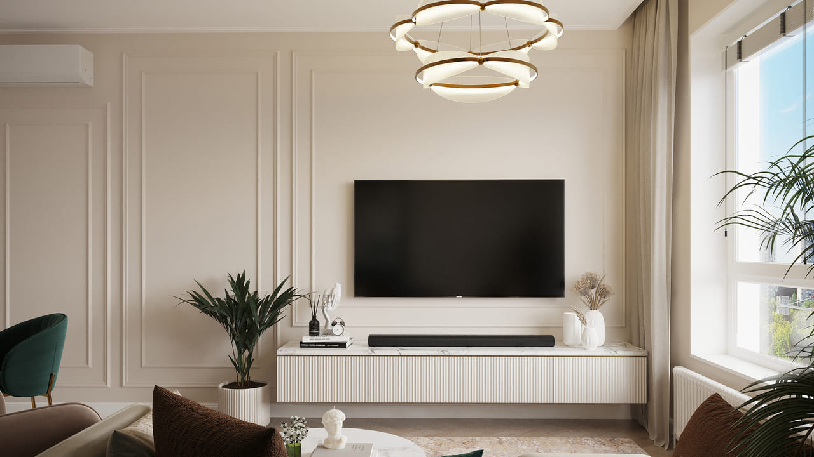
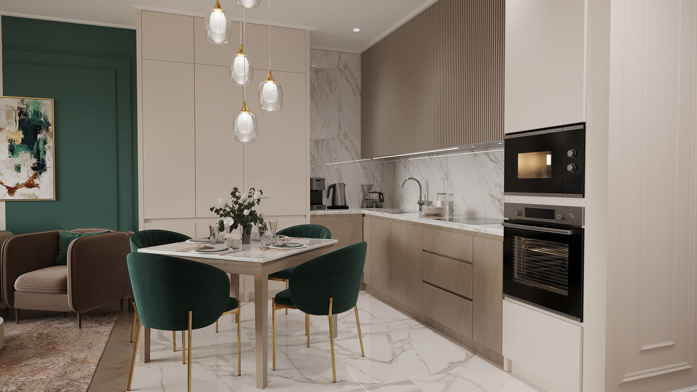
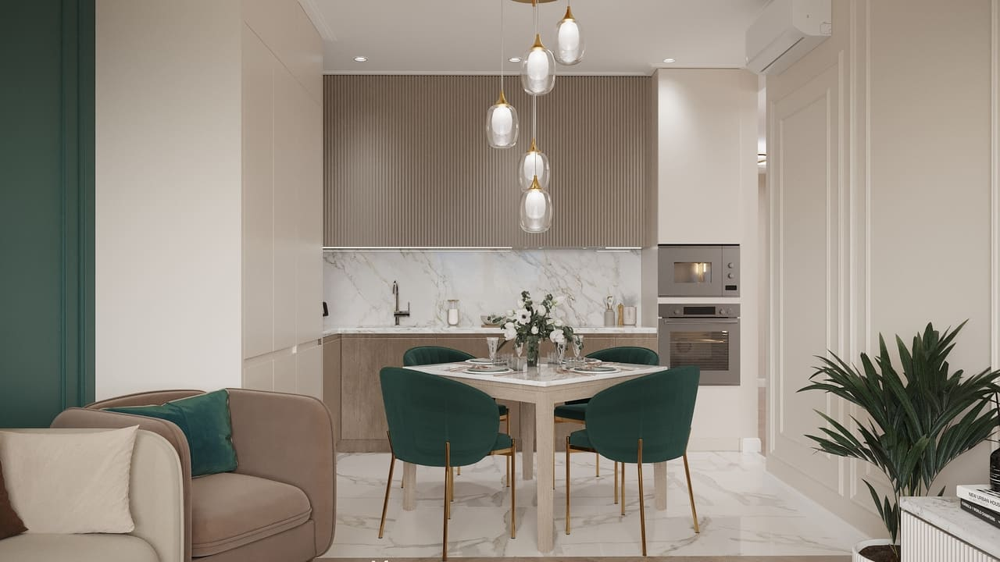

Отправной точкой для оформления стали спокойные бежевые тона стеновых покрытий, белоснежные дверные полотна и светлое глянцевое напольное покрытие, имитирующее мраморную текстуру, — такое решение зрительно увеличивает объём комнаты и насыщает её естественным светом. На этом умиротворённом фоне особенно выразительно звучат контрастные детали: благородный изумрудный оттенок в текстильных элементах и стеновой отделке, природная теплота древесной фактуры на фасадах кухни и предметы мебели в нежной бежевой гамме.

Кухонная часть решена в тёплом капучиновом оттенке, где верхние модули акцентированы выраженной вертикальной фрезеровкой. Рабочая поверхность и стеновой фартук выполнены из искусственного камня с благородным мраморным узором — это сочетание выглядит изысканно и при этом неприхотливо в уходе. В кухонном гарнитуре предусмотрен просторный пенал для хранения утвари, а также встроенная станция для робота-пылесоса — деталь, в которой практичность неразрывно связана с эстетикой.

Гостиная задумана как пространство для расслабления, живого общения и спокойного уединения. Уютный угловой диван в комплекте с пуфом, удобные кресла, журнальный столик с мраморной столешницей и художественная фреска на изумрудной акцентной стене формируют атмосферу, в которую хочется погружаться снова и снова. Зона под телевизор решена сдержанно и элегантно: подвесная тумба, рельефная лепнина и подобранный декор ставят завершающую точку в композиции. Обеденная группа служит связующим звеном, обеспечивая плавный визуальный переход от кухонной части к зоне отдыха. Стулья в изумрудной обивке на золотистых ножках перекликаются с общей цветовой идеей интерьера, а многоярусная композиция из стеклянных подвесных светильников привносит ощущение воздушности и живого ритма.

## Спальня

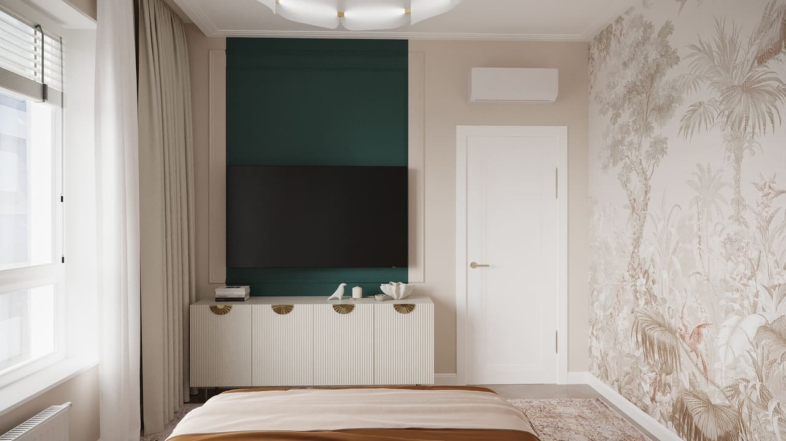
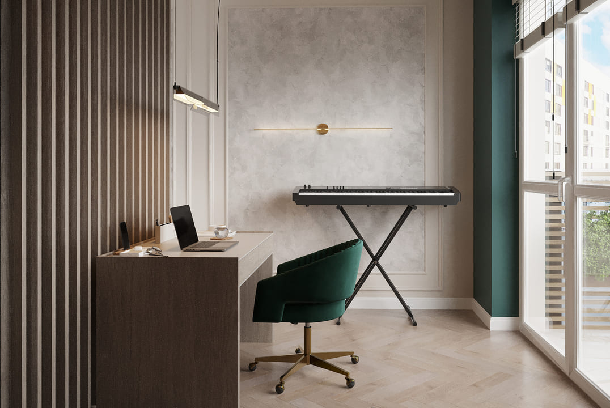
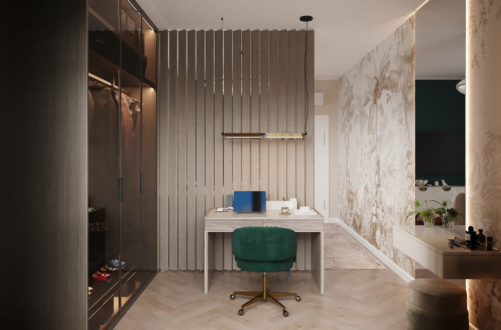
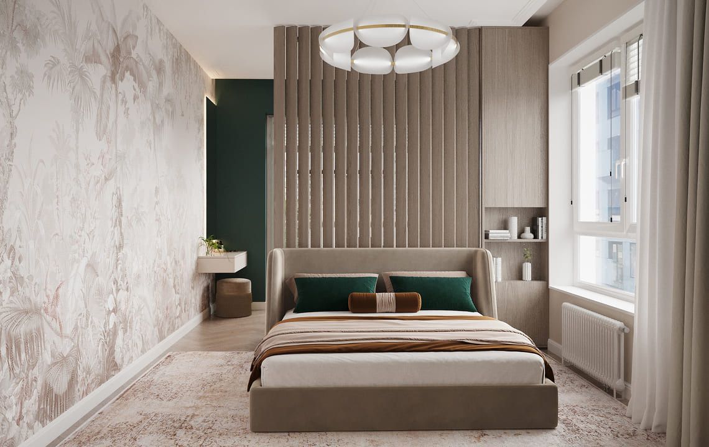
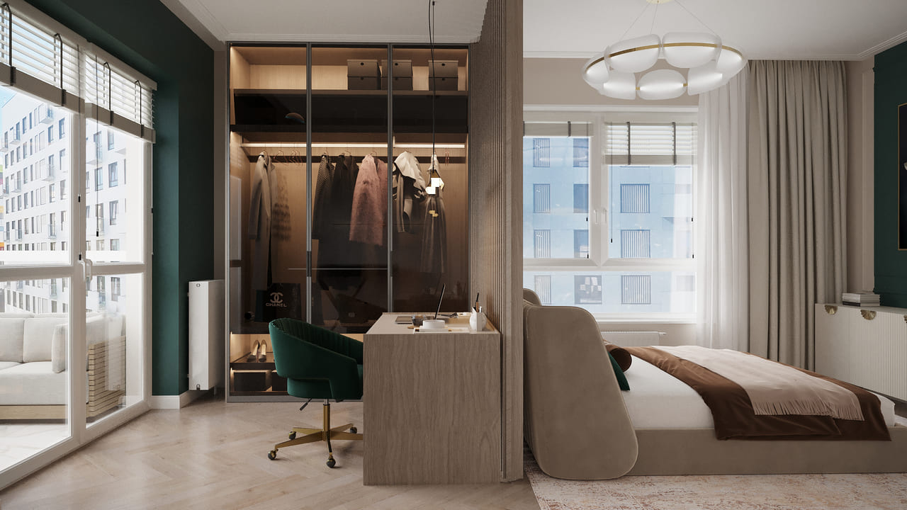
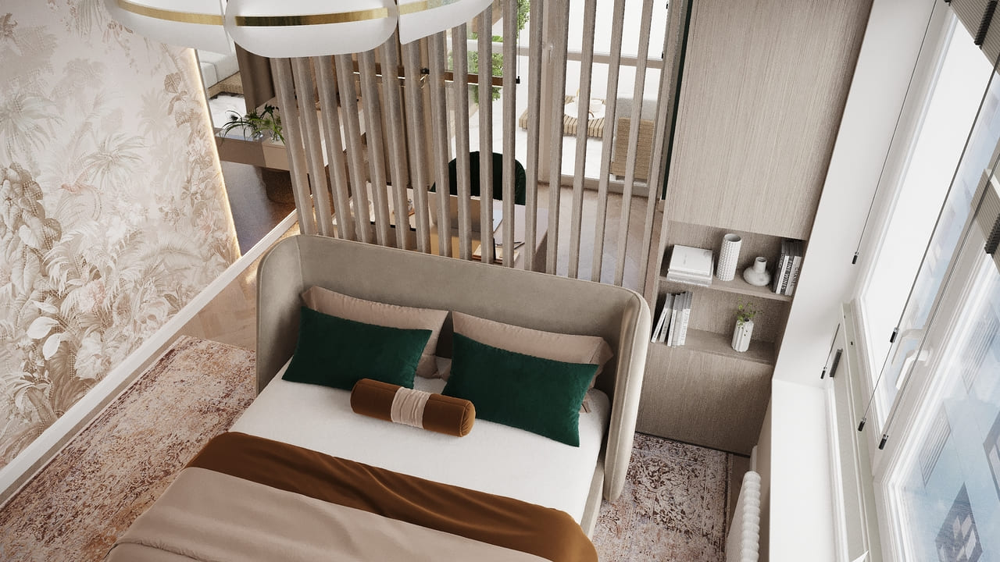

По желанию хозяев планировочная схема осталась нетронутой, однако мы подобрали изящный приём: рабочую зону и гардеробную отделили поворотными декоративными рейками. Они выполняют сразу несколько задач — разграничивают пространство, дают возможность управлять потоком света и варьировать уровень приватности. Цветовая основа построена на тёплой бежевой гамме и светлых древесных оттенках, которые наполняют помещение ощущением покоя и гармонии. Ключевой акцент — глубокий изумрудный тон, связывающий эту комнату с остальными зонами квартиры и придающий интерьеру выразительную глубину.

Рабочее место вписано в пространство с максимальной эргономикой: лаконичный стол, эргономичное кресло, подвесной светильник и встроенный шкаф-гардероб с прозрачными дверцами. Здесь удобно трудиться, предаваться творчеству или заниматься любимым увлечением — нашлось даже место для музыкального инструмента! Кровать с мягким стёганым изголовьем, декоративные подушки и уютный текстиль формируют расслабляющую, обволакивающую атмосферу. Большое окно щедро наполняет комнату дневным светом, а плотные портьеры при желании позволяют полностью затемнить пространство. Зона телевизора размещена на фоне изумрудной акцентной стены, а тумба с золотистыми ручками вносит в образ лёгкое дыхание ар-деко.

## Ванная комната

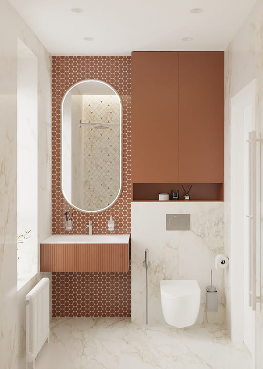
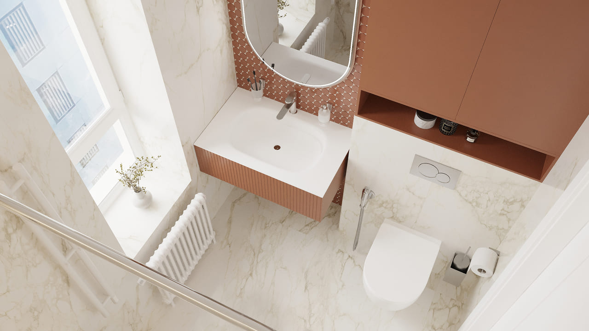
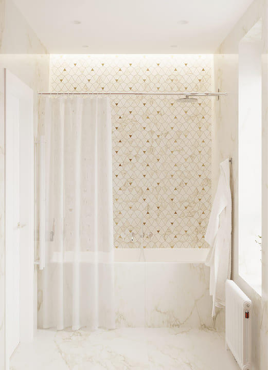

В отделке применён керамогранит с выразительной мраморной фактурой: он зрительно раздвигает границы помещения и наполняет его ощущением свежести и света. Стены, напольное покрытие и чаша ванны воспринимаются как единое целое, образуя эффект монолитного объёма. Для комнаты с вытянутой геометрией это особенно ценно — здесь каждый сантиметр подчинён задаче создать впечатление простора. Центральным акцентом стала зона умывальника. Терракотовая плитка в форме сот, контурная подсветка зеркала и подвесная тумба с рельефными рифлёными фасадами мгновенно приковывают внимание. Оттенок тумбы и навесного шкафчика вторит отделке прихожей, поддерживая единую цветовую линию всей квартиры.

В нише над инсталляцией размещён встроенный шкаф для хранения, выдержанный в том же тёплом тоне. Этот приём позволяет убрать с глаз бытовые принадлежности, не нарушая выверенной геометрии пространства. Зона купания облицована мозаикой с деликатным золотистым орнаментом, а лёгкая светлая штора на потолочном карнизе привносит ощущение невесомости. Благодаря большому окну ванная комната буквально залита естественным светом — редкая привилегия для квартиры типовой планировки.