## Прихожая

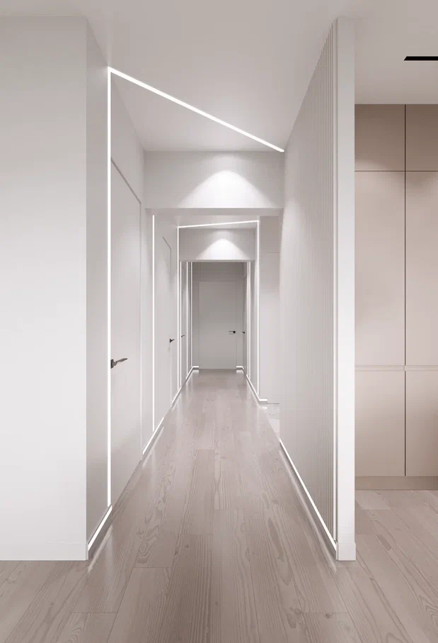
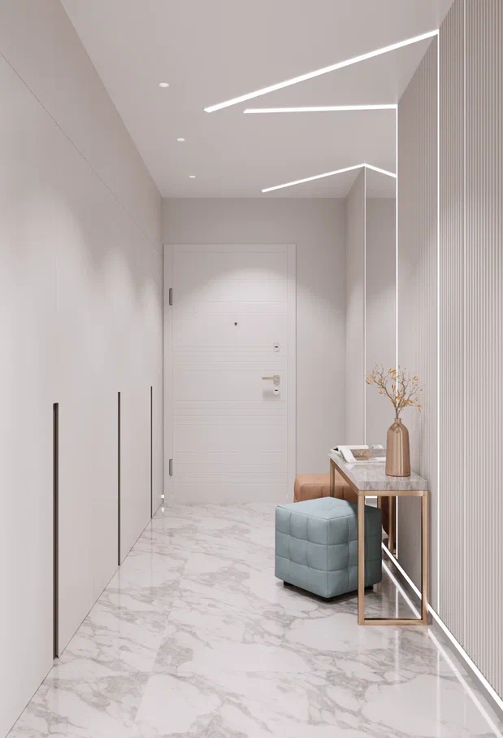
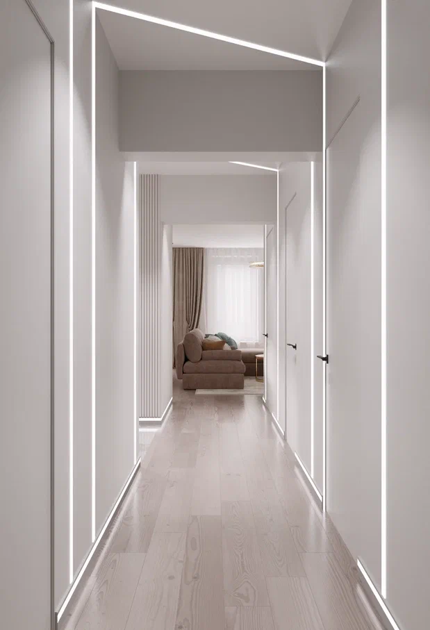

Входная группа встречает гостей безупречной белизной, где главенствуют чистые линии и обилие света, мгновенно создавая ощущение простора и упорядоченности. Архитектура встроенной подсветки, проходящей по периметру стен и потолка, работает как визуальный навигатор, мягко направляя взгляды вглубь квартиры, к её сердцу. В качестве напольного покрытия выбран крупноформатный керамогранит с рисунком белого мрамора — решение, объединяющее в себе красоту природного камня и абсолютную бытовую практичность.

Масштабное зеркальное полотно стирает физические границы помещения, одновременно выполняя утилитарную функцию и позволяя оценить образ перед выходом. Завершают композицию прихожей изящная консоль с деликатной золотой фурнитурой и мягкий пуф, привносящие в лаконичный холл нотку домашнего тепла и элегантности.

## Кухня-гостиная

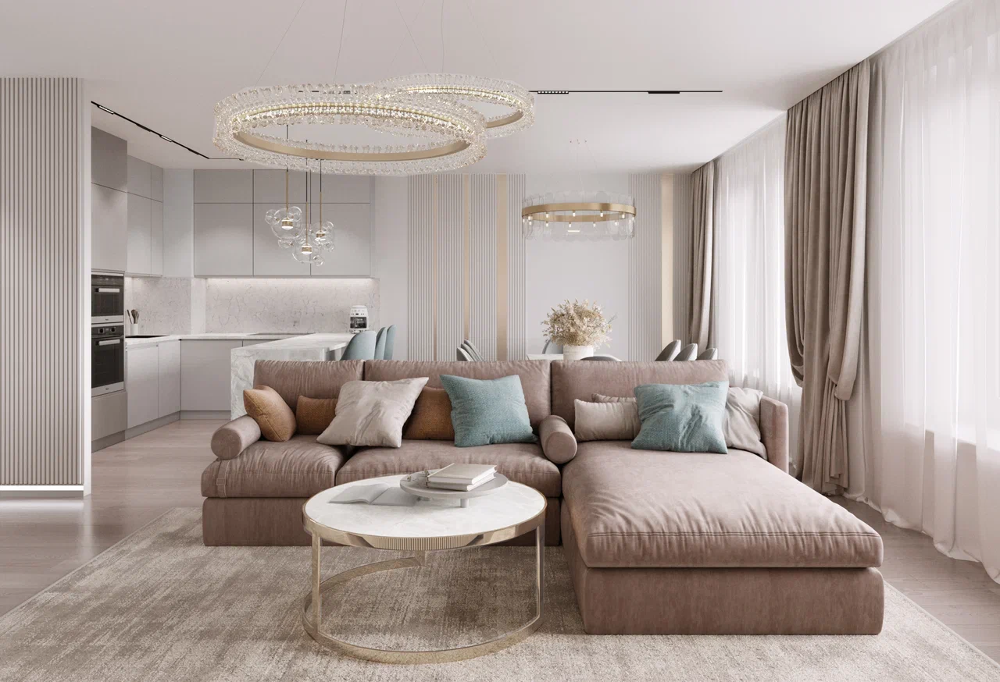
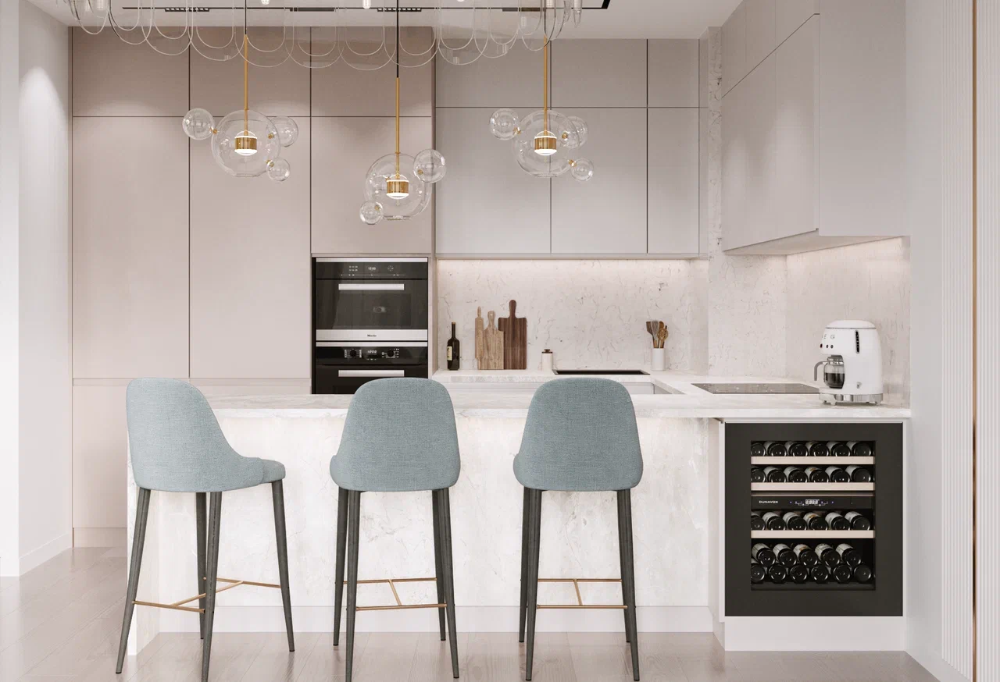
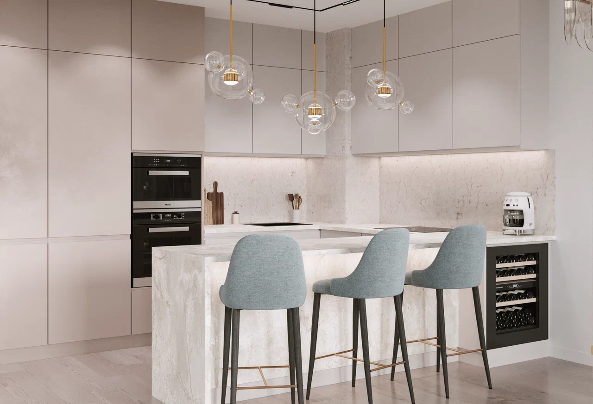
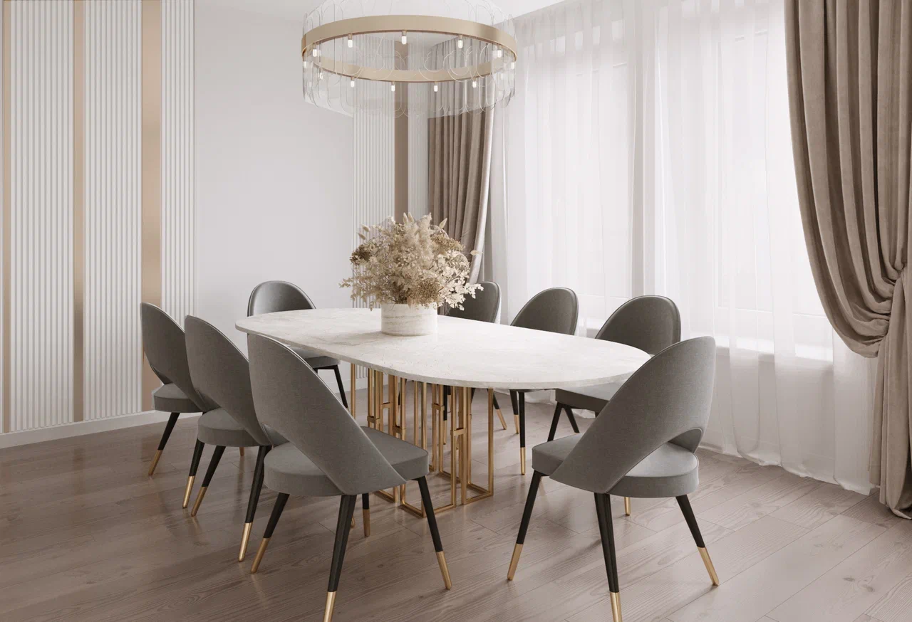
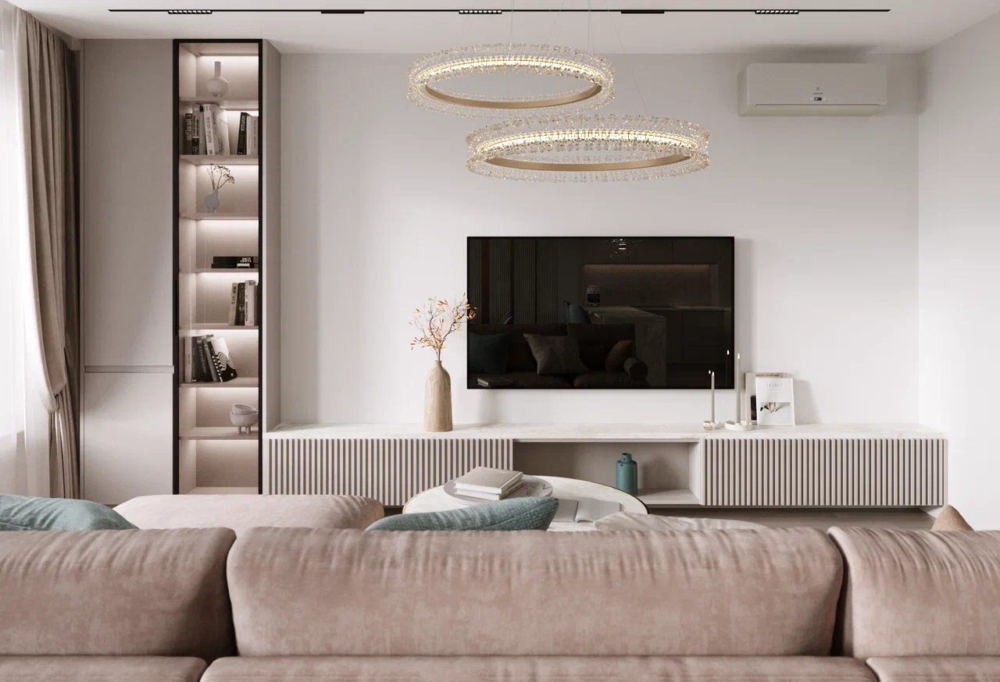
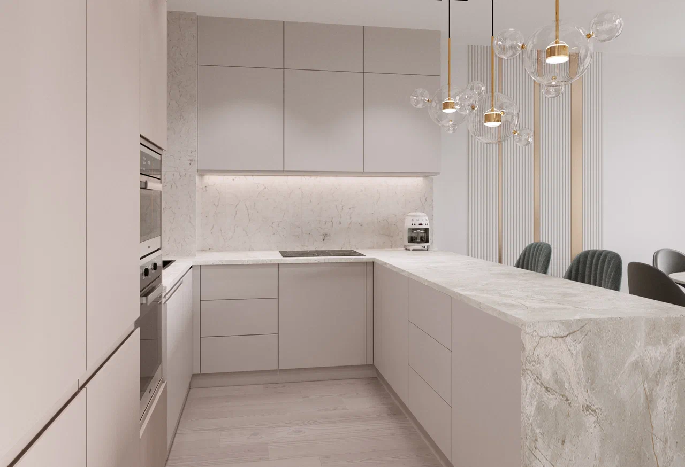
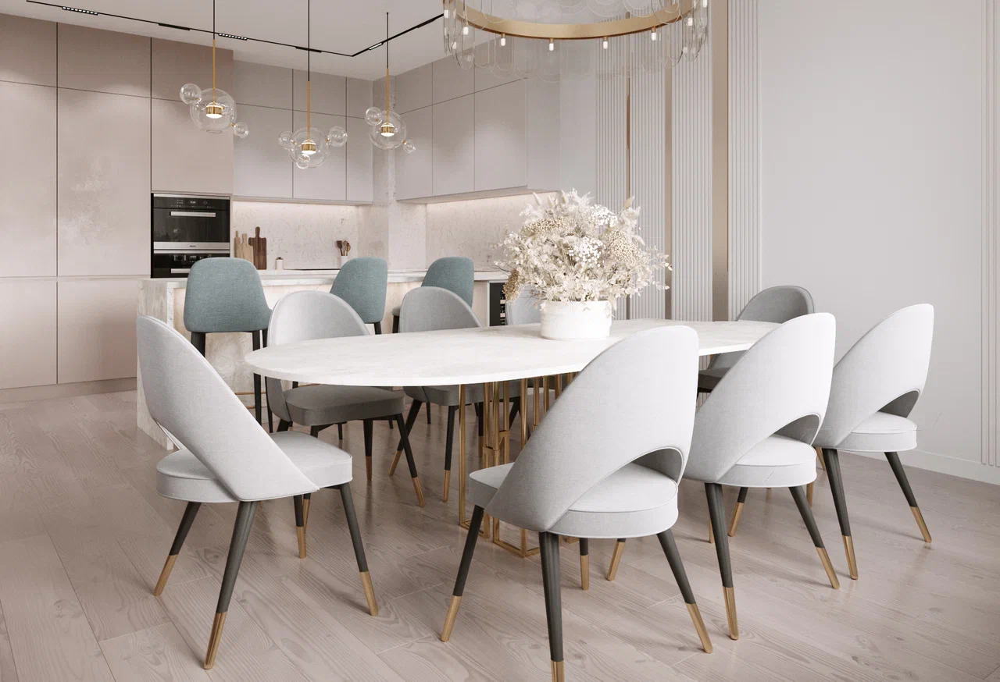

Кулинарный блок решён в сдержанной светлой гамме: матовые фасады гарнитура не только придают интерьеру аристократичный вид, но и отличаются высокой практичностью, с лёгкостью выдерживая ежедневные нагрузки. Благородный мрамор, использованный для столешницы и стенового фартука, привносит в пространство деликатное сияние и статусность. Границу между кухней и столовой обозначает барная стойка — идеальное место для утреннего кофе или быстрого перекуса. Дополняет композицию винная витрина, служащая изящной, сугубо взрослой ноткой в пространстве, ориентированном на всю семью.

Столовая группа сформирована вокруг изысканного овального стола со светлой столешницей, опирающейся на тонкие ножки золотистого оттенка. Вокруг него расставлены комфортные стулья, чья обивка мастерски играет на контрасте: сочетание нежно-серого и небесно-голубого текстиля добавляет обстановке динамики и свежести. Венчает эту зону роскошная люстра, напоминающая ювелирное украшение — её невесомая конструкция из прозрачного стекла и золотистых элементов становится настоящим арт-объектом.

Пространство гостиной буквально пропитано уютом, центром притяжения здесь выступает масштабный диван с удлиненной секцией-лежанкой, выполненный в благородном карамельном оттенке. Декоративные подушки бирюзового и бежевого цветов тонко рифмуются с оформлением портьер и обивкой обеденных стульев, складываясь в выверенную и тёплую колористическую историю. Особую магию и чувство невесомости, особенно в вечернее время, дарят потолочные светильники в виде парящих светящихся колец. Медиазона выдержана в эстетике спокойной элегантности: ТВ-тумба с выразительным рифлёным фасадом, открытые полки с деликатной внутренней подсветкой и мягкий, обволакивающий свет формируют идеальную атмосферу для релакса, полностью исключая визуальный шум.

## Спальня

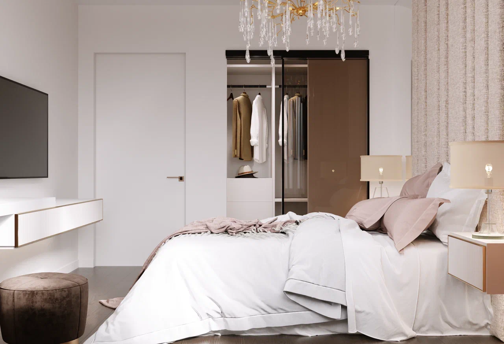
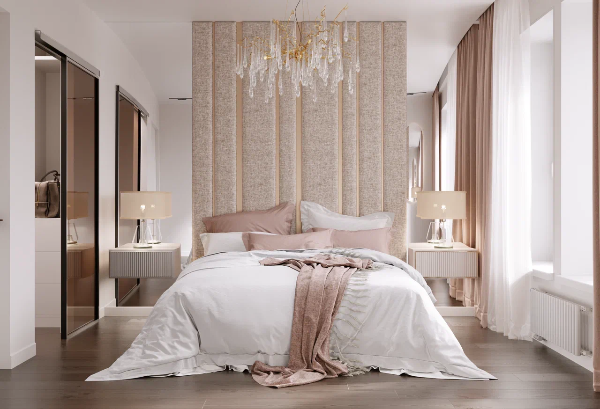
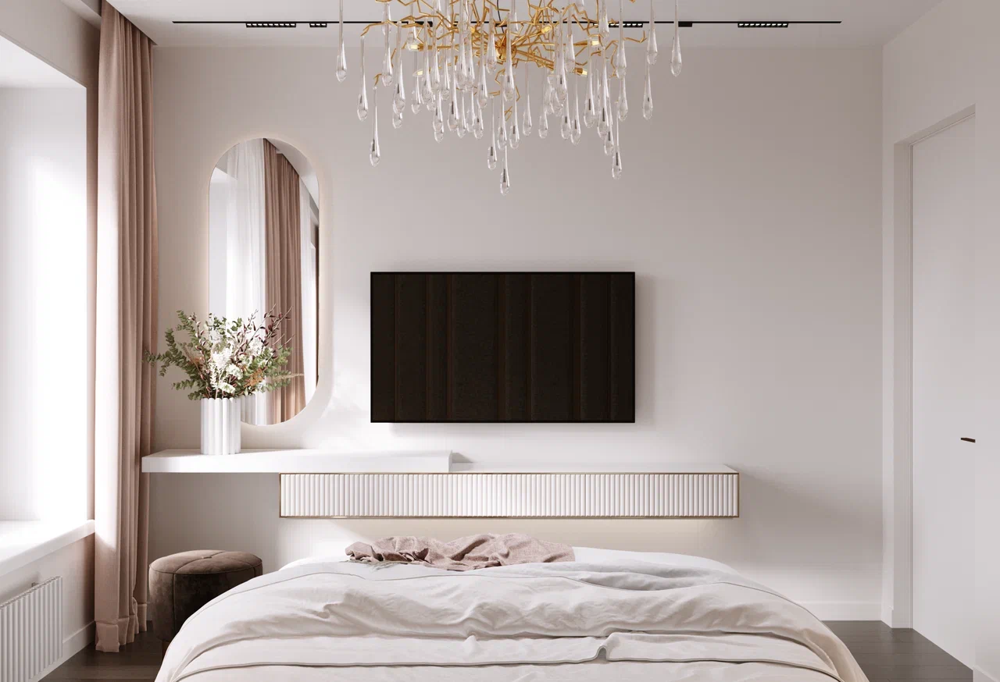

Архитектурной и визуальной доминантой комнаты выступает масштабное мягкое изголовье кровати. Тактильная ткань с деликатной фактурой изящно чередуется с вертикальными вставками, обладающими благородным золотистым отблеском. Этот дизайнерский приём мастерски вытягивает пропорции помещения вверх, наполняя его аристократичным шармом. Спальное место оформлено светлым текстилем с нежными пудрово-розовыми нюансами, что создаёт безупречную атмосферу для полноценного отдыха и расслабления.

Симметрию пространства поддерживают парящие прикроватные тумбы с выразительными рельефными фасадами. Их дополняют воздушные светильники на прозрачных стеклянных основаниях, не перегружающие интерьер. Венчает световую композицию роскошная хрустальная люстра на золотистом каркасе: она привносит в обстановку нотку подлинной роскоши и подчёркивает статусный, выдержанный характер хозяйской спальни.

Оконный проём обрамлён многослойным текстилем: невесомый тюль сочетается с плотными портьерами глубокого кофейного оттенка. Такое решение позволяет гибко управлять уровнем естественного освещения, адаптируя его под время суток и настроение. Напротив кровати организована лаконичная медиазона с подвесной ТВ-консолью, а пространство у окна эргономично задействовано под встроенный туалетный столик.

Отдельного внимания заслуживает система хранения. Просторный гардеробный шкаф оснащён зеркальными фасадами во всю высоту. Это решение не только безупречно организует размещение вещей, но и работает на оптическое расширение пространства: зеркала мастерски умножают свет и отражают изящные детали интерьера, делая комнату ещё более объёмной и воздушной.

## Детская комната

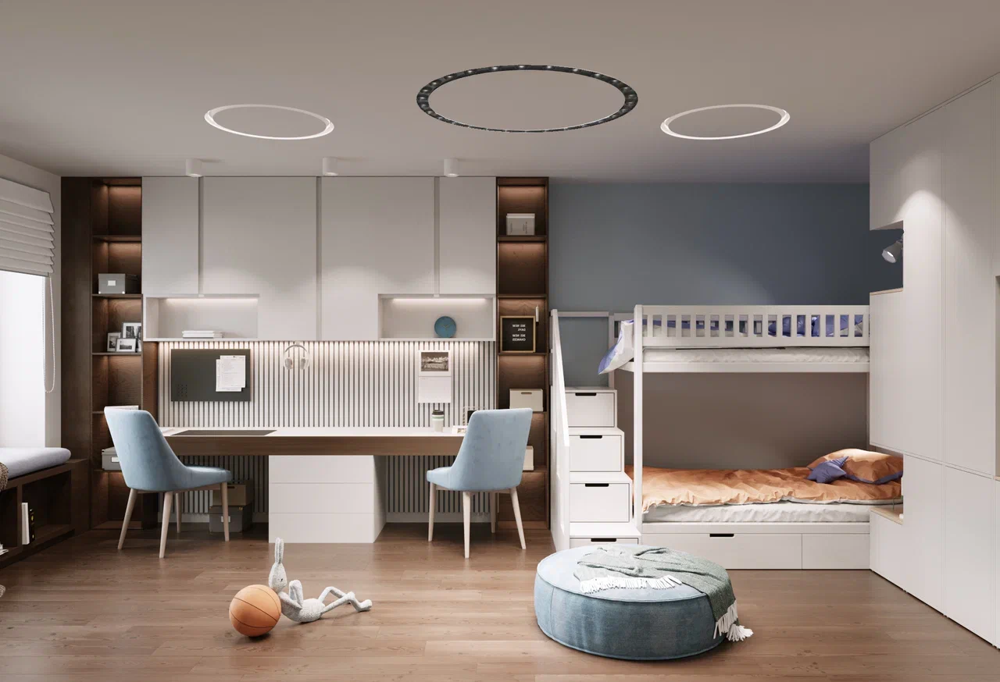
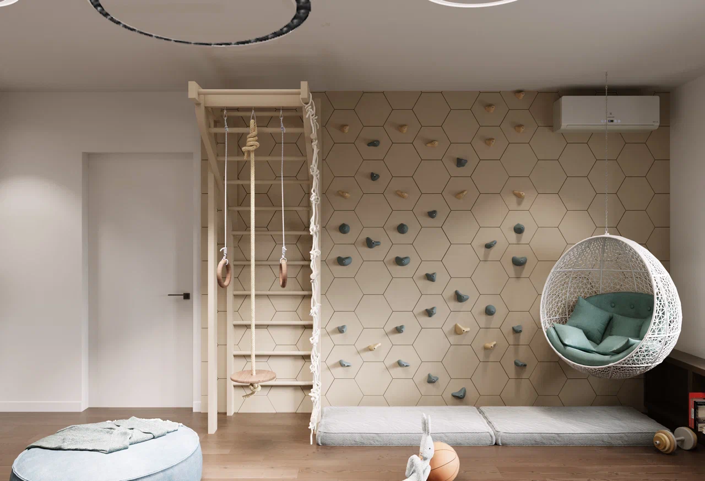
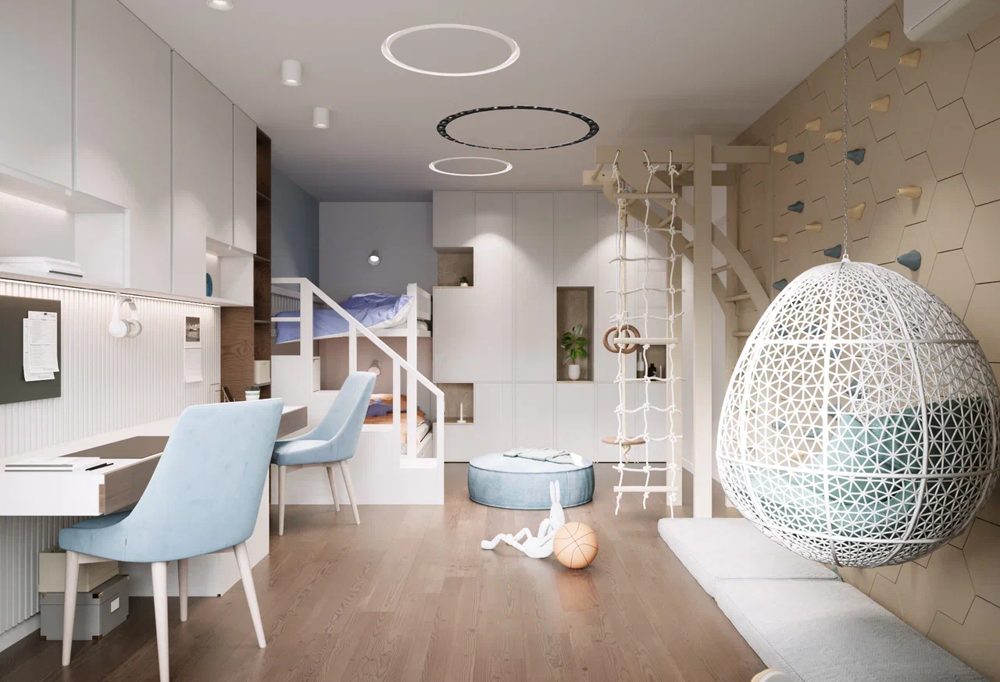
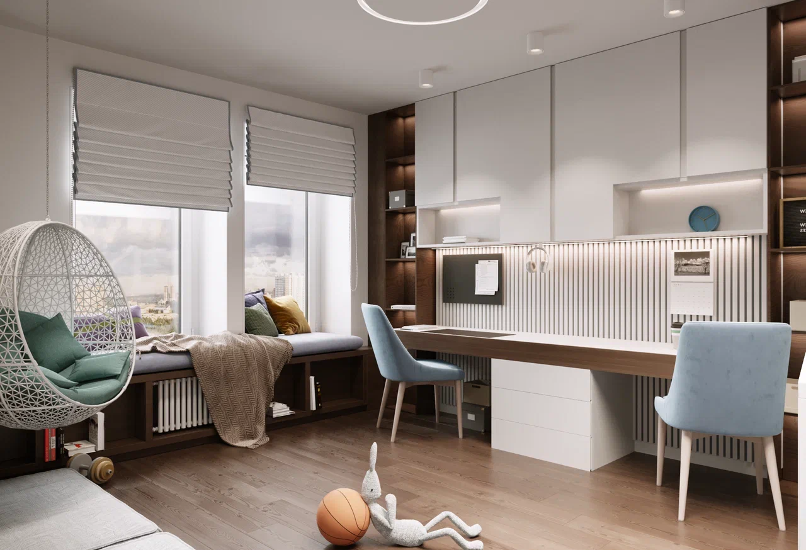

Это пространство — не просто комната, а настоящий мини-мир для двух энергичных мальчишек, где есть место и для учёбы, и для игр, и для отдыха. Интерьер создавался с акцентом на свободу движения, творчество и организацию личного пространства каждого ребёнка. Комната наполнена светом благодаря большим окнам и спокойной светлой палитре с акцентами в голубых и древесных тонах. У окна устроена удобная скамья-подоконник с мягкими подушками — идеальное место, чтобы почитать, пофантазировать или просто посмотреть в окно. Радиаторы скрыты за мебелью, а по бокам встроены открытые полки — дополнительное место для книг и игрушек.

Рабочая зона организована с заботой о комфорте и порядке: большой общий стол на двоих, встроенное освещение, вертикальные панели для заметок и чёткая система хранения. Всё под рукой, но ничто не отвлекает. Мягкие кресла нежно-голубого цвета делают зону учёбы не только практичной, но и уютной. Зона сна оформлена в виде двухъярусной кровати с удобными ступенями-комодами и вместительными ящиками под нижним ярусом. Такое решение позволяет экономить место и организовать хранение без лишней мебели.

Особая гордость комнаты — спортивный комплекс с шведской стенкой, верёвками, кольцами и даже мини-скалодромом. Всё это превращает комнату в настоящую зону активностей прямо дома. Мягкий мат на полу делает игры безопасными. А подвесное кресло-кокон — уголок уединения и отдыха, где можно покачаться, обняв подушку, или послушать аудиокнигу. Завершает атмосферу круглый мягкий пуф и дизайнерское потолочное освещение в виде световых колец.

## Ванная комната

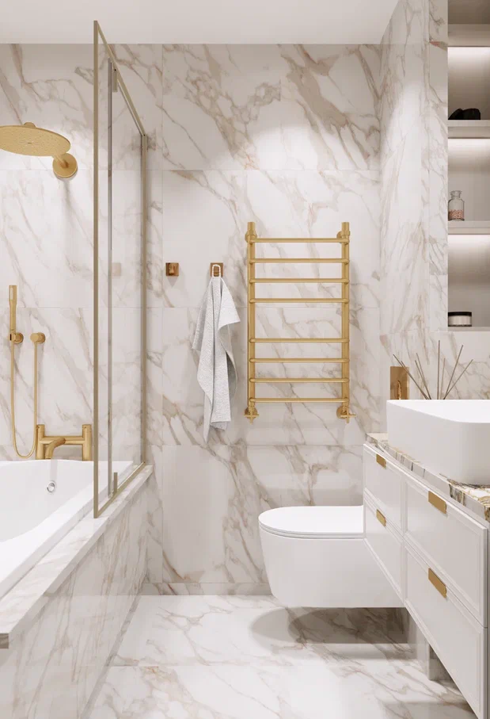
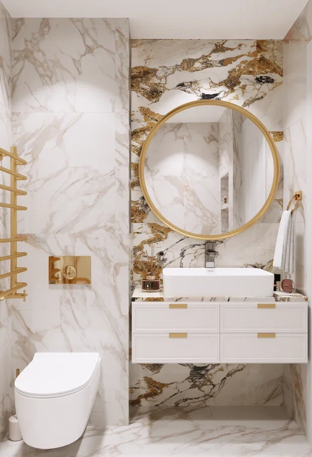
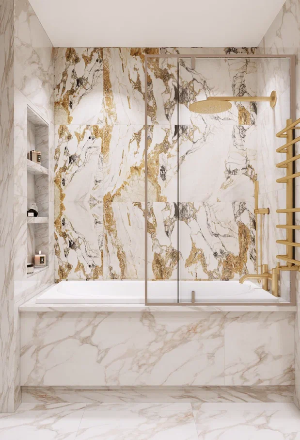

Архитектурную основу санузла сформировал масштабный керамогранит, имитирующий белый мрамор с эффектной сетью золотых прожилок. Бесшовное покрытие, переходящее со стен на пол, стирает визуальные границы и складывается в монолитный, гармоничный объём. На этом благородном фоне роскошным акцентом выступает сантехническое оснащение в золотой отделке. Душевая стойка, смеситель, полотенцесушитель и даже клавиша смыва скрытой инсталляции складываются в единую драгоценную палитру, наделяющую интерьер аристократичным статусом и утончённым шиком.

Купальная зона деликатно выделена прозрачной стеклянной перегородкой на тончайшем, почти незаметном профиле. Такой приём сохраняет визуальную лёгкость, не дробит пространство и позволяет свету свободно проникать в каждый уголок. Вопросы повседневного хранения решены скрытно и элегантно: архитектурные ниши, интегрированные прямо в стены, стали идеальным и эстетичным убежищем для банных принадлежностей и уходовой косметики, не перегружая при этом интерьер лишними деталями.

Мебельная композиция сочетает в себе строгую лаконичность и декоративную выразительность. Подвесная тумба со светлыми фасадами и изящной золотой фурнитурой безупречно рифмуется с круглым зеркалом в тонком металлическом обрамлении. «Парящий» дизайн мебели не только безупречен с точки зрения эргономики и удобства уборки, но и мастерски разгружает интерьер, заставляя помещение ощущаться значительно просторнее и свободнее.

## Санузел

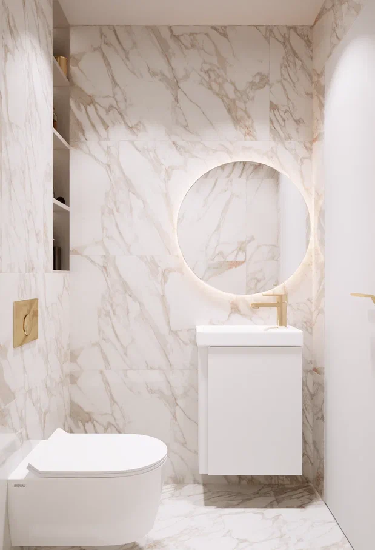
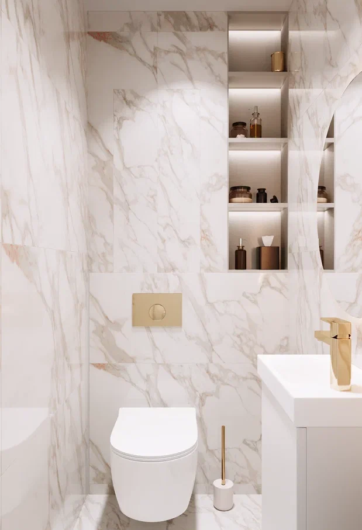

Пространство от пола до потолка облачено в крупноформатный керамогранит, имитирующий белый мрамор со сдержанным, деликатным рисунком. Этот монолитный приём мастерски раздвигает физические границы помещения, наделяя его ощущением солидности и премиальности. Тончайшие золотистые прожилки в текстуре камня находят изящное продолжение в металлической фурнитуре — смесителе, клавише инсталляции и минималистичном держателе для бумаги. Подобное единство деталей формирует безупречно цельный образ, полностью свободный от визуального шума.

Зона умывания спроектирована предельно эргономично: компактная подвесная тумба с лаконичной раковиной обеспечивает повседневный комфорт, оставаясь при этом визуальной лёгкой и невесомой. Композицию венчает круглое зеркало с мягкой скрытой подсветкой по контуру. Оно выступает не просто как декоративный элемент, а как полноценный световой сценарий, который наполняет интерьер уютным сиянием, придавая ему дополнительную глубину и архитектурный объём.

Отдельного внимания заслуживают встроенные ниши с внутренней подсветкой. Они виртуозно совмещают утилитарную и эстетическую функции: служат стильным пространством для экспозиции декора и хранения уходовой косметики. Такой подход позволяет аккуратно разместить всё необходимое, поддерживая идеальный порядок и сохраняя воздушность пространства без лишних загромождений.
