## Прихожая и коридор

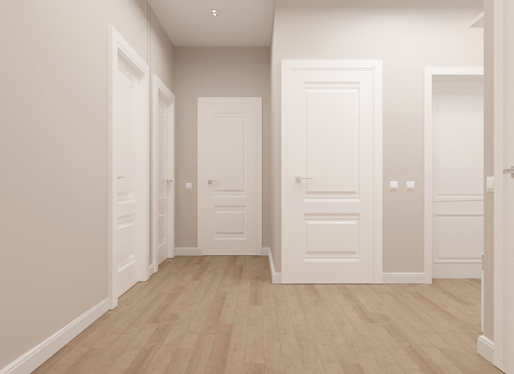
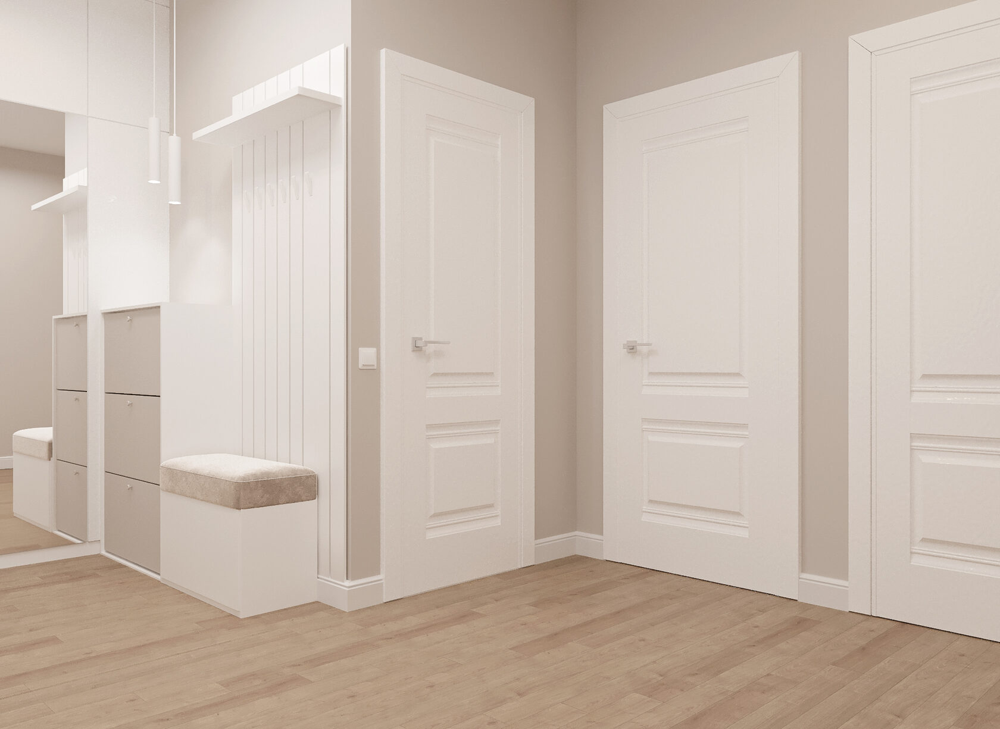
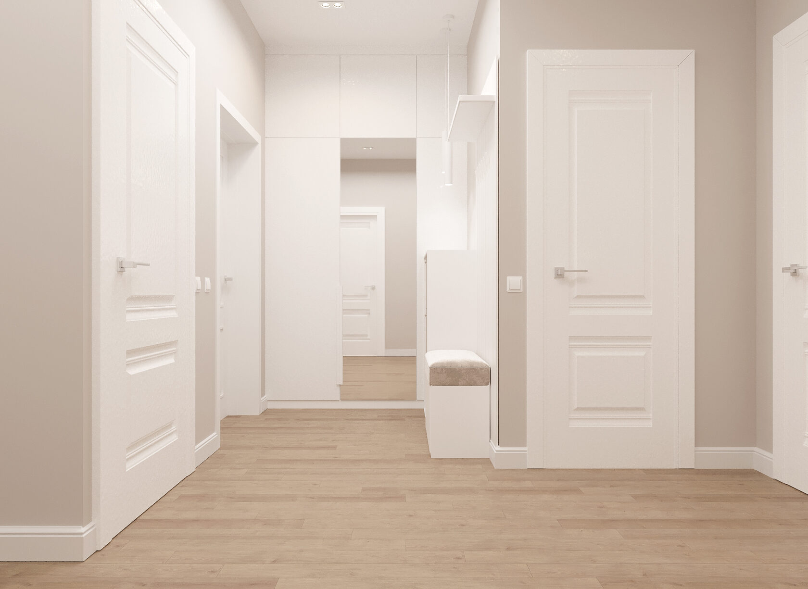

Входная группа с первых шагов задаёт эмоциональный и визуальный тон всей квартире, встречая образцовой аккуратностью и обилием света. Следуя пожеланиям хозяев, мы свели к абсолютному минимуму количество открытых полок. Вместительные гардеробные шкафы интегрированы в архитектурные ниши и визуально сливаются с плоскостью стен, формируя монолитный объём и поддерживая безупречный порядок.

При этом эргономика пространства продумана до мелочей и выведена на первый план: здесь предусмотрена комфортная мягкая банкетка, выдвижные ящики для обуви, удобная полка и крючки для повседневной верхней одежды. Сценарий использования выстроен так, чтобы на пути не возникало ни физических, ни визуальных препятствий.

Колористическое решение холла базируется на сочетании светлых стен и белоснежных дверных полотен, которые идеально рифмуются с напольным покрытием из тёплого кварцвинила, мастерски имитирующего природную древесину. Этот приём создаёт обволакивающее чувство уюта и оптически раздвигает границы помещения. Масштабное зеркало в полный рост многократно умножает глубину пространства, а продуманная система потолочных светильников обеспечивает мягкое, равномерное и комфортное для глаз освещение.

## Кухня

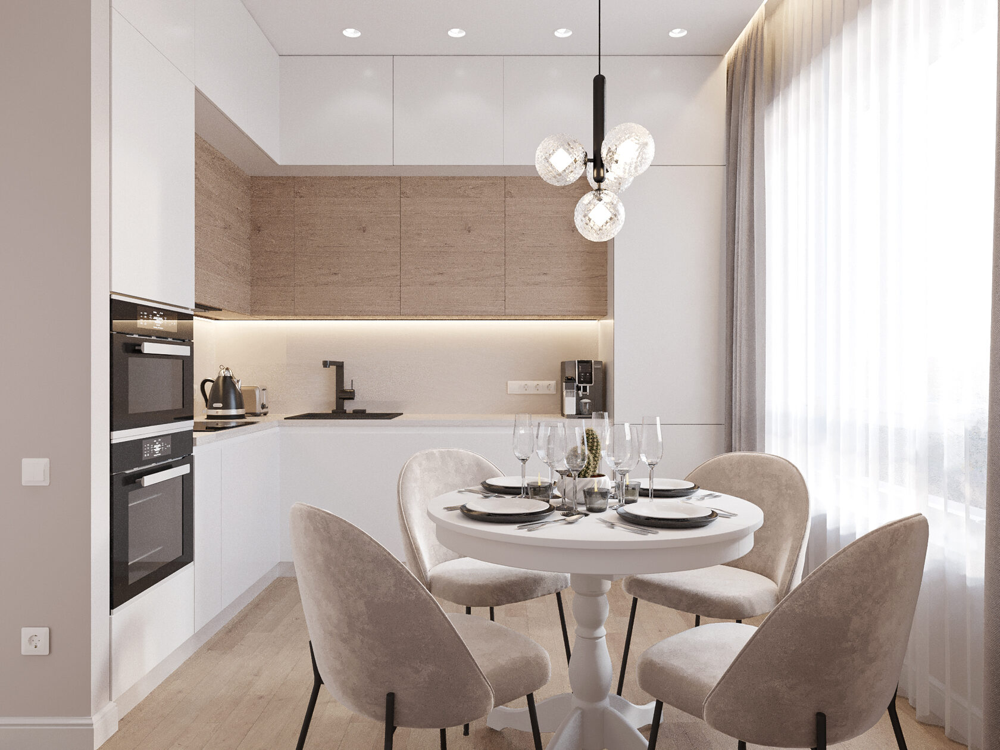
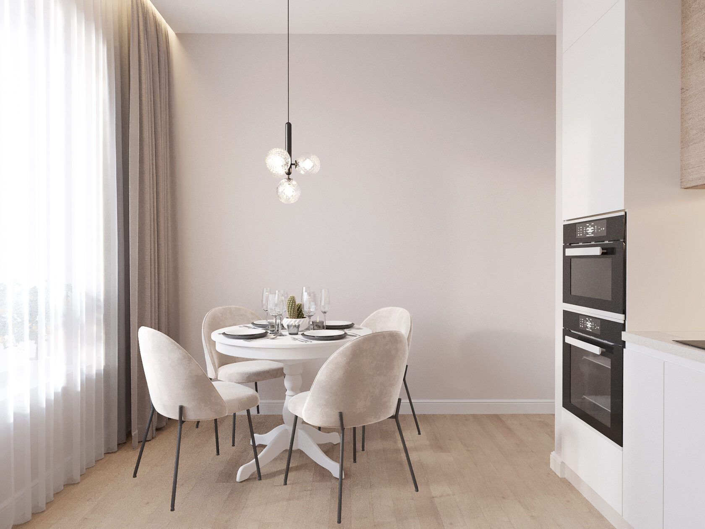
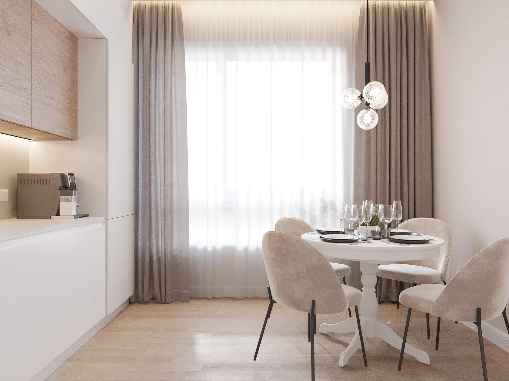
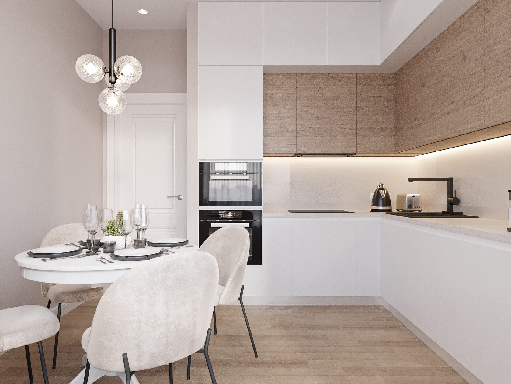

Пространство кухни наполнено ощущением воздушности и домашнего уюта, которое рождается на стыке светлых оттенков, тёплой древесной фактуры и мягкого, рассеянного освещения. Следуя главному запросу заказчика на визуальную чистоту, мы спроектировали гарнитур с исключительно глухими фасадами: весь бытовой сценарий и утварь надёжно скрыты от посторонних глаз, ничто не нарушает строгий архитектурный ритм. Вся техника полностью интегрирована, а верхние модули шкафов доведены до самого потолка — это максимально практичное решение, позволяющее задействовать каждый доступный сантиметр для хранения, совершенно не утяжеляя при этом объём помещения.

Особую выразительность интерьеру придаёт тонкая игра фактур. Безупречно гладкие матовые плоскости шкафов мастерски контрастируют с естественным рисунком дерева и бархатистой обивкой обеденных кресел, создавая богатое тактильное и визуальное разнообразие.

Обеденная зона сформирована как обособленный, по-настоящему камерный островок. В её центре расположился элегантный круглый стол в окружении глубоких мягких кресел, которые буквально приглашают задержаться подольше и насладиться неспешным общением. Венчает эту композицию эффектный светильник с плафонами в форме идеальных сфер — деталь, привносящая в сдержанную обстановку изящную нотку дизайнерской игры и актуальной эстетики.

## Гостиная

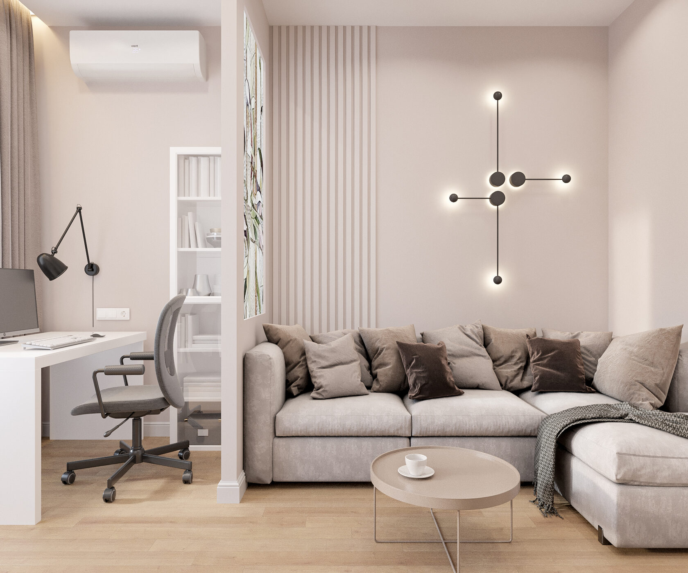
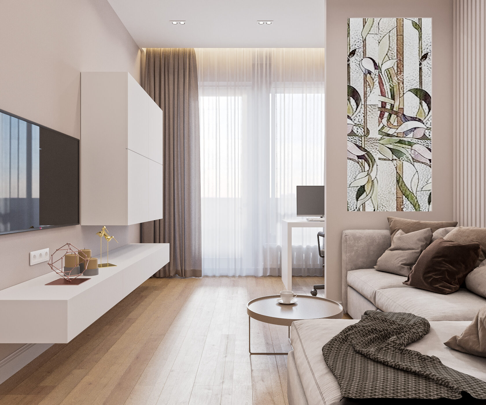
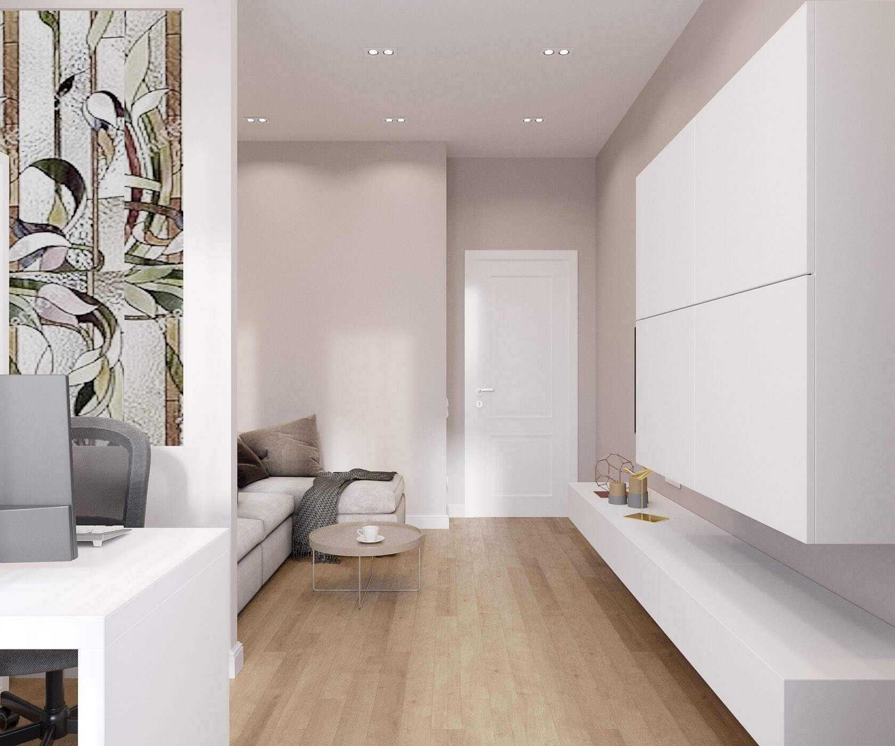
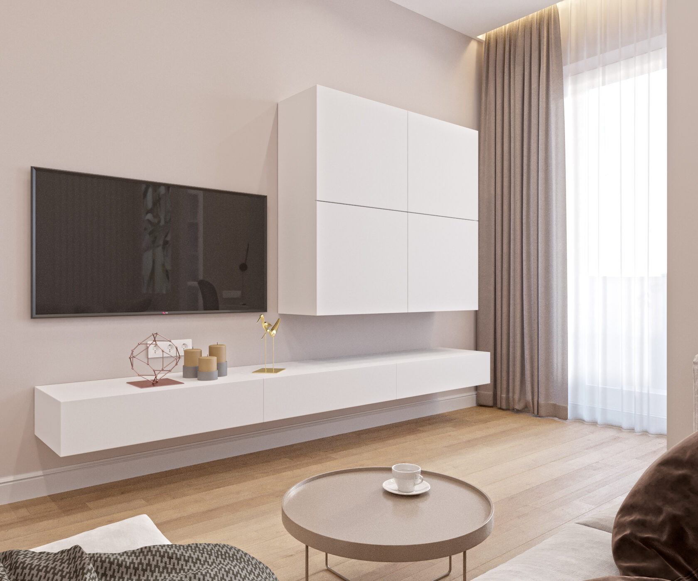
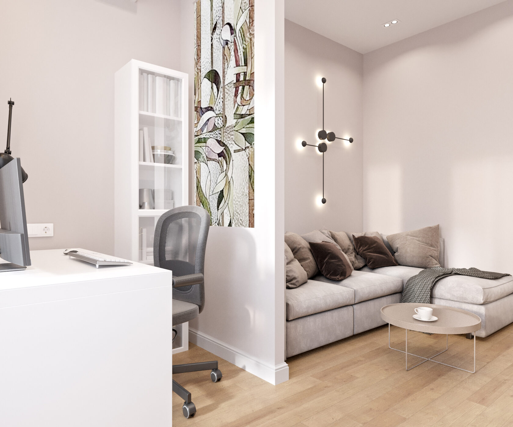

Центром притяжения в зоне отдыха стал просторный светлый диван, чьи мягкие формы и тактильная обивка буквально приглашают к расслаблению. По настоятельной просьбе заказчика нам необходимо было деликатно и нестандартно обособить домашний офис от общего пространства. Для решения этой задачи была спроектирована декоративная перегородка с авторским витражом, палитра и рисунок которого подбирались индивидуально. Стекло с изящными золотистыми и серебристыми переливами наделяет интерьер благородным богатством, совершенно не утяжеляя при этом воздушную атмосферу комнаты.

Само рабочее место получилось визуально невесомым и предельно функциональным, органично вплетаясь в общую стилистику помещения. Снежно-белая столешница, лаконичный настольный светильник и воздушный стеллаж из прозрачного стекла поддерживают ощущение открытости, позволяя сосредоточиться на задачах, не выпадая из расслабляющего контекста гостиной.

Стена за диваном превратилась в выразительный архитектурный акцент: её поверхность декорирована мягкими вертикальными рейками, задающими пространству благородный ритм. Композицию дополняет нестандартный дизайнерский светильник, виртуозно совмещающий две функции: днём он выступает в роли арт-объекта, а с наступлением вечера обеспечивает уютную, камерную подсветку. Медиазона выдержана в эстетике строгого минимализма: навесные модули и подвесная полка, намеренно лишённые видимой фурнитуры, формируют монолитный объём, который не отвлекает взгляд и сохраняет безупречную визуальную чистоту интерьера.

## Спальня

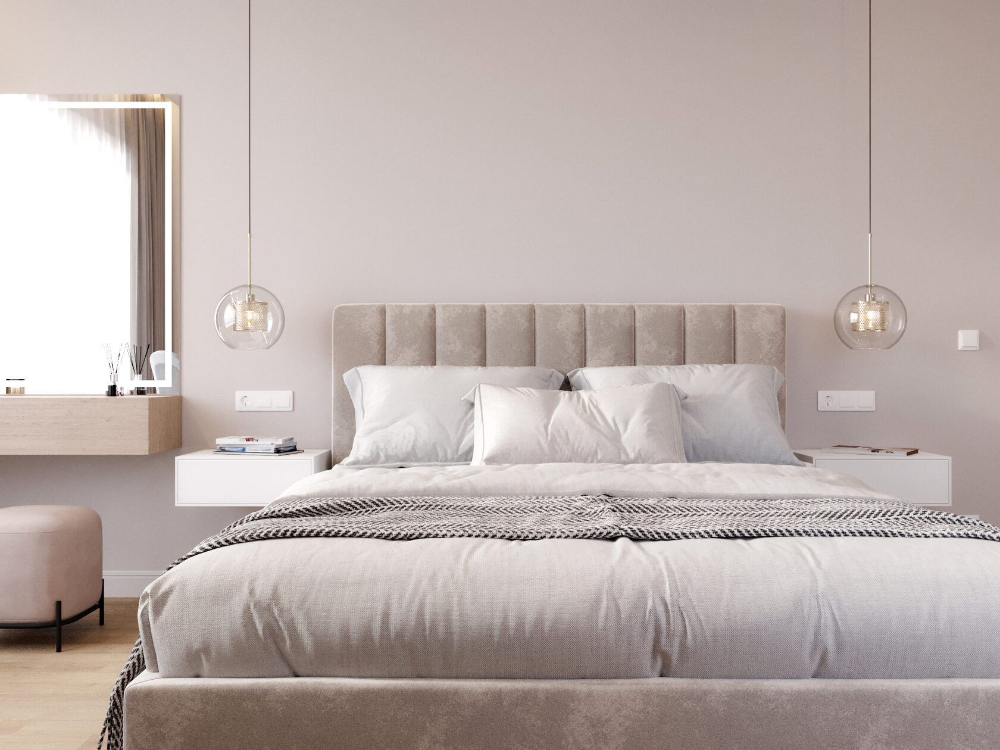
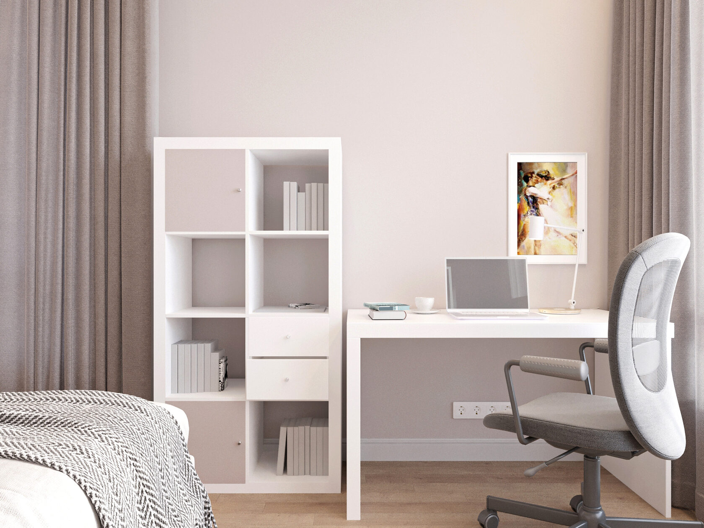
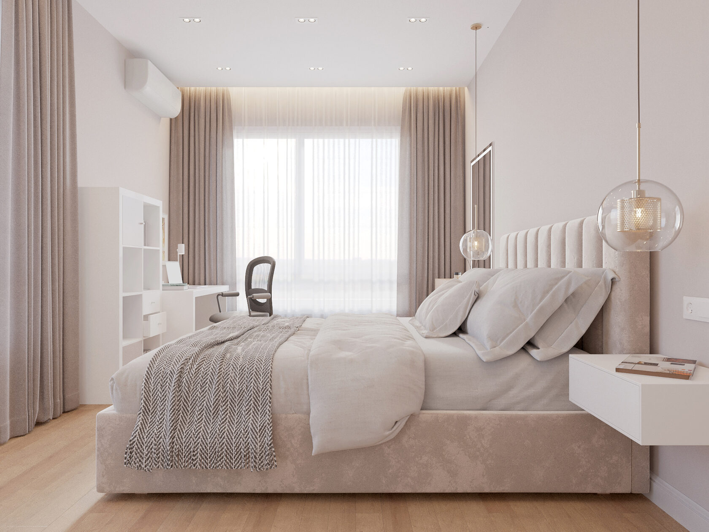
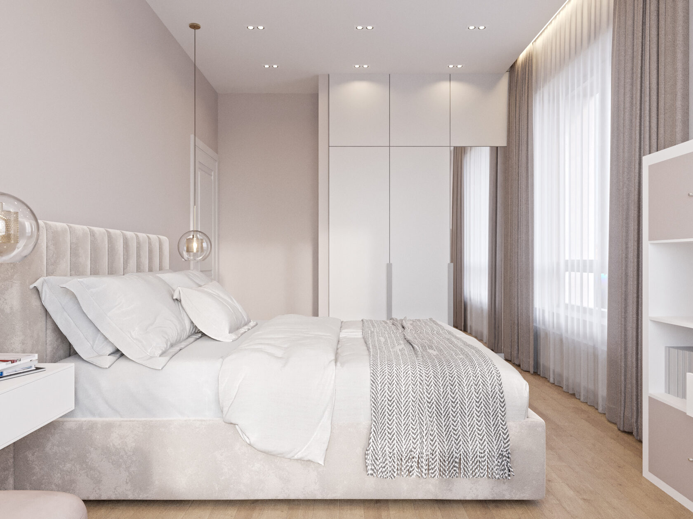

Пространство спальни задумано как абсолютное убежище от повседневной суеты, где каждая деталь работает на атмосферу глубокого расслабления. Светлая, обволакивающая палитра, бархатистые тактильные фактуры текстиля и безупречно чистые линии мебели создают именно тот визуальный и эмоциональный покой, о котором мечтал заказчик. Архитектурной доминантой комнаты выступает кровать с высоким изголовьем в обивке, имитирующей благородный вельвет. Её композицию поддерживают парящие в воздухе лаконичные подвесные тумбы и изящные стеклянные светильники, чьё тёплое свечение создаёт интимную камерную атмосферу. Здесь нет ничего случайного или избыточного — лишь тщательно выверенный минимум, необходимый для полноценного отдыха.

Вдоль окна деликатно вписана функциональная рабочая зона. Она абсолютно не нарушает общую медитативную атмосферу пространства: белоснежная столешница письменного стола, невесомый стеллаж в едином стиле и спокойный по колористике арт-объект на стене не перетягивают на себя внимание, а органично растворяются в интерьере, поддерживая его визуальную лёгкость.

Система хранения спроектирована по принципу абсолютной невидимости: вместительный встроенный шкаф, интегрированный от пола до самого потолка и намеренно лишённый видимой фурнитуры, буквально сливается с плоскостью стены. Этот архитектурный приём избавляет комнату от визуального шума и оптически раздвигает её границы. Оконный проём оформлен элегантным дуэтом: плотные портьеры в паре с воздушным тюлем позволяют гибко управлять уровнем естественного света, а скрытая подсветка по периметру потолка наполняет помещение мягким, равномерным и обволакивающим сиянием.

## Домашний тренажерный зал

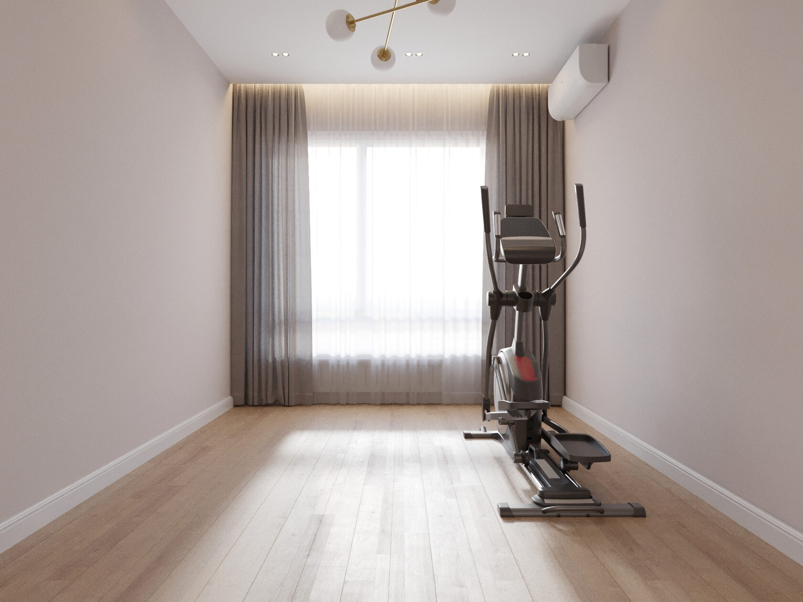
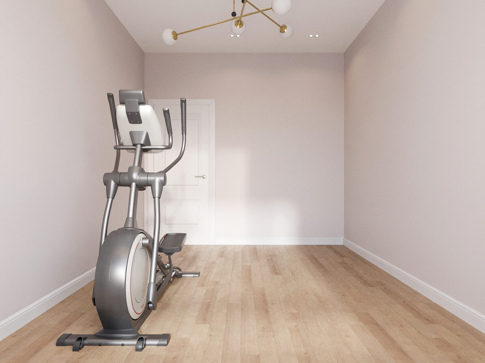

Пространство спортивной зоны стало органичным продолжением общей стилистики квартиры. Воздушная светлая палитра стен, тактильное тепло кварцвинила, мастерски имитирующего фактуру натурального дерева, и деликатный рассеянный свет формируют безмятежную, медитативную среду. Здесь нет визуального шума — спокойная атмосфера комнаты совершенно не отвлекает, а, напротив, идеально настраивает на продуктивное движение и глубокое физическое восстановление.

На данном этапе функциональным ядром помещения выступает эллиптический тренажёр. При этом выверенная планировка и наличие свободного места оставляют простор для будущих интерьерных апгрейдов: комната с лёгкостью вместит уютный уголок для занятий йогой, лаконичный эстетичный шкаф для хранения фитнес-аксессуаров или масштабное настенное зеркало, которое дополнительно умножит объём и свет.

Безупречный микроклимат и повседневную эргономику поддерживают важнейшие инженерные решения. Грамотно спроектированный сценарий качественного освещения в тандеме с современной системой кондиционирования гарантируют, что тренировки будут проходить в максимально комфортных условиях вне зависимости от времени года и погоды за окном.

## Ванная комната

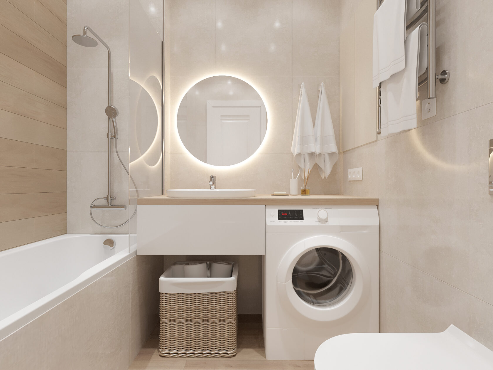
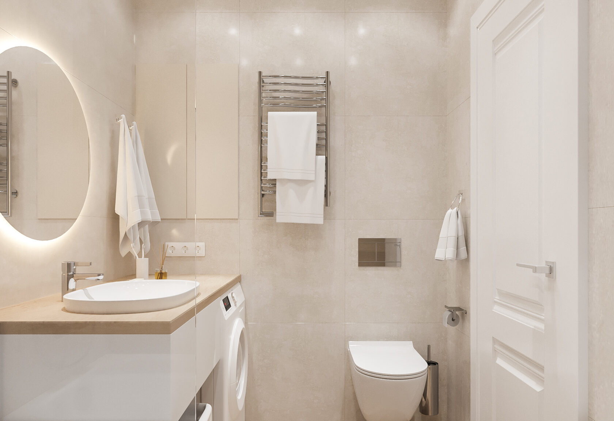
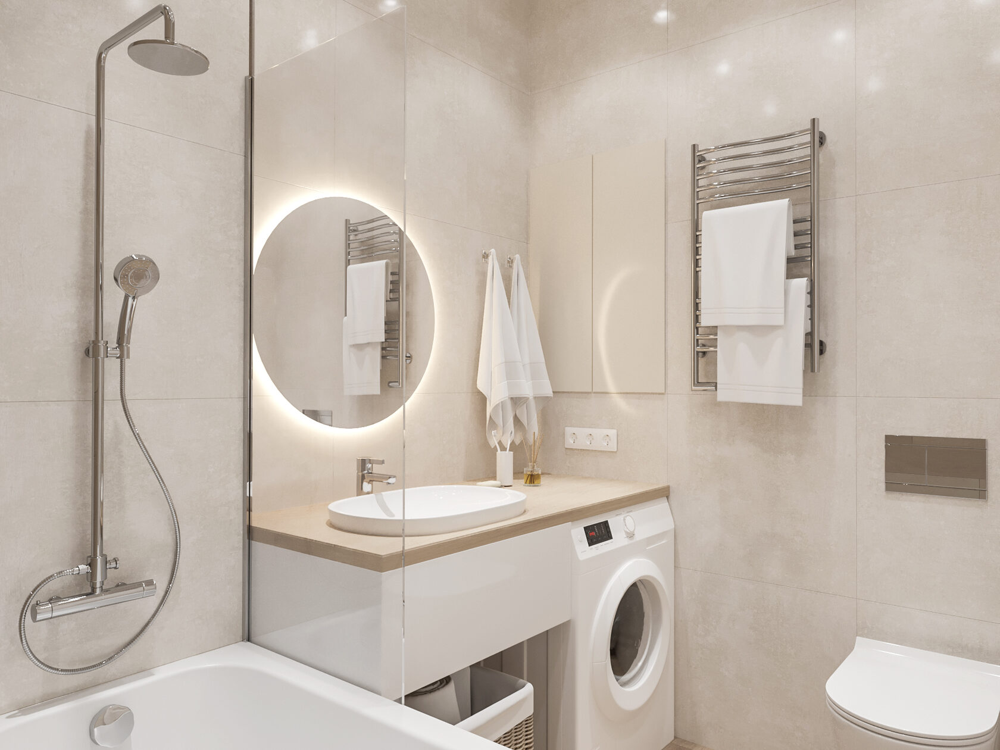
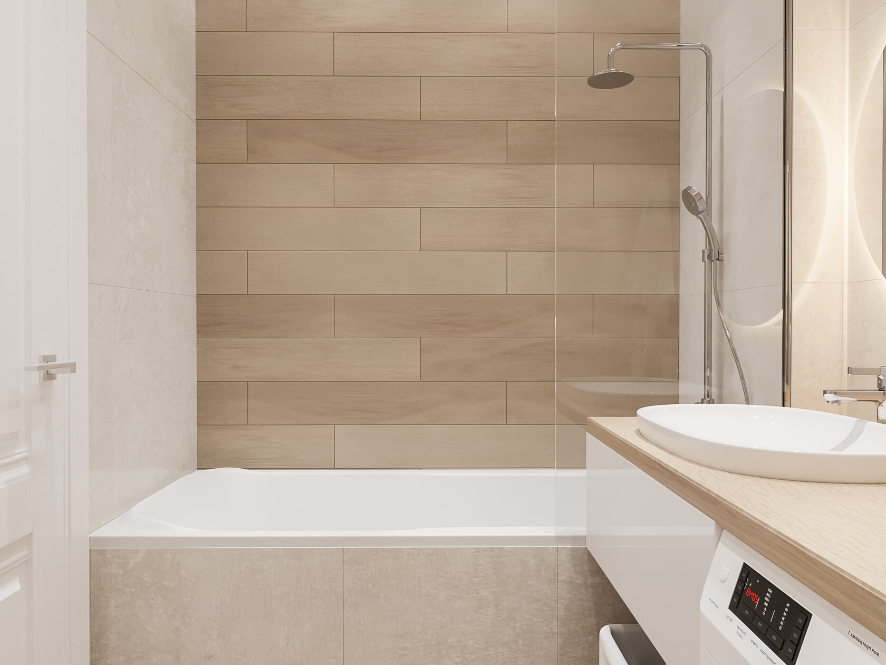

Интерьер этого санузла выстроен на гармоничном сочетании светлой отделки, благородных древесных фактур и деликатного освещения, что наполняет пространство ощущением уюта и визуального простора. Столешница зоны умывальника выполнена из тёплого дерева, а зеркальное полотно обрамлено мягкой скрытой подсветкой, создающей комфортную и расслабляющую атмосферу для ежедневных ритуалов.

Следуя главному пожеланию заказчика, мы свели к абсолютному минимуму количество открытых полок, сделав ставку на эстетичное скрытое хранение. Пространство над раковиной занял лаконичный закрытый шкаф, а под ней расположилась вместительная система модулей для банных принадлежностей. Стиральная машина была мастерски интегрирована в единый мебельный блок, при этом пространство над ней превратилось в полноценную и удобную рабочую поверхность.

Купальная зона объединяет в себе ванну и современную душевую стойку, деликатно обособленные от остального пространства прозрачной стеклянной перегородкой — это практичное и визуально лёгкое решение. Для отделки стен в «мокрой» зоне был выбран керамогранит с выразительной фактурой натурального дерева, который привносит в интерьер природное тепло, тактильность и особый шарм.

Несмотря на компактные размеры помещения, его эргономика продумана до мелочей и не идёт на компромиссы с комфортом. Здесь нашлось место для всего необходимого: подвесного унитаза со скрытой инсталляцией, аккуратной корзины для белья, функционального полотенцесушителя и продуманных электрических розеток. Каждый элемент занимает своё идеальное место, формируя безупречно организованное, современное и по-настоящему уютное пространство.

## Гостевой санузел

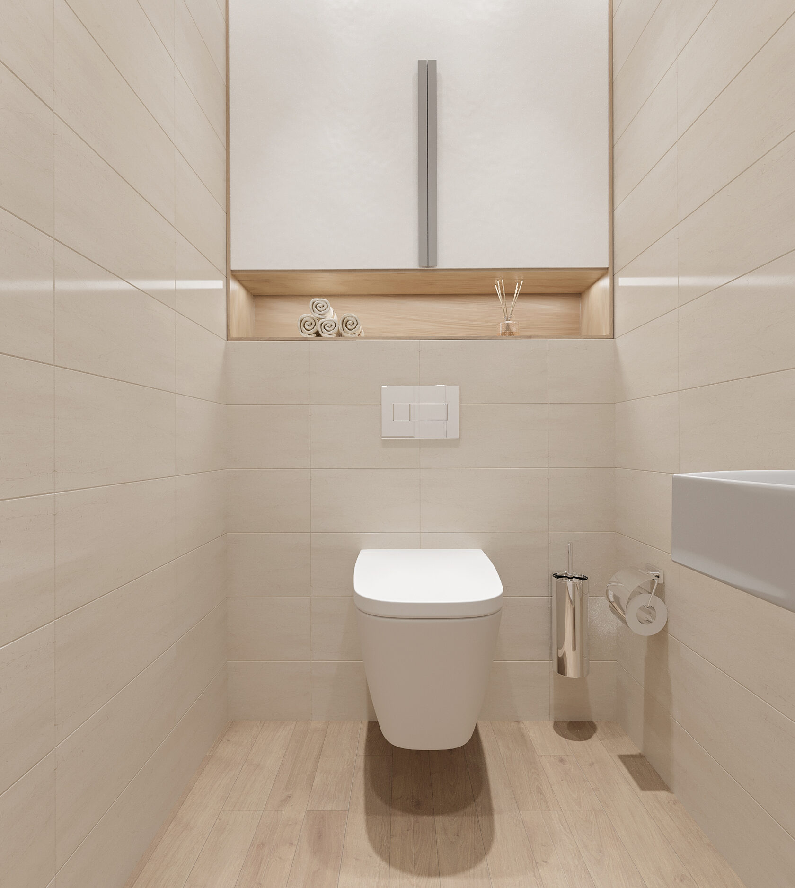
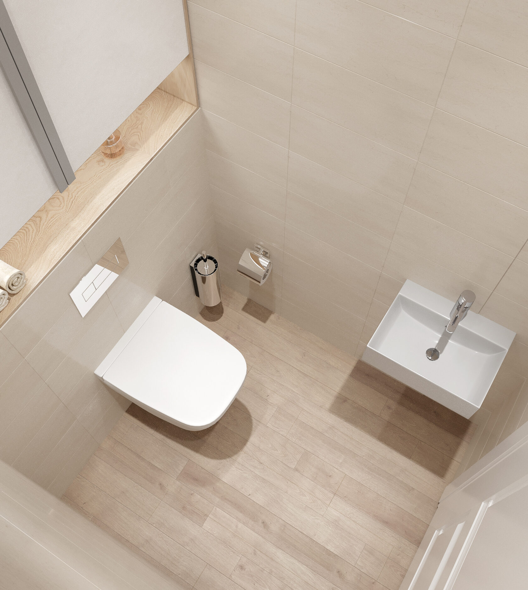

Интерьер этого компактного помещения выстроен на принципах визуальной лёгкости и тактильного тепла. Светлая палитра плитки, подобранная в тон древесным фактурам, в сочетании с лаконичной сантехникой мастерски раздвигает границы пространства, наполняя его воздухом и светом. Напольное покрытие, имитирующее натуральное дерево, добавляет обстановке домашнего уюта и природного тепла, превращая утилитарное помещение в комфортную зону.

Архитектурной изюминкой санузла стала выразительная ниша, спроектированная непосредственно над зоной инсталляции. Она виртуозно совмещает декоративную и практическую функции: здесь аккуратно разместились свёрнутые пушистые полотенца и стильный аромадиффузор. Этот небольшой, но выразительный штрих идеально воплощает главную философию интерьера — минимум визуального шума при максимуме уюта.

Эргономика пространства продумана безупречно. Подвесной унитаз и миниатюрная раковина не только освобождают драгоценные сантиметры полезной площади, но и значительно облегчают процесс уборки, оставляя пол полностью открытым. Пространство над инсталляцией скрыто за фасадами компактного шкафа, который надёжно маскирует инженерные коммуникации и предоставляет дополнительное место для хранения бытовой химии и запасных полотенец. Завершает композицию деликатная скрытая подсветка ниши, которая подчёркивает её архитектурную глубину, добавляет помещению объёма и создаёт мягкую, расслабляющую атмосферу в вечернее время.
