## Прихожая

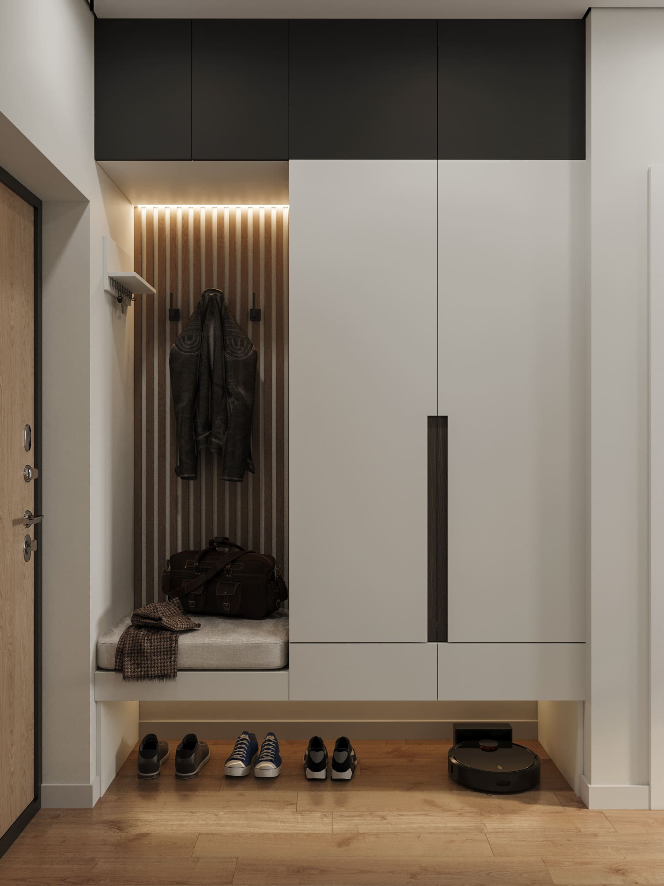
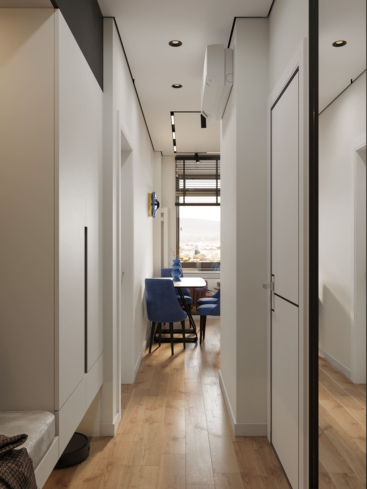 
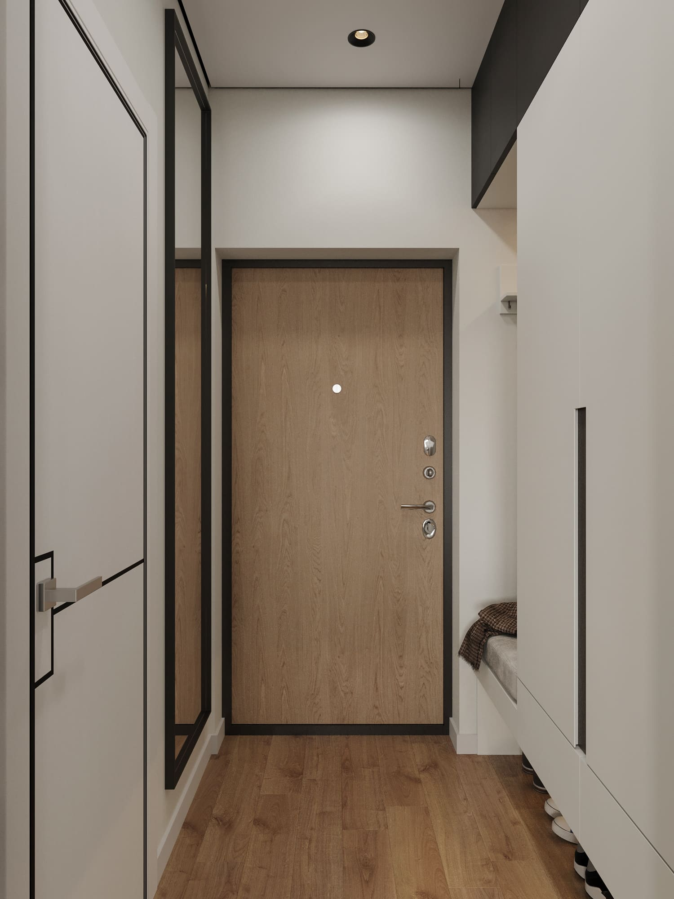  

Этот дизайн-проект однокомнатной квартиры создавался для молодого человека. Перед нами стоял ряд конкретных практических и эстетических задач: организовать на лоджии комфортное пространство для видеозвонков, деликатно интегрировать в интерьер любимые заказчиком реечные конструкции, спроектировать просторную и стильную кухню для приёма гостей, а также сформировать многофункциональную мастер-спальню, объединяющую зону отдыха, гардеробную и домашний офис. Исходная планировка осталась стандартной, однако наполнение пространства приобрело позитивный и лаконичный характер. Стилистической основой послужил современный дизайн в светлой палитре, освежённой выразительными голубыми акцентами.

Входная зона получилась светлой, предельно эргономичной и продуманной с точки зрения ежедневных сценариев. Центральным элементом здесь стала встроенная подвесная композиция: в нижней части предусмотрена открытая ниша для обуви и удобная банкетка с мягким сиденьем. Выше расположена декоративная реечная панель с крючками для верхней одежды, которую венчают вместительные антресоли. Слева от этой системы размещена компактная подвесная полочка для ключей, а справа — полноценный хозяйственный шкаф с верхними отделениями для хранения. Пространство визуально умножает масштабное зеркало, растянувшееся почти от пола до самого потолка. Оформление холла выдержано в строгой и сдержанной манере: доминирует чистый белый цвет, который оттеняется графичными чёрными акцентами и тёплыми древесными фактурами. Дерево деликатно присутствует в реечной панели, дверном полотне и рисунке напольного покрытия, связывая интерьер воедино.

## Кухня

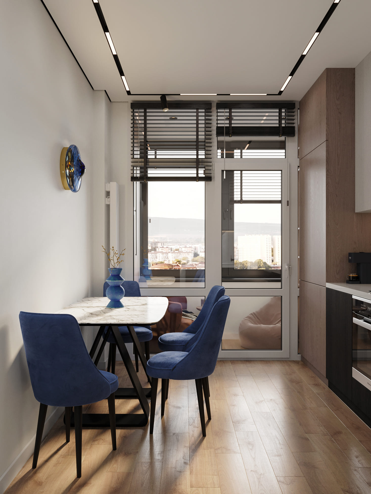
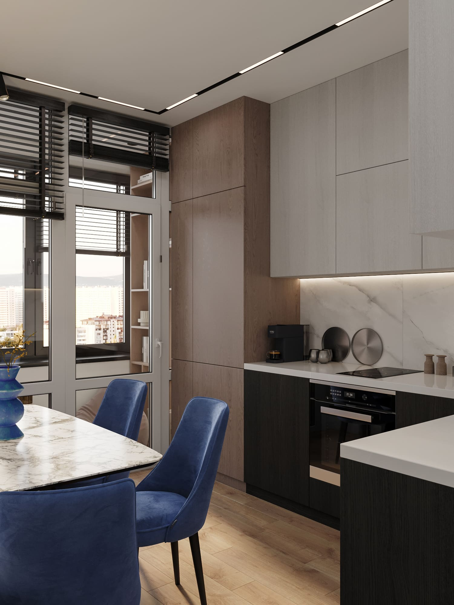
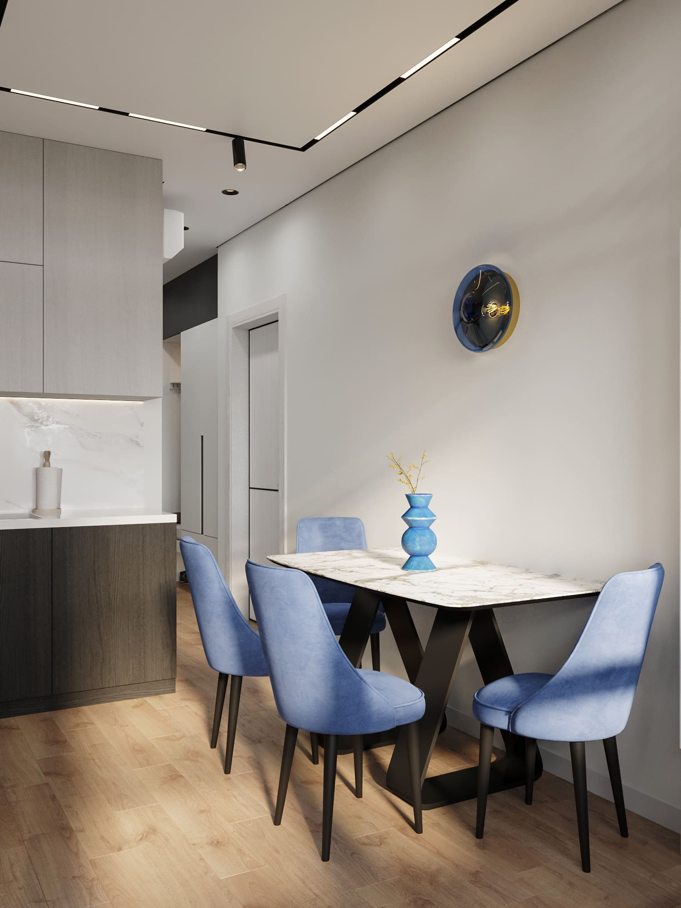
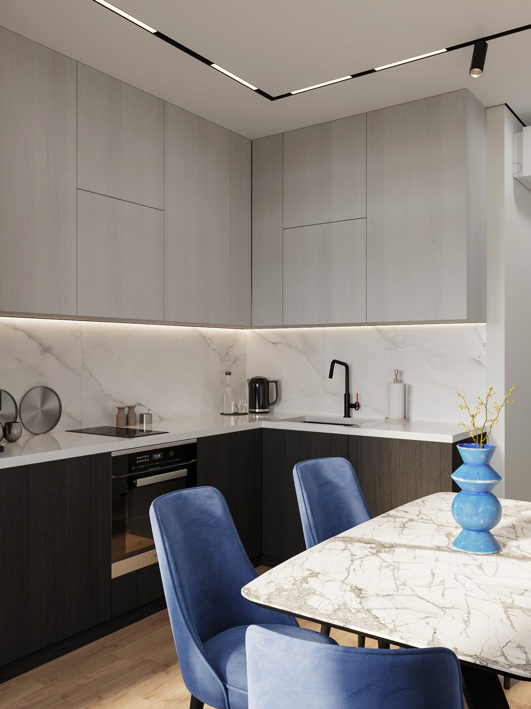

Кухня получилась просторной, наполненной светом и оптимистичной атмосферой. Пространство чётко разделено на две функциональные зоны: непосредственно кухонный гарнитур и обеденную группу. Угловая конфигурация кухни вмещает весь необходимый набор встроенной техники — посудомоечную машину, мойку, варочную панель и холодильник, — а также удобные рабочие поверхности и верхние модули для хранения. Обеденная зона представлена оригинальным прямоугольным столом в окружении выразительных кресел-стульев. За таким столом приятно и не стыдно принимать гостей.

Живость и свежесть интерьеру придают небесно-голубые акценты: обивка стульев-кресел, декоративная ваза на столешнице и круглые настенные бра, размещённые над обеденной группой. Стилистическую выразительность задаёт эффектный контраст белого и чёрного, который читается в фасадах кухонного гарнитура и столешнице обеденного стола. Ощущение простора усиливается благодаря открытой планировке, объединяющей кухню с прихожей-коридором, белоснежным стенам и полностью стеклянным дверям, ведущим на лоджию, — прозрачные полотна стирают визуальные границы и зрительно присоединяют площадь лоджии к кухонному пространству.

## Спальня

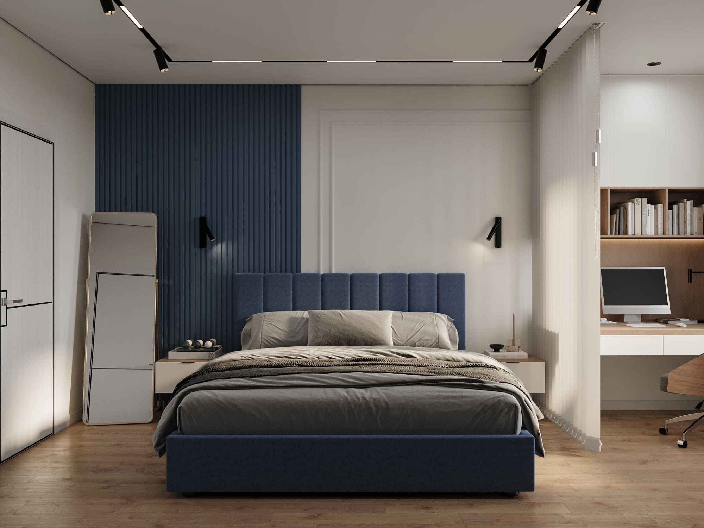
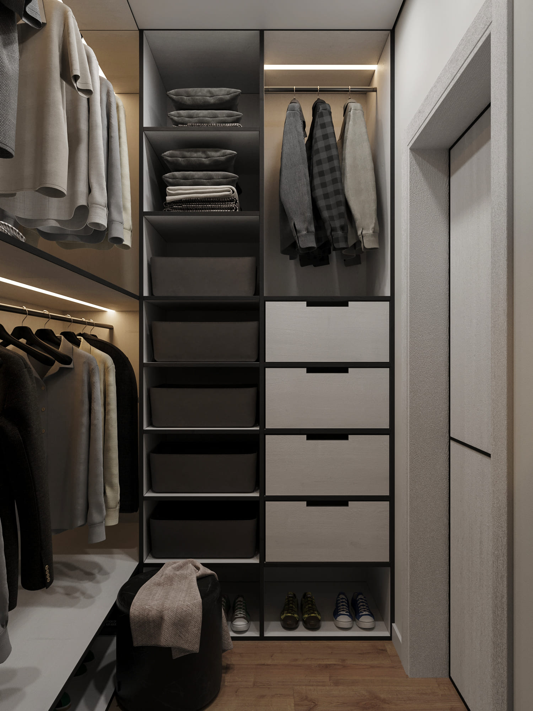
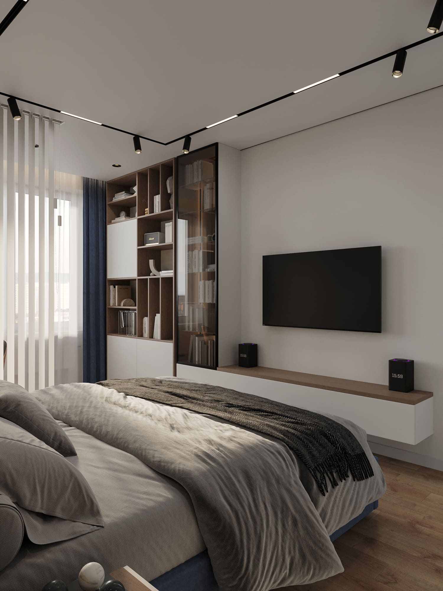
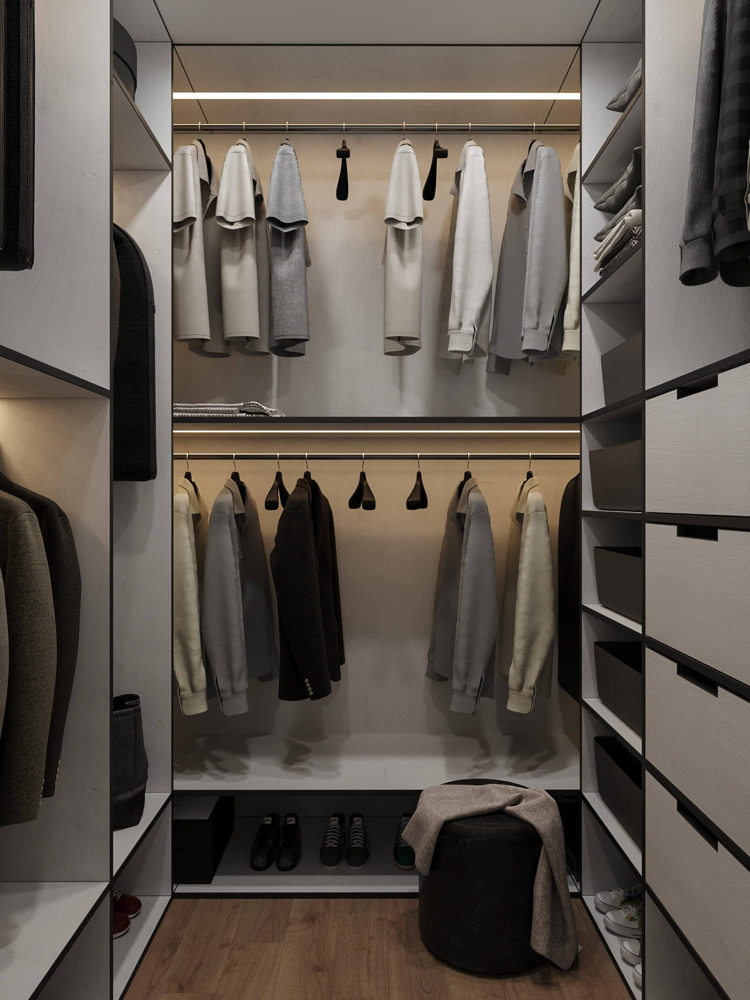
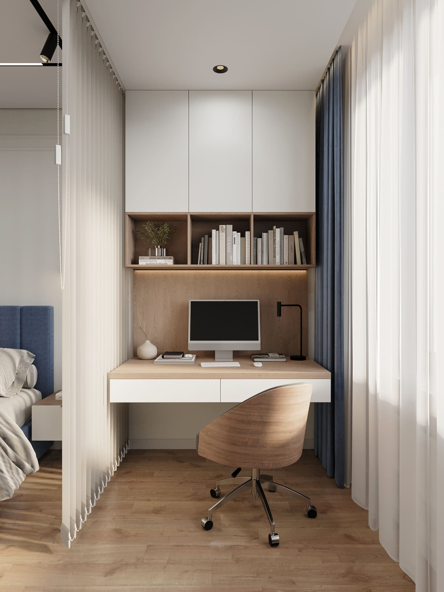

Мастер-спальня представляет собой многофункциональное, эргономичное пространство, объединяющее сразу пять функциональных зон: отдыха, работы, ухода за собой, хранения и полноценной гардеробной с отдельным входом.

Зона отдыха организована вокруг просторной кровати с подвесными прикроватными тумбами и телевизионной панелью, дополненной узкой подвесной ТВ-тумбой в едином стилистическом решении. Рабочее пространство деликатно отделено от спальной зоны шторой в форме вертикальных жалюзи — этот приём создаёт ощущение приватности в спальне и деловую атмосферу в кабинете. Такое разделение позволяет психологически дистанцироваться от рабочих задач во время отдыха, что особенно ценно, когда нет возможности выделить под кабинет отдельную комнату. Рабочее место включает подвесной стол-панель, эргономичное компьютерное кресло и открытую подвесную полку для книг, расположенную над столом. Компактная бьюти-зона представлена напольным ростовым зеркалом, установленным у входа в гардеробную. Система хранения в спальне реализована через вместительный шкаф-стеллаж с открытыми полками для книг и декора, а также отдельной секцией за стеклянным фасадом.

Просторная гардеробная оснащена продуманной системой хранения: нижние открытые полки для обуви, секции со штангами для развешивания одежды, блоки с выдвижными ящиками, открытые отсеки для коробок с обувью, сложенных вещей и подушек, верхние полки для дорожных сумок и чемоданов. Для комфорта в гардеробной предусмотрен цилиндрический пуф.

Как и кухня, мастер-спальня выдержана в светлой палитре с выразительными голубыми акцентами — в обивке изголовья кровати, реечной панели за спальным местом (добавленной по настоятельной просьбе заказчика), текстильном оформлении окон. Тёплые древесные фактуры деликатно присутствуют в столешницах прикроватных тумб и ТВ-тумбы, письменного стола, а также в полках книжного стеллажа и шкафа-стеллажа, привнося в интерьер природную теплоту и тактильность.

## Лоджия

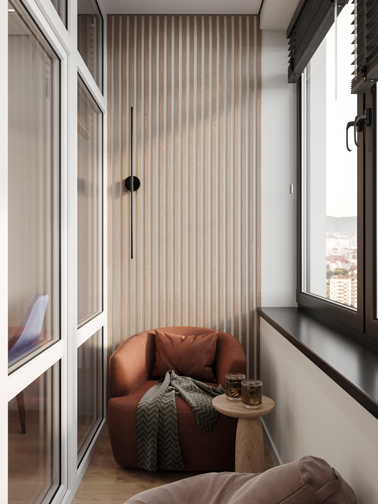
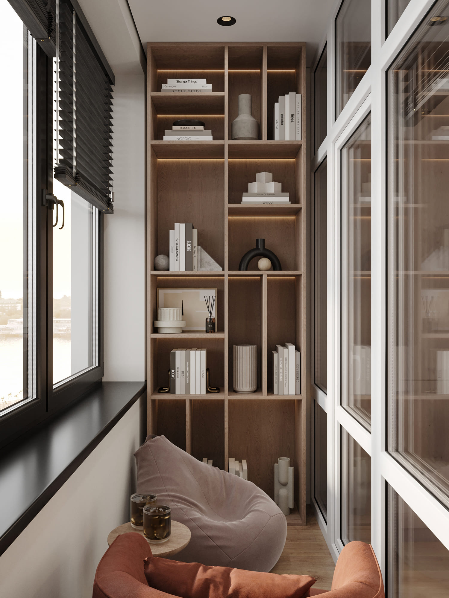

Пространство лоджии превратилось в уютную и атмосферную многофункциональную зону, где грамотно соседствуют три сценария использования. Первая выделена под видеозвонки и удалённую работу: здесь расположилось глубокое, максимально комфортное кресло в паре с компактным кофейным столиком. Вторая зона посвящена неформальному отдыху и релаксации — её центром стал мягкий кресло-мешок, располагающий к тому, чтобы полностью расслабиться. Третья зона берёт на себя практические задачи: вдоль стены выстроен вместительный стеллаж с открытыми полками, обеспечивающий удобное и организованное хранение хозяйственных принадлежностей.

## Душевая

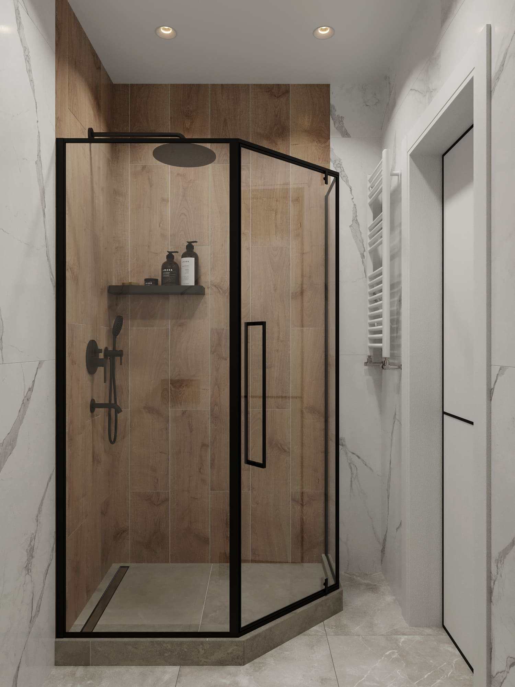
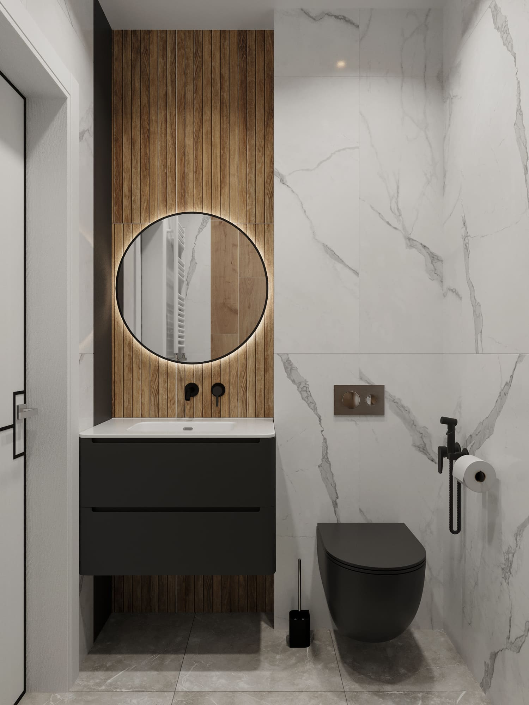
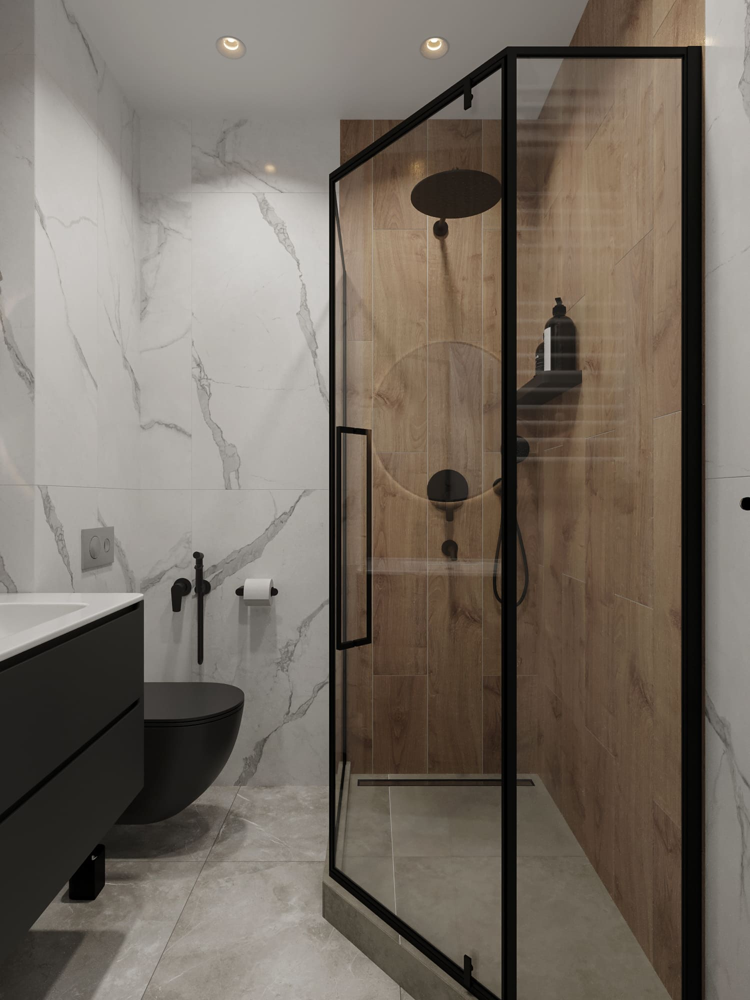

Интерьер этой комнаты строится на принципах эстетичного минимализма, где главную роль играют выразительные контрасты и безупречный стиль. Пространство грамотно оснащено всем необходимым: здесь установлены современная душевая кабина, лаконичная подвесная тумба с раковиной, над которой парит зеркало правильной круглой формы, а также подвесной унитаз, дополненный удобным гигиеническим душем. 

Чтобы ежедневные водные ритуалы проходили максимально комфортно, в помещении предусмотрена изящная подвесная полочка для мелочей, а непосредственно у входа размещён полотенцесушитель. Визуальный облик душевой базируется на строгой и графичной чёрно-белой палитре, создающей эффектный оптический контраст. А чтобы этот монохром не выглядел слишком холодным, по желанию заказчика дизайн деликатно смягчён тёплыми акцентами — деревянными рейками, которые привносят в пространство природную фактуру и уют.